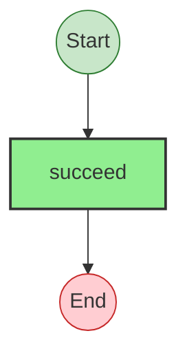

# Effect Analysis: otherModuleProgram

## Metadata

- **File**: `/Users/jreehal/dev/node-examples/effect-analyzer/packages/effect-analyzer/src/__fixtures__/effect-kitchen-sink-other.ts`
- **Analyzed**: 2026-05-22T16:10:32.039Z
- **Source Type**: direct
- **TypeScript Version**: 6.0.2


## Effect Flow




## Statistics

- **Total Effects**: 1


## Explanation

```
otherModuleProgram (direct):
  1. Calls succeed — constructor

  Concurrency: sequential (no parallelism)
```

