# Effect Analysis: genProgram

## Metadata

- **File**: `/Users/jreehal/dev/node-examples/effect-analyzer/packages/effect-analyzer/src/__fixtures__/effect-kitchen-sink.ts`
- **Analyzed**: 2026-05-22T16:10:32.127Z
- **Source Type**: generator
- **TypeScript Version**: 6.0.2


## Effect Flow

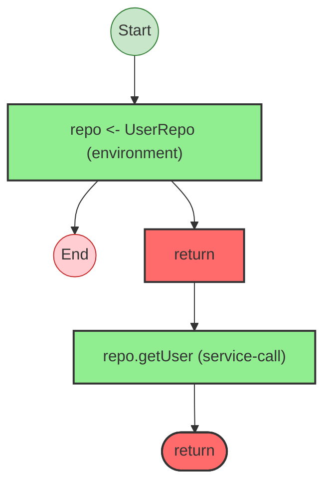


## Statistics

- **Total Effects**: 2


## Explanation

```
genProgram (generator):
  1. Yields repo <- UserRepo
  2. Returns:
    Calls repo.getUser

  Services required: UserRepo
  Error paths: NotFound, RepoCrash
  Concurrency: sequential (no parallelism)
```


## Dependencies

- `UserRepo`


## Error Types

- `NotFound`
- `RepoCrash`


---

# Effect Analysis: runSite

## Metadata

- **File**: `/Users/jreehal/dev/node-examples/effect-analyzer/packages/effect-analyzer/src/__fixtures__/effect-kitchen-sink.ts`
- **Analyzed**: 2026-05-22T16:10:32.128Z
- **Source Type**: run
- **TypeScript Version**: 6.0.2


## Effect Flow

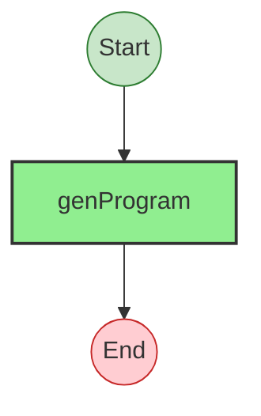


## Statistics

- **Total Effects**: 1


## Explanation

```
runSite (run):
  1. Calls genProgram

  Concurrency: sequential (no parallelism)
```


---

# Effect Analysis: aliasGenProgram

## Metadata

- **File**: `/Users/jreehal/dev/node-examples/effect-analyzer/packages/effect-analyzer/src/__fixtures__/effect-kitchen-sink.ts`
- **Analyzed**: 2026-05-22T16:10:32.130Z
- **Source Type**: generator
- **TypeScript Version**: 6.0.2


## Effect Flow

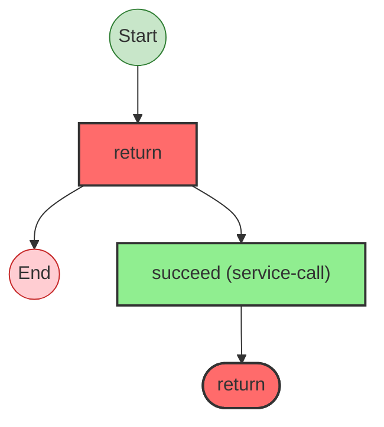


## Statistics

- **Total Effects**: 1


## Explanation

```
aliasGenProgram (generator):
  1. Returns:
    Calls "/Users/jreehal/dev/node-examples/effect-analyzer/node_modules/.pnpm/effect@3.21.2/node_modules/effect/dist/dts/Effect".succeed — service-call

  Services required: "/Users/jreehal/dev/node-examples/effect-analyzer/node_modules/.pnpm/effect@3.21.2/node_modules/effect/dist/dts/Effect"
  Concurrency: sequential (no parallelism)
```


---

# Effect Analysis: destructuredGenProgram

## Metadata

- **File**: `/Users/jreehal/dev/node-examples/effect-analyzer/packages/effect-analyzer/src/__fixtures__/effect-kitchen-sink.ts`
- **Analyzed**: 2026-05-22T16:10:32.131Z
- **Source Type**: generator
- **TypeScript Version**: 6.0.2


## Effect Flow

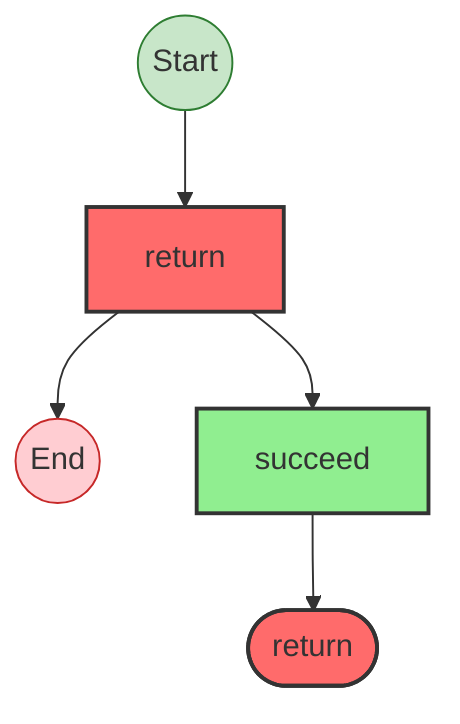


## Statistics

- **Total Effects**: 1


## Explanation

```
destructuredGenProgram (generator):
  1. Returns:
    Calls succeed — constructor

  Concurrency: sequential (no parallelism)
```


---

# Effect Analysis: servicePlumbingProgram

## Metadata

- **File**: `/Users/jreehal/dev/node-examples/effect-analyzer/packages/effect-analyzer/src/__fixtures__/effect-kitchen-sink.ts`
- **Analyzed**: 2026-05-22T16:10:32.136Z
- **Source Type**: generator
- **TypeScript Version**: 6.0.2


## Effect Flow

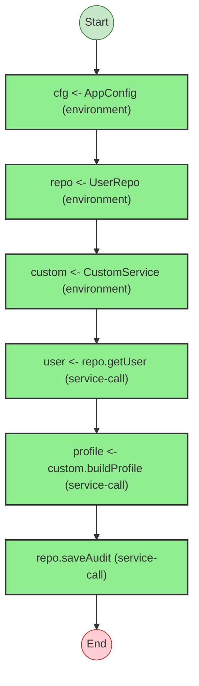


## Statistics

- **Total Effects**: 6


## Explanation

```
servicePlumbingProgram (generator):
  1. Yields cfg <- AppConfig
  2. Yields repo <- UserRepo
  3. Yields custom <- CustomService
  4. Yields user <- repo.getUser
  5. Yields profile <- custom.buildProfile
  6. Calls repo.saveAudit

  Services required: AppConfig, UserRepo, CustomService
  Error paths: NotFound, RepoCrash
  Concurrency: sequential (no parallelism)
```


## Dependencies

- `AppConfig`
- `UserRepo`
- `CustomService`


## Error Types

- `NotFound`
- `RepoCrash`


---

# Effect Analysis: provideServiceProgram

## Metadata

- **File**: `/Users/jreehal/dev/node-examples/effect-analyzer/packages/effect-analyzer/src/__fixtures__/effect-kitchen-sink.ts`
- **Analyzed**: 2026-05-22T16:10:32.141Z
- **Source Type**: generator
- **TypeScript Version**: 6.0.2


## Effect Flow

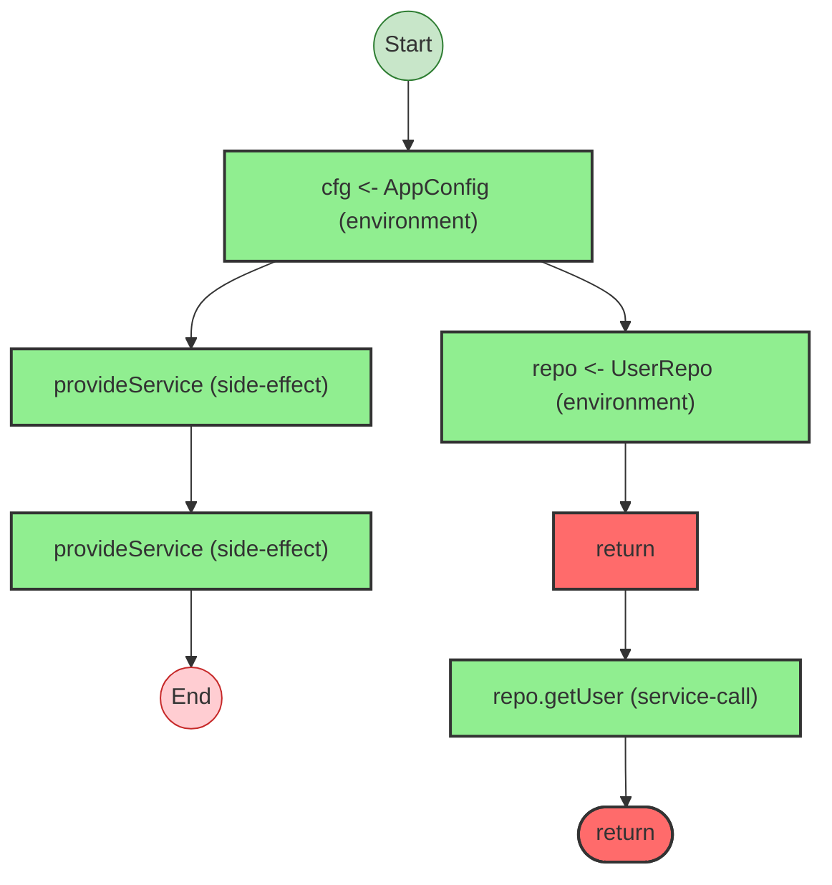


## Statistics

- **Total Effects**: 5


## Explanation

```
provideServiceProgram (generator):
  1. Yields cfg <- AppConfig
  2. Yields repo <- UserRepo
  3. Returns:
    Calls repo.getUser

  Services required: AppConfig, UserRepo
  Error paths: E, NotFound, RepoCrash
  Concurrency: sequential (no parallelism)
```


## Dependencies

- `AppConfig`
- `UserRepo`


## Error Types

- `E`
- `NotFound`
- `RepoCrash`


---

# Effect Analysis: unstableLookup

## Metadata

- **File**: `/Users/jreehal/dev/node-examples/effect-analyzer/packages/effect-analyzer/src/__fixtures__/effect-kitchen-sink.ts`
- **Analyzed**: 2026-05-22T16:10:32.142Z
- **Source Type**: generator
- **TypeScript Version**: 6.0.2


## Effect Flow

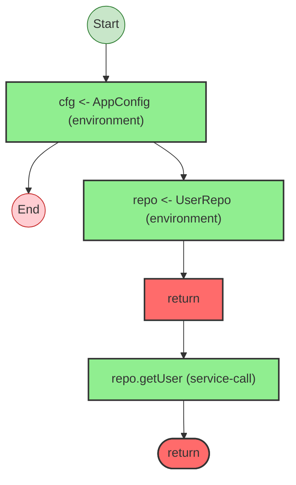


## Statistics

- **Total Effects**: 3


## Explanation

```
unstableLookup (generator):
  1. Yields cfg <- AppConfig
  2. Yields repo <- UserRepo
  3. Returns:
    Calls repo.getUser

  Services required: AppConfig, UserRepo
  Error paths: NotFound, RepoCrash
  Concurrency: sequential (no parallelism)
```


## Dependencies

- `AppConfig`
- `UserRepo`


## Error Types

- `NotFound`
- `RepoCrash`


---

# Effect Analysis: concurrencyProgram

## Metadata

- **File**: `/Users/jreehal/dev/node-examples/effect-analyzer/packages/effect-analyzer/src/__fixtures__/effect-kitchen-sink.ts`
- **Analyzed**: 2026-05-22T16:10:32.154Z
- **Source Type**: generator
- **TypeScript Version**: 6.0.2


## Effect Flow

```mermaid
flowchart TB

  %% Program: concurrencyProgram

  start((Start))
  end_node((End))

  n2["Effect.all (2) (concurrency)"]
  parallel_fork_3{{"All (2)"}}
  parallel_join_3{{"Join"}}
  n4["Pipe (1 steps)"]
  n5["sleep (side-effect)"]
  n6["as (transform)"]
  n7["Pipe (1 steps)"]
  n8["sleep (side-effect)"]
  n9["as (transform)"]
  n10["Effect.race (2 racing) (concurrency)"]
  race_fork_11{{{"Race (2)"}}}
  race_join_11{{{"Winner"}}}
  n12["succeed"]
  n13["Pipe (1 steps)"]
  n14["sleep (side-effect)"]
  n15["as (transform)"]
  n16["fork (fiber)"]
  n17["succeed <number, never, never>"]
  n18["join (fiber)"]

  %% Edges
  n2 --> parallel_fork_3
  n5 --> n6
  n4 --> n5
  parallel_fork_3 -->|Pipe (1 steps)| n4
  n6 --> parallel_join_3
  n8 --> n9
  n7 --> n8
  parallel_fork_3 -->|Pipe (1 steps)| n7
  n9 --> parallel_join_3
  n10 --> race_fork_11
  race_fork_11 -->|succeed| n12
  n12 --> race_join_11
  n14 --> n15
  n13 --> n14
  race_fork_11 -->|Pipe (1 steps)| n13
  n15 --> race_join_11
  parallel_join_3 --> n10
  n16 --> n17
  race_join_11 --> n16
  n17 --> n18
  start --> n2
  n18 --> end_node

  %% Styles
  classDef startStyle fill:#c8e6c9,stroke:#2e7d32
  classDef endStyle fill:#ffcdd2,stroke:#c62828
  classDef effectStyle fill:#90EE90,stroke:#333,stroke-width:2px
  classDef pipeStyle fill:#ADD8E6,stroke:#333,stroke-width:2px
  classDef parallelStyle fill:#FFA500,stroke:#333,stroke-width:2px
  classDef raceStyle fill:#FF6347,stroke:#333,stroke-width:2px
  classDef fiberStyle fill:#DDA0DD,stroke:#333,stroke-width:2px
  classDef transformStyle fill:#A5D6A7,stroke:#388E3C,stroke-width:2px
  class start startStyle
  class end_node endStyle
  class n2 parallelStyle
  class parallel_fork_3 parallelStyle
  class parallel_join_3 parallelStyle
  class n4 pipeStyle
  class n5 effectStyle
  class n6 transformStyle
  class n7 pipeStyle
  class n8 effectStyle
  class n9 transformStyle
  class n10 raceStyle
  class race_fork_11 raceStyle
  class race_join_11 raceStyle
  class n12 effectStyle
  class n13 pipeStyle
  class n14 effectStyle
  class n15 transformStyle
  class n16 fiberStyle
  class n17 effectStyle
  class n18 fiberStyle
```


## Statistics

- **Total Effects**: 8
- **Parallel Operations**: 1
- **Race Operations**: 1


## Explanation

```
concurrencyProgram (generator):
  1. [a, b] = Runs 2 effects in sequential (concurrency: 2):
    Pipes sleep through:
      Calls sleep
      Transforms via as
    Pipes sleep through:
      Calls sleep
      Transforms via as
  2. winner = Races 2 effects:
    Calls succeed — constructor
    Pipes sleep through:
      Calls sleep
      Transforms via as
  3. fiber = Fiber fork:
    Calls succeed — constructor
  4. joined = Fiber join:

  Concurrency: uses parallelism / racing
```


---

# Effect Analysis: stmProgram

## Metadata

- **File**: `/Users/jreehal/dev/node-examples/effect-analyzer/packages/effect-analyzer/src/__fixtures__/effect-kitchen-sink.ts`
- **Analyzed**: 2026-05-22T16:10:32.160Z
- **Source Type**: generator
- **TypeScript Version**: 6.0.2


## Effect Flow

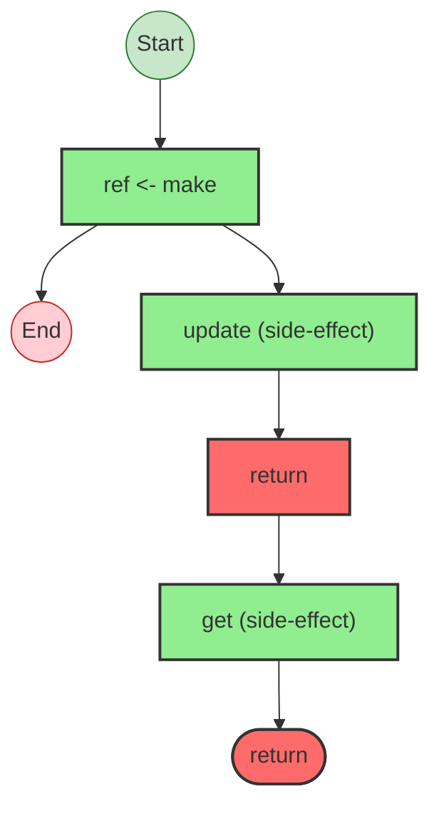


## Statistics

- **Total Effects**: 3


## Explanation

```
stmProgram (generator):
  1. Yields ref <- make
  2. Calls update
  3. Returns:
    Calls get

  Concurrency: sequential (no parallelism)
```


---

# Effect Analysis: controlFlowProgram

## Metadata

- **File**: `/Users/jreehal/dev/node-examples/effect-analyzer/packages/effect-analyzer/src/__fixtures__/effect-kitchen-sink.ts`
- **Analyzed**: 2026-05-22T16:10:32.164Z
- **Source Type**: generator
- **TypeScript Version**: 6.0.2


## Effect Flow

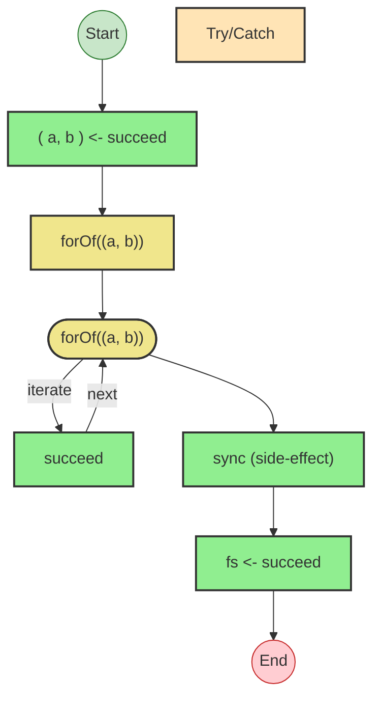


## Statistics

- **Total Effects**: 4
- **Loops**: 1


## Explanation

```
controlFlowProgram (generator):
  1. Yields { a, b } <- succeed
  2. Iterates (forOf) over [a, b]:
    Calls succeed — constructor
  3. Try:
    Calls sync — constructor
  4. Yields fs <- succeed

  Concurrency: sequential (no parallelism)
```


---

# Effect Analysis: main

## Metadata

- **File**: `/Users/jreehal/dev/node-examples/effect-analyzer/packages/effect-analyzer/src/__fixtures__/effect-kitchen-sink.ts`
- **Analyzed**: 2026-05-22T16:10:32.184Z
- **Source Type**: generator
- **TypeScript Version**: 6.0.2


## Effect Flow

```mermaid
flowchart TB

  %% Program: main

  start((Start))
  end_node((End))

  n1["retry: Schedule.recurs(1)"]
  n3["repo <- UserRepo"]
  n4["cfg <- AppConfig"]
  n5["custom <- CustomService"]
  n6["db <- Db"]
  n7["internal <- internalAliasProgram"]
  n8["Resource"]
  n9["sync"]
  resource_10["Resource"]
  n11["Pipe (1 steps)"]
  n12["Effect.race (2 racing)"]
  race_fork_13{{{"Race (2)"}}}
  race_join_13{{{"Winner"}}}
  n14["repo.getUser"]
  n15["succeed"]
  n16["catchTag"]
  n17["Effect"]
  err_handler_18["catchTag"]
  n19["Unknown: Could not determine effect type"]
  n20["Effect.all (2)"]
  parallel_fork_21{{"All (2)"}}
  parallel_join_21{{"Join"}}
  n22["custom.buildProfile"]
  n23["db.query"]
  n24["fork"]
  n25["custom.doWork"]
  n26["join"]
  n27["repo.saveAudit"]
  n28["log"]
  retry_29["Retry(Schedule.recurs(1))"]
  n30["timeout: '2 seconds'"]
  n31["Effect"]
  timeout_32["Timeout('2 seconds')"]
  n33["tapErrorCause"]
  n34["Resource"]
  n35["Effect"]
  resource_36["Resource"]
  n37["provide"]

  %% Edges
  n3 --> n4
  n4 --> n5
  n5 --> n6
  n6 --> n7
  n9 --> resource_10
  n7 --> n9
  n12 --> race_fork_13
  race_fork_13 -->|repo.getUser| n14
  n14 --> race_join_13
  race_fork_13 -->|succeed| n15
  n15 --> race_join_13
  n17 -->|on NotFound| err_handler_18
  err_handler_18 --> n19
  race_join_13 --> n17
  n11 --> n12
  resource_10 --> n11
  n20 --> parallel_fork_21
  parallel_fork_21 -->|custom.buildProfile| n22
  n22 --> parallel_join_21
  parallel_fork_21 -->|db.query| n23
  n23 --> parallel_join_21
  n19 --> n20
  n24 --> n25
  parallel_join_21 --> n24
  n25 --> n26
  n26 --> n27
  n27 --> n28
  n28 --> retry_29
  n31 --> timeout_32
  retry_29 --> n31
  timeout_32 --> n33
  n35 --> resource_36
  n33 --> n35
  resource_36 --> n37
  start --> n3
  n37 --> end_node

  %% Styles
  classDef startStyle fill:#c8e6c9,stroke:#2e7d32
  classDef endStyle fill:#ffcdd2,stroke:#c62828
  classDef effectStyle fill:#90EE90,stroke:#333,stroke-width:2px
  classDef pipeStyle fill:#ADD8E6,stroke:#333,stroke-width:2px
  classDef parallelStyle fill:#FFA500,stroke:#333,stroke-width:2px
  classDef raceStyle fill:#FF6347,stroke:#333,stroke-width:2px
  classDef errorHandlerStyle fill:#FFD700,stroke:#333,stroke-width:2px
  classDef retryStyle fill:#EE82EE,stroke:#333,stroke-width:2px
  classDef timeoutStyle fill:#87CEEB,stroke:#333,stroke-width:2px
  classDef resourceStyle fill:#98FB98,stroke:#333,stroke-width:2px
  classDef fiberStyle fill:#DDA0DD,stroke:#333,stroke-width:2px
  classDef unknownStyle fill:#D3D3D3,stroke:#333,stroke-width:1px
  classDef transformStyle fill:#A5D6A7,stroke:#388E3C,stroke-width:2px
  class start startStyle
  class end_node endStyle
  class n1 retryStyle
  class n3 effectStyle
  class n4 effectStyle
  class n5 effectStyle
  class n6 effectStyle
  class n7 effectStyle
  class n8 resourceStyle
  class n9 effectStyle
  class resource_10 resourceStyle
  class n11 pipeStyle
  class n12 raceStyle
  class race_fork_13 raceStyle
  class race_join_13 raceStyle
  class n14 effectStyle
  class n15 effectStyle
  class n16 errorHandlerStyle
  class n17 effectStyle
  class err_handler_18 errorHandlerStyle
  class n19 unknownStyle
  class n20 parallelStyle
  class parallel_fork_21 parallelStyle
  class parallel_join_21 parallelStyle
  class n22 effectStyle
  class n23 effectStyle
  class n24 fiberStyle
  class n25 effectStyle
  class n26 fiberStyle
  class n27 effectStyle
  class n28 effectStyle
  class retry_29 retryStyle
  class n30 timeoutStyle
  class n31 effectStyle
  class timeout_32 timeoutStyle
  class n33 transformStyle
  class n34 resourceStyle
  class n35 effectStyle
  class resource_36 resourceStyle
  class n37 effectStyle
```


## Statistics

- **Total Effects**: 20
- **Parallel Operations**: 1
- **Race Operations**: 1
- **Error Handlers**: 1
- **Retry Operations**: 1
- **Timeout Operations**: 1
- **Resources**: 2
- **Unknown Nodes**: 1


## Explanation

```
main (generator):
  1. Retries with Schedule.recurs(1):
    Yields repo <- UserRepo
    Yields cfg <- AppConfig
    Yields custom <- CustomService
    Yields db <- Db
    Yields internal <- internalAliasProgram
    resource = Acquires resource:
      Calls sync — constructor
      Then releases:
        Calls repo.saveAudit
    user = Pipes Effect.race(2 effects) through:
      Races 2 effects:
        Calls repo.getUser
        Calls succeed — constructor
      Catches tag "NotFound" on:
        Calls Effect
        Handler:
          (unknown: Could not determine effect type)
    [profile, queryResult] = Runs 2 effects in sequential (concurrency: 2):
      Calls custom.buildProfile
      Calls db.query
    worker = Fiber fork:
      Calls custom.doWork
    joined = Fiber join:
    Calls repo.saveAudit
    Calls log
  2. Times out after '2 seconds':
    Calls Effect
  3. Transforms via tapErrorCause
  4. Acquires resource:
    Calls Effect
    Then releases:
      Calls log
  5. Calls provide — context

  Services required: UserRepo, AppConfig, CustomService, Db
  Error paths: E, NotFound, RepoCrash
  Concurrency: uses parallelism / racing
```


## Dependencies

- `UserRepo`
- `AppConfig`
- `CustomService`
- `Db`


## Error Types

- `E`
- `NotFound`
- `RepoCrash`


---

# Effect Analysis: pipeProgram

## Metadata

- **File**: `/Users/jreehal/dev/node-examples/effect-analyzer/packages/effect-analyzer/src/__fixtures__/effect-kitchen-sink.ts`
- **Analyzed**: 2026-05-22T16:10:32.187Z
- **Source Type**: direct
- **TypeScript Version**: 6.0.2


## Effect Flow

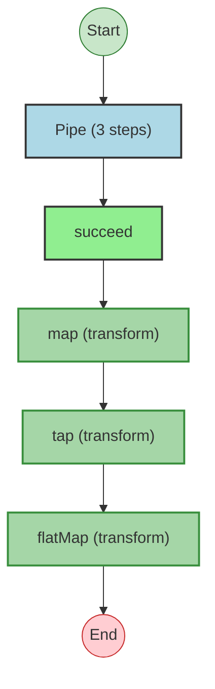


## Statistics

- **Total Effects**: 4


## Explanation

```
pipeProgram (direct):
  1. Pipes succeed through:
    Calls succeed — constructor
    Transforms via map
    Transforms via tap
    Transforms via flatMap

  Concurrency: sequential (no parallelism)
```


---

# Effect Analysis: promiseProgram

## Metadata

- **File**: `/Users/jreehal/dev/node-examples/effect-analyzer/packages/effect-analyzer/src/__fixtures__/effect-kitchen-sink.ts`
- **Analyzed**: 2026-05-22T16:10:32.189Z
- **Source Type**: direct
- **TypeScript Version**: 6.0.2


## Effect Flow

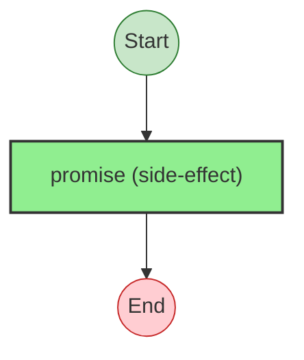


## Statistics

- **Total Effects**: 1


## Explanation

```
promiseProgram (direct):
  1. Calls promise — constructor

  Concurrency: sequential (no parallelism)
```


---

# Effect Analysis: syncProgram

## Metadata

- **File**: `/Users/jreehal/dev/node-examples/effect-analyzer/packages/effect-analyzer/src/__fixtures__/effect-kitchen-sink.ts`
- **Analyzed**: 2026-05-22T16:10:32.189Z
- **Source Type**: direct
- **TypeScript Version**: 6.0.2


## Effect Flow

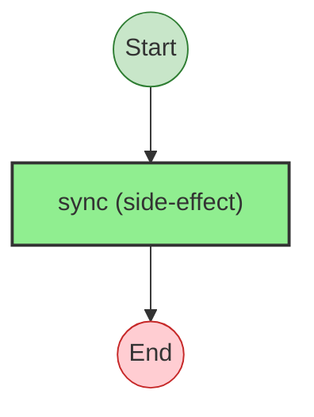


## Statistics

- **Total Effects**: 1


## Explanation

```
syncProgram (direct):
  1. Calls sync — constructor

  Concurrency: sequential (no parallelism)
```


---

# Effect Analysis: notAProgram

## Metadata

- **File**: `/Users/jreehal/dev/node-examples/effect-analyzer/packages/effect-analyzer/src/__fixtures__/effect-kitchen-sink.ts`
- **Analyzed**: 2026-05-22T16:10:32.190Z
- **Source Type**: direct
- **TypeScript Version**: 6.0.2


## Effect Flow

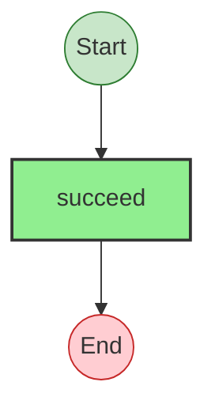


## Statistics

- **Total Effects**: 1


## Explanation

```
notAProgram (direct):
  1. Calls succeed — constructor

  Concurrency: sequential (no parallelism)
```


---

# Effect Analysis: effectFactory

## Metadata

- **File**: `/Users/jreehal/dev/node-examples/effect-analyzer/packages/effect-analyzer/src/__fixtures__/effect-kitchen-sink.ts`
- **Analyzed**: 2026-05-22T16:10:32.191Z
- **Source Type**: direct
- **TypeScript Version**: 6.0.2


## Effect Flow


## Statistics

- **Total Effects**: 1


## Explanation

```
effectFactory (direct):
  1. Calls succeed — constructor

  Concurrency: sequential (no parallelism)
```


---

# Effect Analysis: errorTopologyProgram

## Metadata

- **File**: `/Users/jreehal/dev/node-examples/effect-analyzer/packages/effect-analyzer/src/__fixtures__/effect-kitchen-sink.ts`
- **Analyzed**: 2026-05-22T16:10:32.196Z
- **Source Type**: direct
- **TypeScript Version**: 6.0.2


## Effect Flow

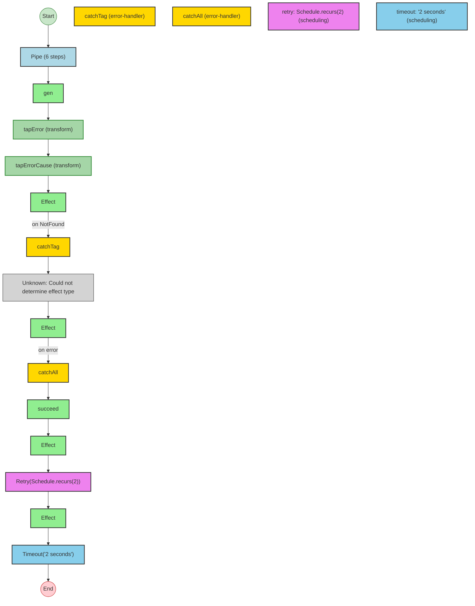


## Statistics

- **Total Effects**: 8
- **Error Handlers**: 2
- **Retry Operations**: 1
- **Timeout Operations**: 1
- **Unknown Nodes**: 1


## Explanation

```
errorTopologyProgram (direct):
  1. Pipes gen through:
    Calls gen
    Transforms via tapError
    Transforms via tapErrorCause
    Catches tag "NotFound" on:
      Calls Effect
      Handler:
        (unknown: Could not determine effect type)
    Catches all errors on:
      Calls Effect
      Handler:
        Calls succeed — constructor
    Retries (max 2, custom):
      Calls Effect
    Times out after '2 seconds':
      Calls Effect

  Error paths: NotFound, RepoCrash
  Concurrency: sequential (no parallelism)
```


## Error Types

- `NotFound`
- `RepoCrash`


---

# Effect Analysis: scopedResourceProgram

## Metadata

- **File**: `/Users/jreehal/dev/node-examples/effect-analyzer/packages/effect-analyzer/src/__fixtures__/effect-kitchen-sink.ts`
- **Analyzed**: 2026-05-22T16:10:32.198Z
- **Source Type**: direct
- **TypeScript Version**: 6.0.2


## Effect Flow

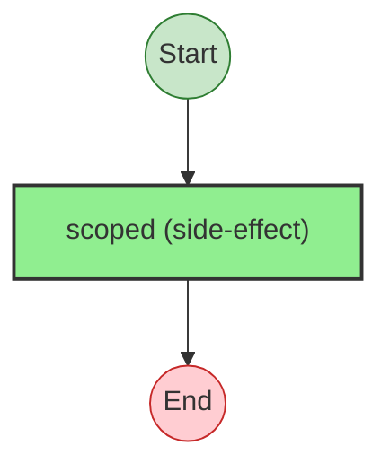


## Statistics

- **Total Effects**: 1


## Explanation

```
scopedResourceProgram (direct):
  1. Calls scoped

  Concurrency: sequential (no parallelism)
```


---

# Effect Analysis: LayerGraph

## Metadata

- **File**: `/Users/jreehal/dev/node-examples/effect-analyzer/packages/effect-analyzer/src/__fixtures__/effect-kitchen-sink.ts`
- **Analyzed**: 2026-05-22T16:10:32.203Z
- **Source Type**: direct
- **TypeScript Version**: 6.0.2


## Effect Flow

```mermaid
flowchart TB

  %% Program: LayerGraph

  start((Start))
  end_node((End))

  n1["Layer (merged) (layer)"]
  n2["Layer (merged) (layer)"]
  n3["Layer (layer)"]
  n4["UserRepo"]
  n5["Unknown: Could not determine effect type"]
  n6["Layer (layer)"]
  n7["AppConfig"]
  n8["Unknown: Could not determine effect type"]
  n9["Layer (layer)"]
  n10["CustomService"]
  n11["Unknown: Could not determine effect type"]
  n12["Layer (layer)"]
  n13["Db"]
  n14["succeed"]
  n15["Layer (layer)"]
  n16["Db"]
  n17["succeed"]

  %% Edges
  n4 --> n5
  n3 --> n4
  n7 --> n8
  n6 --> n7
  n5 --> n6
  n10 --> n11
  n9 --> n10
  n8 --> n9
  n13 --> n14
  n12 --> n13
  n11 --> n12
  n2 --> n3
  n16 --> n17
  n15 --> n16
  n14 --> n15
  n1 --> n2
  start --> n1
  n17 --> end_node

  %% Styles
  classDef startStyle fill:#c8e6c9,stroke:#2e7d32
  classDef endStyle fill:#ffcdd2,stroke:#c62828
  classDef effectStyle fill:#90EE90,stroke:#333,stroke-width:2px
  classDef layerStyle fill:#E6E6FA,stroke:#333,stroke-width:2px
  classDef unknownStyle fill:#D3D3D3,stroke:#333,stroke-width:1px
  class start startStyle
  class end_node endStyle
  class n1 layerStyle
  class n2 layerStyle
  class n3 layerStyle
  class n4 effectStyle
  class n5 unknownStyle
  class n6 layerStyle
  class n7 effectStyle
  class n8 unknownStyle
  class n9 layerStyle
  class n10 effectStyle
  class n11 unknownStyle
  class n12 layerStyle
  class n13 effectStyle
  class n14 effectStyle
  class n15 layerStyle
  class n16 effectStyle
  class n17 effectStyle
```


## Statistics

- **Total Effects**: 7
- **Unknown Nodes**: 3


## Explanation

```
LayerGraph (direct):
  1. Provides layer (requires CustomService):
    Provides layer (requires CustomService):
      Provides layer providing UserRepo:
        Calls UserRepo
        (unknown: Could not determine effect type)
      Provides layer providing AppConfig:
        Calls AppConfig
        (unknown: Could not determine effect type)
      Provides layer providing CustomService (requires CustomService):
        Calls CustomService
        (unknown: Could not determine effect type)
      Provides layer providing Db:
        Calls Db
        Calls succeed — constructor
    Provides layer providing Db:
      Calls Db
      Calls succeed — constructor

  Concurrency: sequential (no parallelism)
```


---

# Effect Analysis: providedProgram

## Metadata

- **File**: `/Users/jreehal/dev/node-examples/effect-analyzer/packages/effect-analyzer/src/__fixtures__/effect-kitchen-sink.ts`
- **Analyzed**: 2026-05-22T16:10:32.204Z
- **Source Type**: direct
- **TypeScript Version**: 6.0.2


## Effect Flow

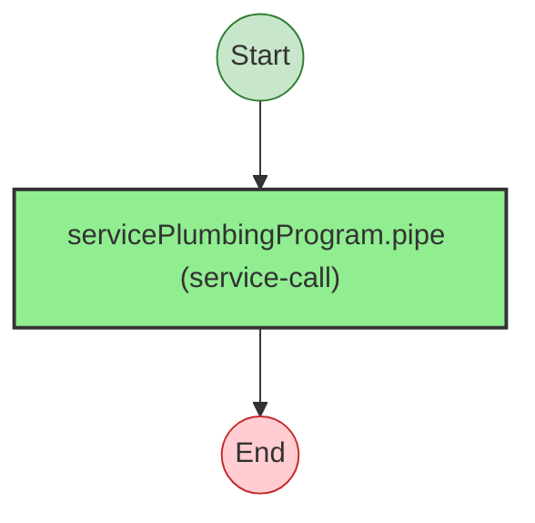


## Statistics

- **Total Effects**: 1


## Explanation

```
providedProgram (direct):
  1. Calls Effect.pipe — service-call

  Error paths: NotFound, RepoCrash
  Concurrency: sequential (no parallelism)
```


## Error Types

- `NotFound`
- `RepoCrash`


---

# Effect Analysis: streamProgram

## Metadata

- **File**: `/Users/jreehal/dev/node-examples/effect-analyzer/packages/effect-analyzer/src/__fixtures__/effect-kitchen-sink.ts`
- **Analyzed**: 2026-05-22T16:10:32.208Z
- **Source Type**: direct
- **TypeScript Version**: 6.0.2


## Effect Flow

```mermaid
flowchart TB

  %% Program: streamProgram

  start((Start))
  end_node((End))

  n1["Stream → fromIterable → mapEffect (stream)"]
  n2["Unknown: Could not determine effect type"]

  %% Edges
  n1 --> n2
  start --> n1
  n2 --> end_node

  %% Styles
  classDef startStyle fill:#c8e6c9,stroke:#2e7d32
  classDef endStyle fill:#ffcdd2,stroke:#c62828
  classDef streamStyle fill:#E0F7FA,stroke:#333,stroke-width:2px
  classDef unknownStyle fill:#D3D3D3,stroke:#333,stroke-width:1px
  class start startStyle
  class end_node endStyle
  class n1 streamStyle
  class n2 unknownStyle
```


## Statistics

- **Total Effects**: 2
- **Unknown Nodes**: 1


## Explanation

```
streamProgram (direct):
  1. Stream: fromIterable -> mapEffect
    (unknown: Could not determine effect type)
    mapEffect callback:
      Calls succeed — callback-call

  Concurrency: sequential (no parallelism)
```


---

# Effect Analysis: scheduledProgram

## Metadata

- **File**: `/Users/jreehal/dev/node-examples/effect-analyzer/packages/effect-analyzer/src/__fixtures__/effect-kitchen-sink.ts`
- **Analyzed**: 2026-05-22T16:10:32.212Z
- **Source Type**: direct
- **TypeScript Version**: 6.0.2


## Effect Flow

```mermaid
flowchart TB

  %% Program: scheduledProgram

  start((Start))
  end_node((End))

  n1["Pipe (1 steps)"]
  n2["Pipe (3 steps)"]
  n3["succeed"]
  n4["map (transform)"]
  n5["tap (transform)"]
  n6["flatMap (transform)"]
  n7["repeat (side-effect)"]

  %% Edges
  n3 --> n4
  n4 --> n5
  n5 --> n6
  n2 --> n3
  n6 --> n7
  n1 --> n2
  start --> n1
  n7 --> end_node

  %% Styles
  classDef startStyle fill:#c8e6c9,stroke:#2e7d32
  classDef endStyle fill:#ffcdd2,stroke:#c62828
  classDef effectStyle fill:#90EE90,stroke:#333,stroke-width:2px
  classDef pipeStyle fill:#ADD8E6,stroke:#333,stroke-width:2px
  classDef transformStyle fill:#A5D6A7,stroke:#388E3C,stroke-width:2px
  class start startStyle
  class end_node endStyle
  class n1 pipeStyle
  class n2 pipeStyle
  class n3 effectStyle
  class n4 transformStyle
  class n5 transformStyle
  class n6 transformStyle
  class n7 effectStyle
```


## Statistics

- **Total Effects**: 5


## Explanation

```
scheduledProgram (direct):
  1. Pipes pipe(succeed) through:
    Pipes succeed through:
      Calls succeed — constructor
      Transforms via map
      Transforms via tap
      Transforms via flatMap
    Calls repeat

  Error paths: E
  Concurrency: sequential (no parallelism)
```


## Error Types

- `E`

