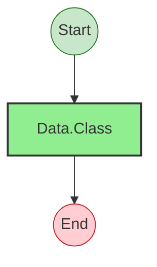
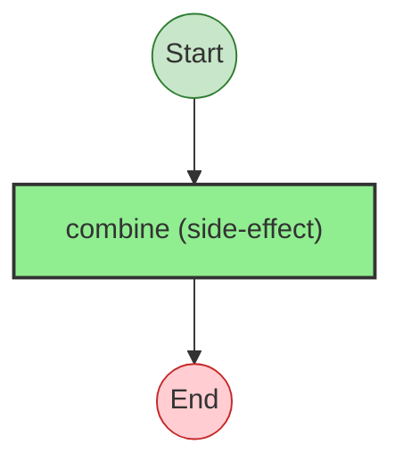

# Effect Analysis: MyPoint

## Metadata

- **File**: `/Users/jreehal/dev/node-examples/effect-analyzer/packages/effect-analyzer/src/__fixtures__/equal-hash-class.ts`
- **Analyzed**: 2026-05-22T16:10:32.277Z
- **Source Type**: class
- **TypeScript Version**: 6.0.2


## Effect Flow




## Statistics

- **Total Effects**: 1


## Explanation

```
MyPoint (class):
  1. Calls Data.Class — data

  Concurrency: sequential (no parallelism)
```


---

# Effect Analysis: MyPoint.[Hash.symbol]

## Metadata

- **File**: `/Users/jreehal/dev/node-examples/effect-analyzer/packages/effect-analyzer/src/__fixtures__/equal-hash-class.ts`
- **Analyzed**: 2026-05-22T16:10:32.279Z
- **Source Type**: classMethod
- **TypeScript Version**: 6.0.2


## Effect Flow




## Statistics

- **Total Effects**: 1


## Explanation

```
MyPoint.[Hash.symbol] (classMethod):
  1. Calls combine

  Concurrency: sequential (no parallelism)
```

