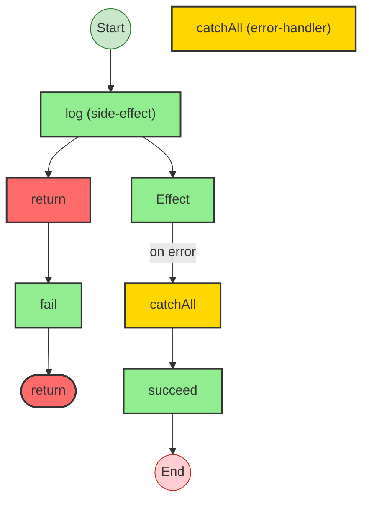
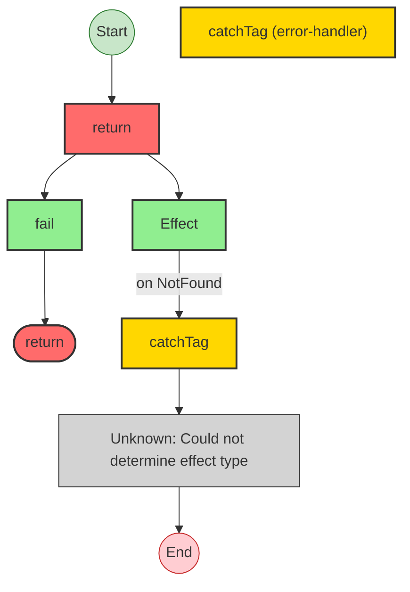
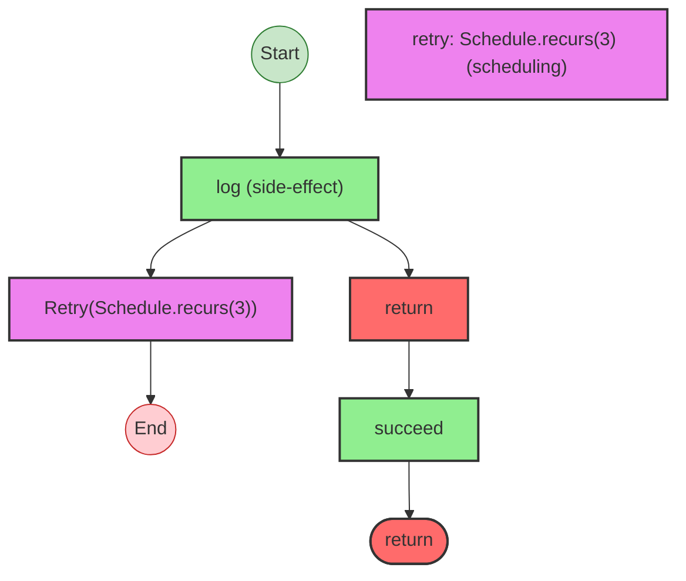
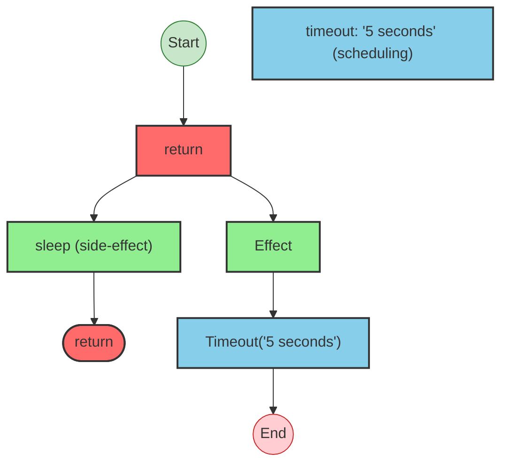
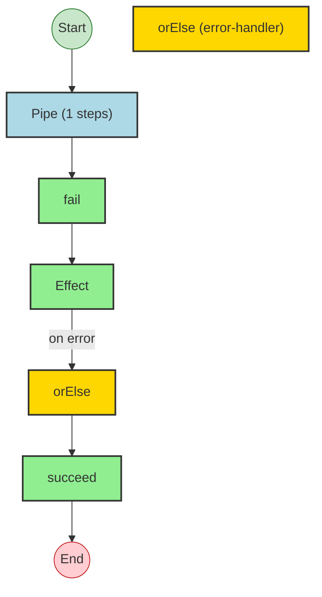
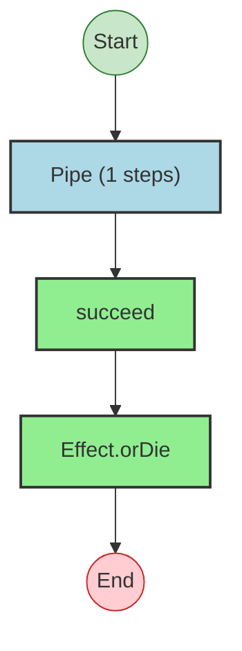

# Effect Analysis: catchAllProgram

## Metadata

- **File**: `/Users/jreehal/dev/node-examples/effect-analyzer/packages/effect-analyzer/src/__fixtures__/error-handling.ts`
- **Analyzed**: 2026-05-22T16:10:32.355Z
- **Source Type**: generator
- **TypeScript Version**: 6.0.2


## Effect Flow




## Statistics

- **Total Effects**: 4
- **Error Handlers**: 1


## Explanation

```
catchAllProgram (generator):
  1. Calls log
  2. Returns:
    Calls fail — constructor

  Error paths: string
  Concurrency: sequential (no parallelism)
```


## Error Types

- `string`


---

# Effect Analysis: catchTagProgram

## Metadata

- **File**: `/Users/jreehal/dev/node-examples/effect-analyzer/packages/effect-analyzer/src/__fixtures__/error-handling.ts`
- **Analyzed**: 2026-05-22T16:10:32.356Z
- **Source Type**: generator
- **TypeScript Version**: 6.0.2


## Effect Flow




## Statistics

- **Total Effects**: 2
- **Error Handlers**: 1
- **Unknown Nodes**: 1


## Explanation

```
catchTagProgram (generator):
  1. Returns:
    Calls fail — constructor

  Error paths: { _tag: "NotFound"; }
  Concurrency: sequential (no parallelism)
```


## Error Types

- `{ _tag: "NotFound"; }`


---

# Effect Analysis: retryProgram

## Metadata

- **File**: `/Users/jreehal/dev/node-examples/effect-analyzer/packages/effect-analyzer/src/__fixtures__/error-handling.ts`
- **Analyzed**: 2026-05-22T16:10:32.358Z
- **Source Type**: generator
- **TypeScript Version**: 6.0.2


## Effect Flow




## Statistics

- **Total Effects**: 2
- **Retry Operations**: 1


## Explanation

```
retryProgram (generator):
  1. Retries with Schedule.recurs(3):
    Calls log
    Returns:
      Calls succeed — constructor

  Concurrency: sequential (no parallelism)
```


---

# Effect Analysis: timeoutProgram

## Metadata

- **File**: `/Users/jreehal/dev/node-examples/effect-analyzer/packages/effect-analyzer/src/__fixtures__/error-handling.ts`
- **Analyzed**: 2026-05-22T16:10:32.359Z
- **Source Type**: generator
- **TypeScript Version**: 6.0.2


## Effect Flow




## Statistics

- **Total Effects**: 2
- **Timeout Operations**: 1


## Explanation

```
timeoutProgram (generator):
  1. Returns:
    Calls sleep

  Concurrency: sequential (no parallelism)
```


---

# Effect Analysis: orElseProgram

## Metadata

- **File**: `/Users/jreehal/dev/node-examples/effect-analyzer/packages/effect-analyzer/src/__fixtures__/error-handling.ts`
- **Analyzed**: 2026-05-22T16:10:32.360Z
- **Source Type**: direct
- **TypeScript Version**: 6.0.2


## Effect Flow




## Statistics

- **Total Effects**: 3
- **Error Handlers**: 1


## Explanation

```
orElseProgram (direct):
  1. Pipes fail through:
    Calls fail — constructor
    Falls back (orElse) on error:
      Calls Effect
      Handler:
        Calls succeed — constructor

  Error paths: string
  Concurrency: sequential (no parallelism)
```


## Error Types

- `string`


---

# Effect Analysis: orDieProgram

## Metadata

- **File**: `/Users/jreehal/dev/node-examples/effect-analyzer/packages/effect-analyzer/src/__fixtures__/error-handling.ts`
- **Analyzed**: 2026-05-22T16:10:32.361Z
- **Source Type**: direct
- **TypeScript Version**: 6.0.2


## Effect Flow




## Statistics

- **Total Effects**: 2


## Explanation

```
orDieProgram (direct):
  1. Pipes succeed through:
    Calls succeed — constructor
    Calls Effect.orDie

  Concurrency: sequential (no parallelism)
```

