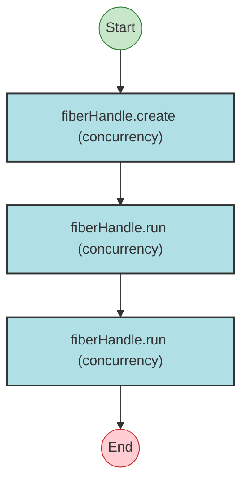

# Effect Analysis: handleProgram

## Metadata

- **File**: `/Users/jreehal/dev/node-examples/effect-analyzer/packages/effect-analyzer/src/__fixtures__/fiber-handle-lifecycle.ts`
- **Analyzed**: 2026-05-22T16:10:32.437Z
- **Source Type**: generator
- **TypeScript Version**: 6.0.2


## Effect Flow




## Statistics

- No operations found


## Explanation

```
handleProgram (generator):
  1. handle = fiberHandle.create
  2. fiberHandle.run
  3. fiberHandle.run

  Concurrency: sequential (no parallelism)
```

