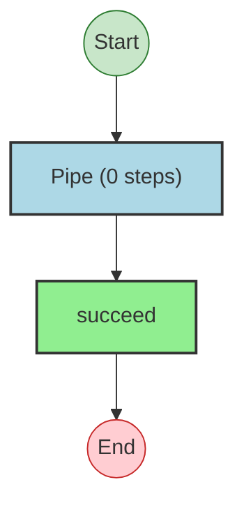
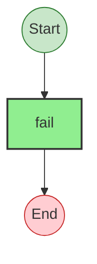
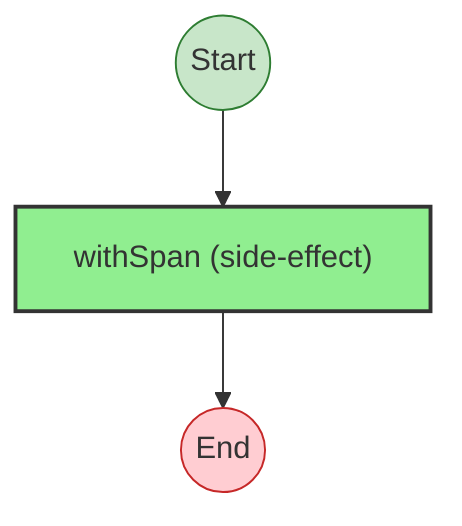

# Effect Analysis: pipeWithSpan

## Metadata

- **File**: `/Users/jreehal/dev/node-examples/effect-analyzer/packages/effect-analyzer/src/__fixtures__/generic-e-resolution.ts`
- **Analyzed**: 2026-05-22T16:10:32.506Z
- **Source Type**: pipe
- **TypeScript Version**: 6.0.2


## Effect Flow




## Statistics

- **Total Effects**: 2


## Explanation

```
pipeWithSpan (pipe):
  1. Pipes succeed through:
    Calls succeed — constructor

  Concurrency: sequential (no parallelism)
```


---

# Effect Analysis: inner

## Metadata

- **File**: `/Users/jreehal/dev/node-examples/effect-analyzer/packages/effect-analyzer/src/__fixtures__/generic-e-resolution.ts`
- **Analyzed**: 2026-05-22T16:10:32.506Z
- **Source Type**: direct
- **TypeScript Version**: 6.0.2


## Effect Flow




## Statistics

- **Total Effects**: 1


## Explanation

```
inner (direct):
  1. Calls fail — constructor

  Error paths: "oops"
  Concurrency: sequential (no parallelism)
```


## Error Types

- `"oops"`


---

# Effect Analysis: curriedWithSpan

## Metadata

- **File**: `/Users/jreehal/dev/node-examples/effect-analyzer/packages/effect-analyzer/src/__fixtures__/generic-e-resolution.ts`
- **Analyzed**: 2026-05-22T16:10:32.506Z
- **Source Type**: direct
- **TypeScript Version**: 6.0.2


## Effect Flow




## Statistics

- **Total Effects**: 1


## Explanation

```
curriedWithSpan (direct):
  1. Calls withSpan

  Error paths: "oops"
  Concurrency: sequential (no parallelism)
```


## Error Types

- `"oops"`

