# Effect Analysis: internalAliasProgram

## Metadata

- **File**: `/Users/jagreehal/dev/node-examples/effect-analyzer/src/__fixtures__/internal/alias.ts`
- **Analyzed**: 2026-03-09T06:36:28.335Z
- **Source Type**: direct
- **TypeScript Version**: 5.9.2

## Effect Flow

```mermaid
flowchart TB

  %% Program: internalAliasProgram

  start((Start))
  end_node((End))

  n1["Effect.succeed <string, never, never> <string, never, never>"]

  %% Edges
  start --> n1
  n1 --> end_node

  %% Styles
  classDef startStyle fill:#c8e6c9,stroke:#2e7d32
  classDef endStyle fill:#ffcdd2,stroke:#c62828
  classDef effectStyle fill:#90EE90,stroke:#333,stroke-width:2px
  classDef generatorStyle fill:#FFB6C1,stroke:#333,stroke-width:2px
  classDef pipeStyle fill:#ADD8E6,stroke:#333,stroke-width:2px
  classDef parallelStyle fill:#FFA500,stroke:#333,stroke-width:2px
  classDef raceStyle fill:#FF6347,stroke:#333,stroke-width:2px
  classDef errorHandlerStyle fill:#FFD700,stroke:#333,stroke-width:2px
  classDef retryStyle fill:#EE82EE,stroke:#333,stroke-width:2px
  classDef timeoutStyle fill:#87CEEB,stroke:#333,stroke-width:2px
  classDef resourceStyle fill:#98FB98,stroke:#333,stroke-width:2px
  classDef conditionalStyle fill:#DDA0DD,stroke:#333,stroke-width:2px
  classDef loopStyle fill:#F0E68C,stroke:#333,stroke-width:2px
  classDef layerStyle fill:#E6E6FA,stroke:#333,stroke-width:2px
  classDef streamStyle fill:#E0F7FA,stroke:#333,stroke-width:2px
  classDef concurrencyPrimitiveStyle fill:#B0E0E6,stroke:#333,stroke-width:2px
  classDef fiberStyle fill:#DDA0DD,stroke:#333,stroke-width:2px
  classDef decisionStyle fill:#DDA0DD,stroke:#333,stroke-width:2px
  classDef switchStyle fill:#FFD700,stroke:#333,stroke-width:2px
  classDef tryCatchStyle fill:#FFE4B5,stroke:#333,stroke-width:2px
  classDef terminalStyle fill:#FF6B6B,stroke:#333,stroke-width:2px
  classDef opaqueStyle fill:#FF9800,stroke:#333,stroke-width:2px
  classDef unknownStyle fill:#D3D3D3,stroke:#333,stroke-width:1px
  classDef causeStyle fill:#FF8A80,stroke:#D32F2F,stroke-width:2px
  classDef exitStyle fill:#B39DDB,stroke:#512DA8,stroke-width:2px
  classDef scheduleStyle fill:#80DEEA,stroke:#00838F,stroke-width:2px
  classDef matchStyle fill:#FFE082,stroke:#F57F17,stroke-width:2px
  classDef transformStyle fill:#A5D6A7,stroke:#388E3C,stroke-width:2px
  classDef channelStyle fill:#90CAF9,stroke:#1565C0,stroke-width:2px
  classDef sinkStyle fill:#CE93D8,stroke:#7B1FA2,stroke-width:2px
  classDef interruptionStyle fill:#FFAB91,stroke:#BF360C,stroke-width:2px
  class start startStyle
  class end_node endStyle
  class n1 effectStyle
```

## Statistics

- **Total Effects**: 1

