# Effect Analysis: genWithServices

## Metadata

- **File**: `/Users/jreehal/dev/node-examples/effect-analyzer/packages/effect-analyzer/src/__fixtures__/kitchen-sink.ts`
- **Analyzed**: 2026-05-22T16:10:32.657Z
- **Source Type**: generator
- **TypeScript Version**: 6.0.2


## Effect Flow

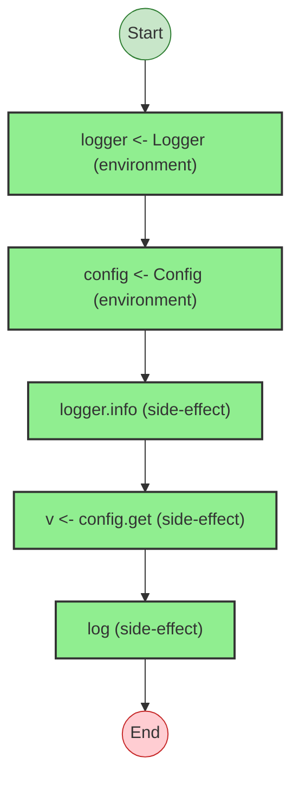


## Statistics

- **Total Effects**: 5


## Explanation

```
genWithServices (generator):
  1. Yields logger <- Logger
  2. Yields config <- Config
  3. Calls logger.info
  4. Yields v <- config.get
  5. Calls log

  Concurrency: sequential (no parallelism)
```


---

# Effect Analysis: parallelProgram

## Metadata

- **File**: `/Users/jreehal/dev/node-examples/effect-analyzer/packages/effect-analyzer/src/__fixtures__/kitchen-sink.ts`
- **Analyzed**: 2026-05-22T16:10:32.662Z
- **Source Type**: generator
- **TypeScript Version**: 6.0.2


## Effect Flow

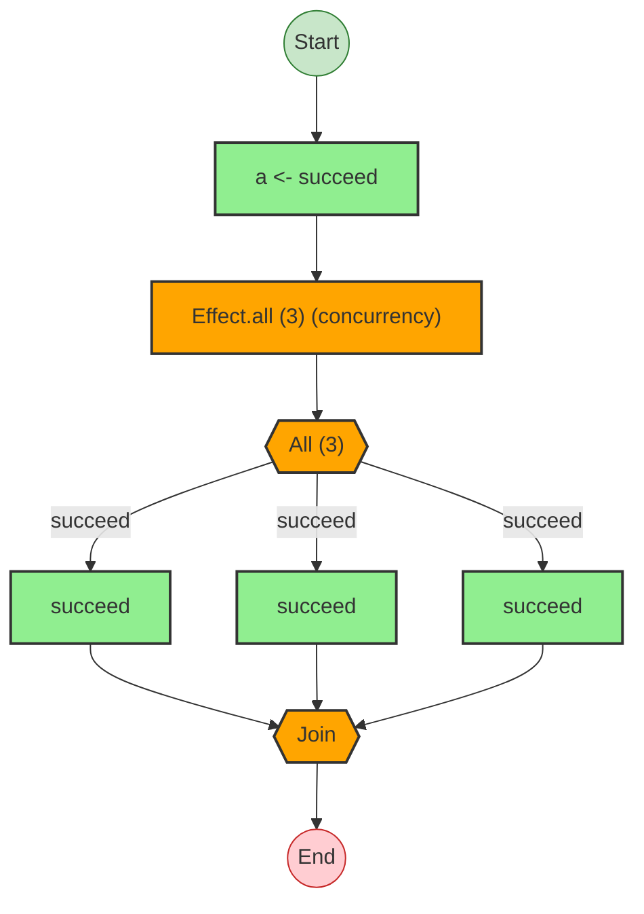


## Statistics

- **Total Effects**: 4
- **Parallel Operations**: 1


## Explanation

```
parallelProgram (generator):
  1. Yields a <- succeed
  2. [x, y, z] = Runs 3 effects in sequential:
    Calls succeed — constructor
    Calls succeed — constructor
    Calls succeed — constructor

  Concurrency: uses parallelism / racing
```


---

# Effect Analysis: raceProgram

## Metadata

- **File**: `/Users/jreehal/dev/node-examples/effect-analyzer/packages/effect-analyzer/src/__fixtures__/kitchen-sink.ts`
- **Analyzed**: 2026-05-22T16:10:32.663Z
- **Source Type**: generator
- **TypeScript Version**: 6.0.2


## Effect Flow

```mermaid
flowchart TB

  %% Program: raceProgram

  start((Start))
  end_node((End))

  n2["return"]
  term_3(["return"])
  n4["Effect.race (2 racing) (concurrency)"]
  race_fork_5{{{"Race (2)"}}}
  race_join_5{{{"Winner"}}}
  n6["succeed"]
  n7["succeed"]

  %% Edges
  n4 --> race_fork_5
  race_fork_5 -->|succeed| n6
  n6 --> race_join_5
  race_fork_5 -->|succeed| n7
  n7 --> race_join_5
  n2 --> n4
  race_join_5 --> term_3
  start --> n2
  n2 --> end_node

  %% Styles
  classDef startStyle fill:#c8e6c9,stroke:#2e7d32
  classDef endStyle fill:#ffcdd2,stroke:#c62828
  classDef effectStyle fill:#90EE90,stroke:#333,stroke-width:2px
  classDef raceStyle fill:#FF6347,stroke:#333,stroke-width:2px
  classDef terminalStyle fill:#FF6B6B,stroke:#333,stroke-width:2px
  class start startStyle
  class end_node endStyle
  class n2 terminalStyle
  class term_3 terminalStyle
  class n4 raceStyle
  class race_fork_5 raceStyle
  class race_join_5 raceStyle
  class n6 effectStyle
  class n7 effectStyle
```


## Statistics

- **Total Effects**: 2
- **Race Operations**: 1


## Explanation

```
raceProgram (generator):
  1. Returns:
    Races 2 effects:
      Calls succeed — constructor
      Calls succeed — constructor

  Concurrency: uses parallelism / racing
```


---

# Effect Analysis: streamProgram

## Metadata

- **File**: `/Users/jreehal/dev/node-examples/effect-analyzer/packages/effect-analyzer/src/__fixtures__/kitchen-sink.ts`
- **Analyzed**: 2026-05-22T16:10:32.666Z
- **Source Type**: generator
- **TypeScript Version**: 6.0.2


## Effect Flow

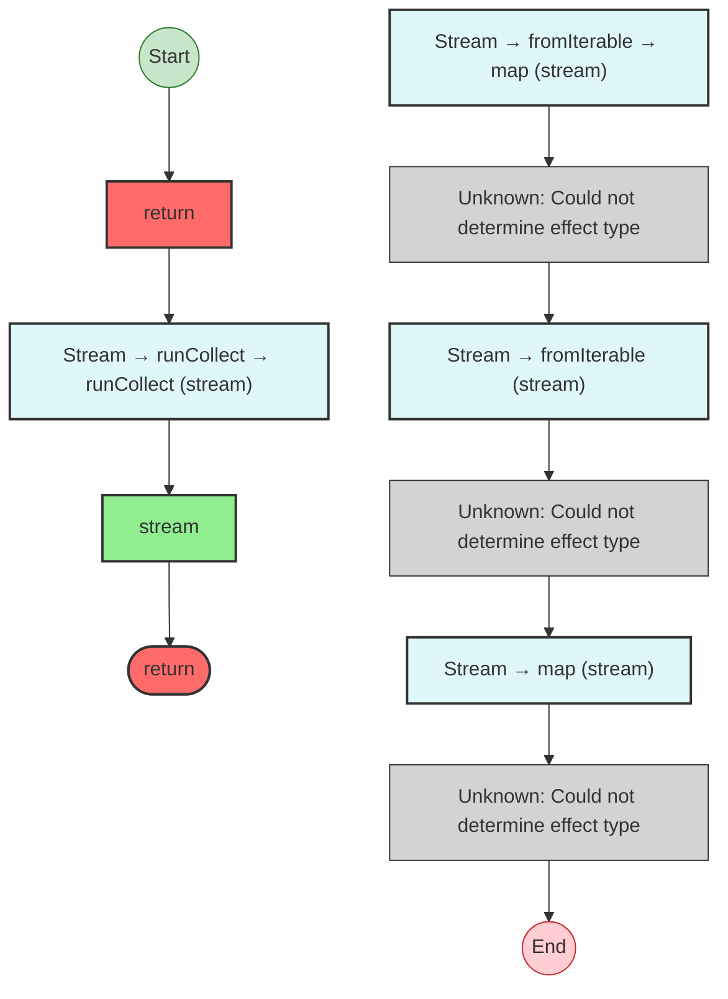


## Statistics

- **Total Effects**: 1
- **Unknown Nodes**: 4


## Explanation

```
streamProgram (generator):
  1. Returns:
    Stream: runCollect -> runCollect
      Calls stream
  2. Stream: fromIterable -> map
    (unknown: Could not determine effect type)
    map callback:
      Calls n * 2 — callback-transform
  3. Stream: fromIterable
    (unknown: Could not determine effect type)
  4. Stream: map
    (unknown: Could not determine effect type)
    map callback:
      Calls n * 2 — callback-transform

  Concurrency: sequential (no parallelism)
```


---

# Effect Analysis: schemaProgram

## Metadata

- **File**: `/Users/jreehal/dev/node-examples/effect-analyzer/packages/effect-analyzer/src/__fixtures__/kitchen-sink.ts`
- **Analyzed**: 2026-05-22T16:10:32.681Z
- **Source Type**: generator
- **TypeScript Version**: 6.0.2


## Effect Flow

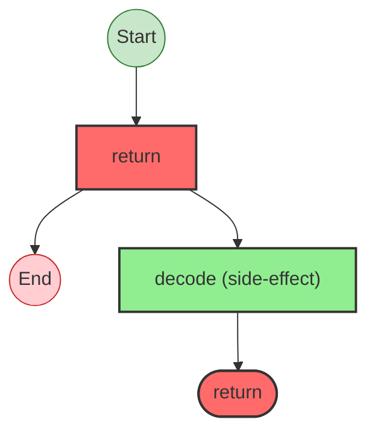


## Statistics

- **Total Effects**: 1


## Explanation

```
schemaProgram (generator):
  1. Returns:
    Calls decode — schema

  Error paths: ParseError
  Concurrency: sequential (no parallelism)
```


## Error Types

- `ParseError`


---

# Effect Analysis: errorHandlingProgram

## Metadata

- **File**: `/Users/jreehal/dev/node-examples/effect-analyzer/packages/effect-analyzer/src/__fixtures__/kitchen-sink.ts`
- **Analyzed**: 2026-05-22T16:10:32.682Z
- **Source Type**: generator
- **TypeScript Version**: 6.0.2


## Effect Flow

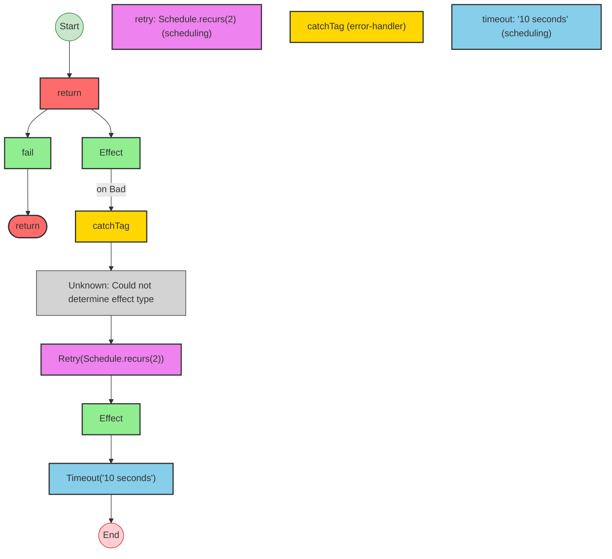


## Statistics

- **Total Effects**: 3
- **Error Handlers**: 1
- **Retry Operations**: 1
- **Timeout Operations**: 1
- **Unknown Nodes**: 1


## Explanation

```
errorHandlingProgram (generator):
  1. Retries with Schedule.recurs(2):
    Returns:
      Calls fail — constructor
    Catches tag "Bad" on:
      Calls Effect
      Handler:
        (unknown: Could not determine effect type)
  2. Times out after '10 seconds':
    Calls Effect

  Error paths: { _tag: "Bad"; }
  Concurrency: sequential (no parallelism)
```


## Error Types

- `{ _tag: "Bad"; }`


---

# Effect Analysis: fiberProgram

## Metadata

- **File**: `/Users/jreehal/dev/node-examples/effect-analyzer/packages/effect-analyzer/src/__fixtures__/kitchen-sink.ts`
- **Analyzed**: 2026-05-22T16:10:32.688Z
- **Source Type**: generator
- **TypeScript Version**: 6.0.2


## Effect Flow

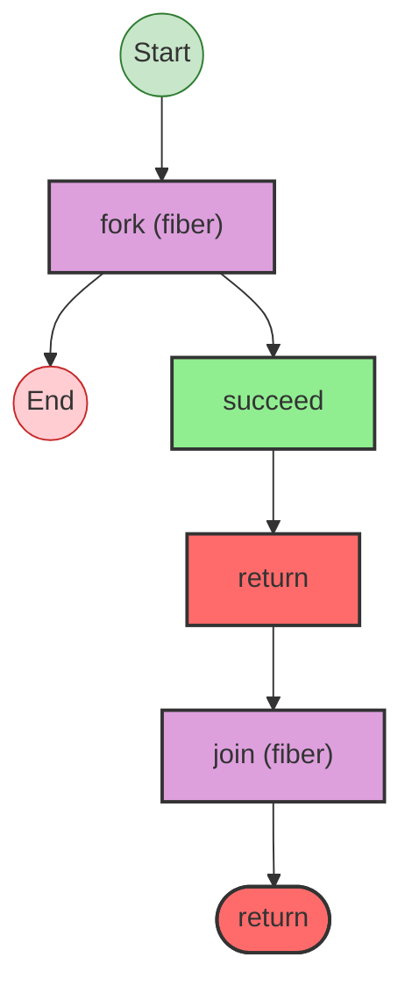


## Statistics

- **Total Effects**: 1


## Explanation

```
fiberProgram (generator):
  1. fiber = Fiber fork:
    Calls succeed — constructor
  2. Returns:
    Fiber join:

  Concurrency: sequential (no parallelism)
```


---

# Effect Analysis: scopedProgram

## Metadata

- **File**: `/Users/jreehal/dev/node-examples/effect-analyzer/packages/effect-analyzer/src/__fixtures__/kitchen-sink.ts`
- **Analyzed**: 2026-05-22T16:10:32.690Z
- **Source Type**: generator
- **TypeScript Version**: 6.0.2


## Effect Flow

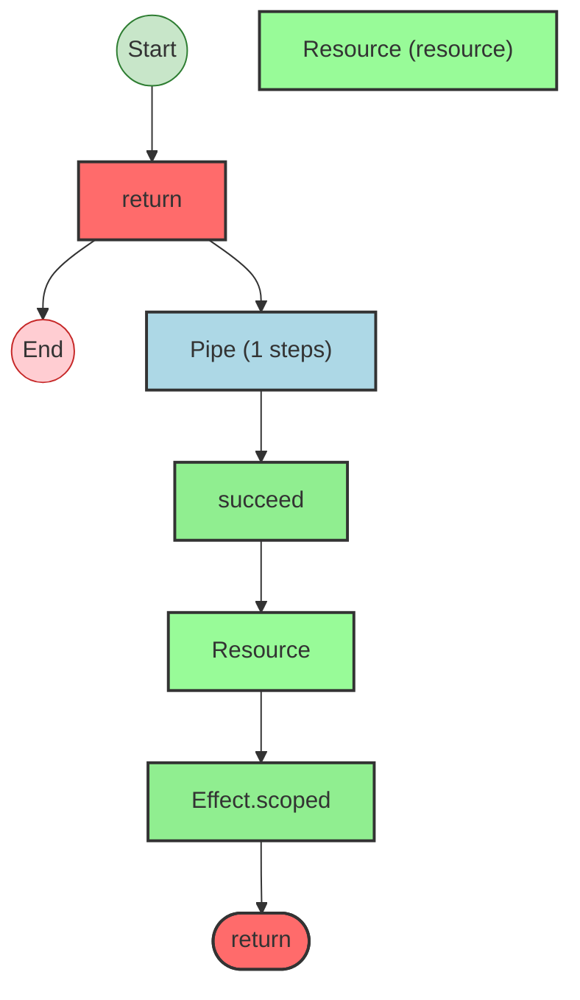


## Statistics

- **Total Effects**: 3
- **Resources**: 1


## Explanation

```
scopedProgram (generator):
  1. Returns:
    Pipes acquireRelease through:
      Acquires resource:
        Calls succeed — constructor
        Then releases:
          Calls Effect.void
      Calls Effect.scoped

  Concurrency: sequential (no parallelism)
```


---

# Effect Analysis: LoggerLive

## Metadata

- **File**: `/Users/jreehal/dev/node-examples/effect-analyzer/packages/effect-analyzer/src/__fixtures__/kitchen-sink.ts`
- **Analyzed**: 2026-05-22T16:10:32.692Z
- **Source Type**: direct
- **TypeScript Version**: 6.0.2


## Effect Flow


## Statistics

- **Total Effects**: 1
- **Unknown Nodes**: 1


## Explanation

```
LoggerLive (direct):
  1. Provides layer providing Logger:
    Calls Logger
    (unknown: Could not determine effect type)

  Concurrency: sequential (no parallelism)
```


---

# Effect Analysis: ConfigLive

## Metadata

- **File**: `/Users/jreehal/dev/node-examples/effect-analyzer/packages/effect-analyzer/src/__fixtures__/kitchen-sink.ts`
- **Analyzed**: 2026-05-22T16:10:32.693Z
- **Source Type**: direct
- **TypeScript Version**: 6.0.2


## Effect Flow

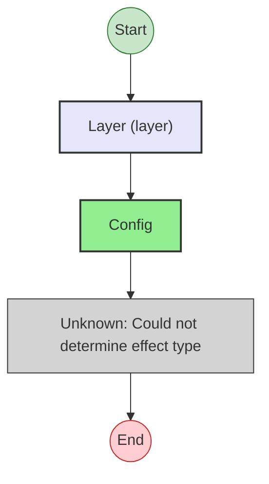


## Statistics

- **Total Effects**: 1
- **Unknown Nodes**: 1


## Explanation

```
ConfigLive (direct):
  1. Provides layer providing Config:
    Calls Config
    (unknown: Could not determine effect type)

  Concurrency: sequential (no parallelism)
```


---

# Effect Analysis: AppLayer

## Metadata

- **File**: `/Users/jreehal/dev/node-examples/effect-analyzer/packages/effect-analyzer/src/__fixtures__/kitchen-sink.ts`
- **Analyzed**: 2026-05-22T16:10:32.694Z
- **Source Type**: direct
- **TypeScript Version**: 6.0.2


## Effect Flow

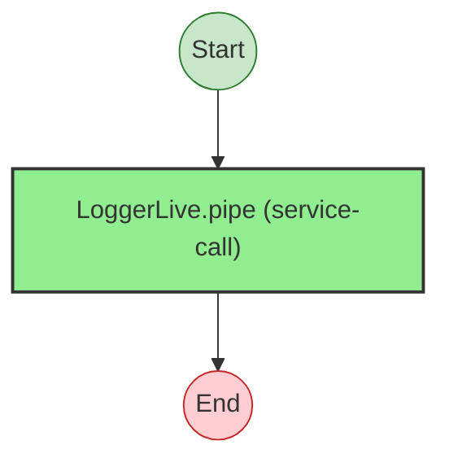


## Statistics

- **Total Effects**: 1


## Explanation

```
AppLayer (direct):
  1. Calls Layer.pipe — service-call

  Services required: Layer
  Concurrency: sequential (no parallelism)
```


---

# Effect Analysis: UserSchema

## Metadata

- **File**: `/Users/jreehal/dev/node-examples/effect-analyzer/packages/effect-analyzer/src/__fixtures__/kitchen-sink.ts`
- **Analyzed**: 2026-05-22T16:10:32.696Z
- **Source Type**: direct
- **TypeScript Version**: 6.0.2


## Effect Flow

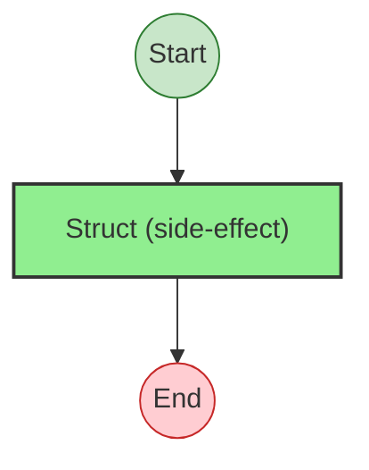


## Statistics

- **Total Effects**: 1


## Explanation

```
UserSchema (direct):
  1. Calls Struct — schema

  Concurrency: sequential (no parallelism)
```


---

# Effect Analysis: resourceProgram

## Metadata

- **File**: `/Users/jreehal/dev/node-examples/effect-analyzer/packages/effect-analyzer/src/__fixtures__/kitchen-sink.ts`
- **Analyzed**: 2026-05-22T16:10:32.698Z
- **Source Type**: direct
- **TypeScript Version**: 6.0.2


## Effect Flow

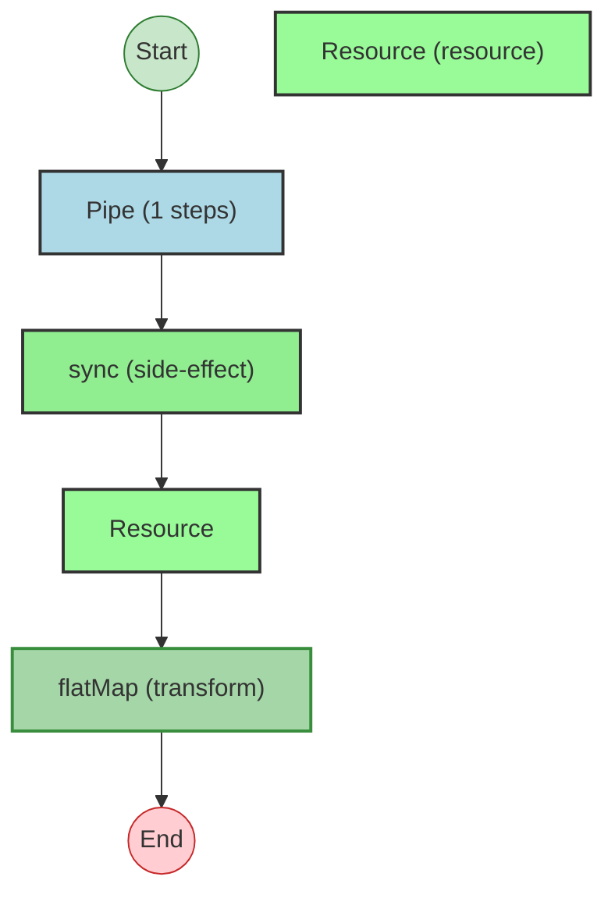


## Statistics

- **Total Effects**: 3
- **Resources**: 1


## Explanation

```
resourceProgram (direct):
  1. Pipes acquireRelease through:
    Acquires resource:
      Calls sync — constructor
      Then releases:
        Calls sync — constructor
    Transforms via flatMap

  Concurrency: sequential (no parallelism)
```


---

# Effect Analysis: conditionalProgram

## Metadata

- **File**: `/Users/jreehal/dev/node-examples/effect-analyzer/packages/effect-analyzer/src/__fixtures__/kitchen-sink.ts`
- **Analyzed**: 2026-05-22T16:10:32.699Z
- **Source Type**: direct
- **TypeScript Version**: 6.0.2


## Effect Flow

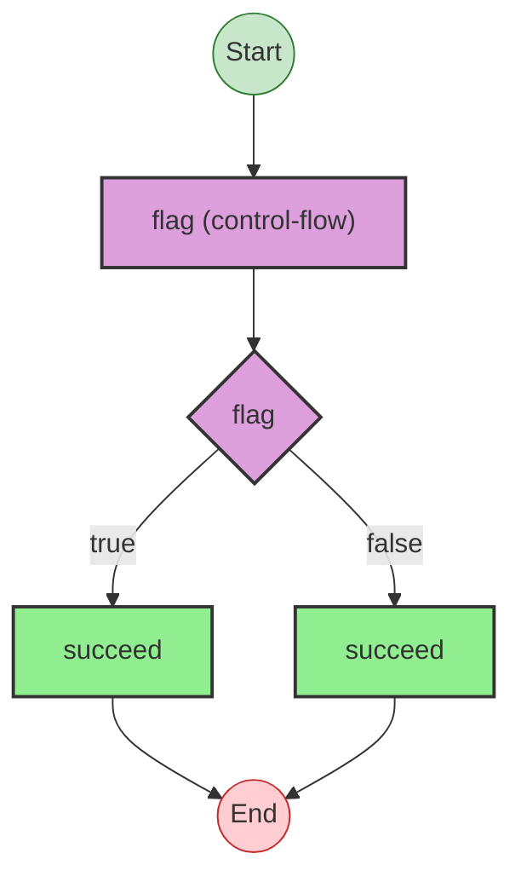


## Statistics

- **Total Effects**: 2
- **Conditionals**: 1


## Explanation

```
conditionalProgram (direct):
  1. If flag:
    Calls succeed — constructor
  2. Else:
    Calls succeed — constructor

  Concurrency: sequential (no parallelism)
```


---

# Effect Analysis: loopProgram

## Metadata

- **File**: `/Users/jreehal/dev/node-examples/effect-analyzer/packages/effect-analyzer/src/__fixtures__/kitchen-sink.ts`
- **Analyzed**: 2026-05-22T16:10:32.701Z
- **Source Type**: direct
- **TypeScript Version**: 6.0.2


## Effect Flow

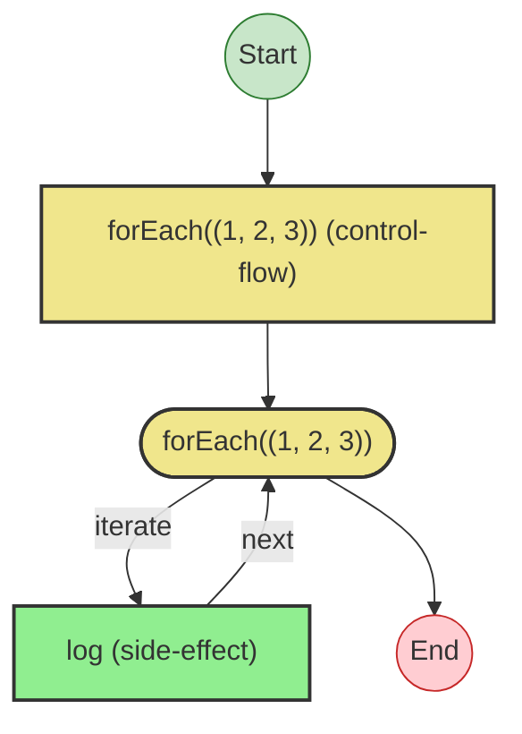


## Statistics

- **Loops**: 1


## Explanation

```
loopProgram (direct):
  1. Iterates (forEach) over [1, 2, 3]:
    Calls log — callback-call
    Callback:
      Calls log — callback-call

  Concurrency: sequential (no parallelism)
```


---

# Effect Analysis: pipeChainProgram

## Metadata

- **File**: `/Users/jreehal/dev/node-examples/effect-analyzer/packages/effect-analyzer/src/__fixtures__/kitchen-sink.ts`
- **Analyzed**: 2026-05-22T16:10:32.704Z
- **Source Type**: direct
- **TypeScript Version**: 6.0.2


## Effect Flow

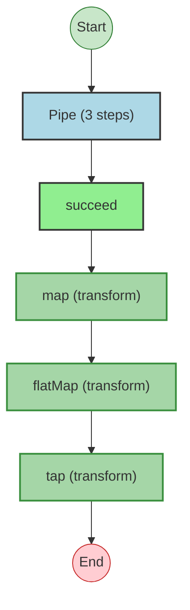


## Statistics

- **Total Effects**: 4


## Explanation

```
pipeChainProgram (direct):
  1. Pipes succeed through:
    Calls succeed — constructor
    Transforms via map
    Transforms via flatMap
    Transforms via tap

  Concurrency: sequential (no parallelism)
```


---

# Effect Analysis: Logger

## Metadata

- **File**: `/Users/jreehal/dev/node-examples/effect-analyzer/packages/effect-analyzer/src/__fixtures__/kitchen-sink.ts`
- **Analyzed**: 2026-05-22T16:10:32.704Z
- **Source Type**: class
- **TypeScript Version**: 6.0.2


## Effect Flow

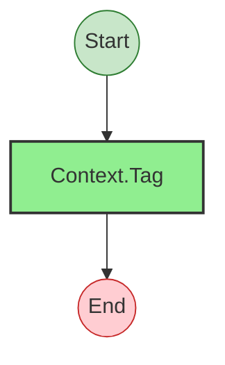


## Statistics

- **Total Effects**: 1


## Explanation

```
Logger (class):
  1. Calls Context.Tag — service-tag

  Concurrency: sequential (no parallelism)
```


---

# Effect Analysis: Config

## Metadata

- **File**: `/Users/jreehal/dev/node-examples/effect-analyzer/packages/effect-analyzer/src/__fixtures__/kitchen-sink.ts`
- **Analyzed**: 2026-05-22T16:10:32.704Z
- **Source Type**: class
- **TypeScript Version**: 6.0.2


## Effect Flow


## Statistics

- **Total Effects**: 1


## Explanation

```
Config (class):
  1. Calls Context.Tag — service-tag

  Concurrency: sequential (no parallelism)
```

