# Effect Analysis: swallowedErrorProgram

## Metadata

- **File**: `/Users/jreehal/dev/node-examples/effect-analyzer/packages/effect-analyzer/src/__fixtures__/lint-issues-extra.ts`
- **Analyzed**: 2026-05-22T16:10:32.787Z
- **Source Type**: generator
- **TypeScript Version**: 6.0.2


## Effect Flow

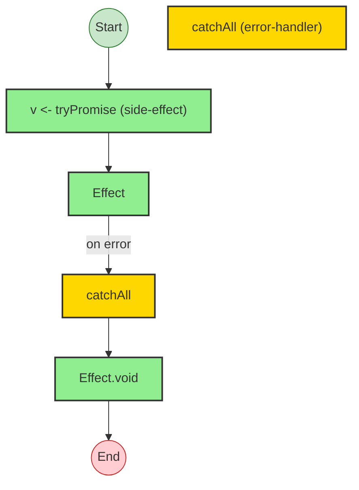


## Statistics

- **Total Effects**: 3
- **Error Handlers**: 1


## Explanation

```
swallowedErrorProgram (generator):
  1. Yields v <- tryPromise

  Error paths: Error
  Concurrency: sequential (no parallelism)
```


## Error Types

- `Error`


---

# Effect Analysis: swallowedErrorWithLog

## Metadata

- **File**: `/Users/jreehal/dev/node-examples/effect-analyzer/packages/effect-analyzer/src/__fixtures__/lint-issues-extra.ts`
- **Analyzed**: 2026-05-22T16:10:32.790Z
- **Source Type**: generator
- **TypeScript Version**: 6.0.2


## Effect Flow

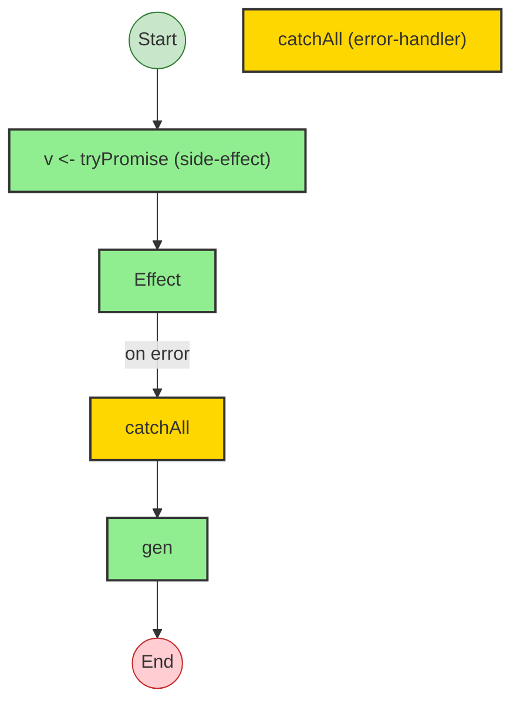


## Statistics

- **Total Effects**: 3
- **Error Handlers**: 1


## Explanation

```
swallowedErrorWithLog (generator):
  1. Yields v <- tryPromise

  Error paths: Error
  Concurrency: sequential (no parallelism)
```


## Error Types

- `Error`


---

# Effect Analysis: swallowedErrorWithLog

## Metadata

- **File**: `/Users/jreehal/dev/node-examples/effect-analyzer/packages/effect-analyzer/src/__fixtures__/lint-issues-extra.ts`
- **Analyzed**: 2026-05-22T16:10:32.791Z
- **Source Type**: generator
- **TypeScript Version**: 6.0.2


## Effect Flow

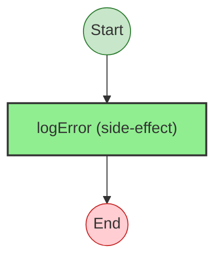


## Statistics

- **Total Effects**: 1


## Explanation

```
swallowedErrorWithLog (generator):
  1. Calls logError

  Concurrency: sequential (no parallelism)
```


---

# Effect Analysis: largeGenBlock

## Metadata

- **File**: `/Users/jreehal/dev/node-examples/effect-analyzer/packages/effect-analyzer/src/__fixtures__/lint-issues-extra.ts`
- **Analyzed**: 2026-05-22T16:10:32.796Z
- **Source Type**: generator
- **TypeScript Version**: 6.0.2


## Effect Flow

```mermaid
flowchart TB

  %% Program: largeGenBlock

  start((Start))
  end_node((End))

  n2["a1 <- succeed"]
  n3["a2 <- succeed"]
  n4["a3 <- succeed"]
  n5["a4 <- succeed"]
  n6["a5 <- succeed"]
  n7["a6 <- succeed"]
  n8["a7 <- succeed"]
  n9["a8 <- succeed"]
  n10["a9 <- succeed"]
  n11["a10 <- succeed"]
  n12["a11 <- succeed"]
  n13["a12 <- succeed"]
  n14["a13 <- succeed"]
  n15["a14 <- succeed"]
  n16["a15 <- succeed"]
  n17["a16 <- succeed"]
  n18["a17 <- succeed"]
  n19["a18 <- succeed"]
  n20["a19 <- succeed"]
  n21["a20 <- succeed"]
  n22["a21 <- succeed"]
  n23["a22 <- succeed"]
  n24["a23 <- succeed"]
  n25["a24 <- succeed"]
  n26["a25 <- succeed"]
  n27["a26 <- succeed"]
  n28["a27 <- succeed"]

  %% Edges
  n2 --> n3
  n3 --> n4
  n4 --> n5
  n5 --> n6
  n6 --> n7
  n7 --> n8
  n8 --> n9
  n9 --> n10
  n10 --> n11
  n11 --> n12
  n12 --> n13
  n13 --> n14
  n14 --> n15
  n15 --> n16
  n16 --> n17
  n17 --> n18
  n18 --> n19
  n19 --> n20
  n20 --> n21
  n21 --> n22
  n22 --> n23
  n23 --> n24
  n24 --> n25
  n25 --> n26
  n26 --> n27
  n27 --> n28
  start --> n2
  n28 --> end_node

  %% Styles
  classDef startStyle fill:#c8e6c9,stroke:#2e7d32
  classDef endStyle fill:#ffcdd2,stroke:#c62828
  classDef effectStyle fill:#90EE90,stroke:#333,stroke-width:2px
  class start startStyle
  class end_node endStyle
  class n2 effectStyle
  class n3 effectStyle
  class n4 effectStyle
  class n5 effectStyle
  class n6 effectStyle
  class n7 effectStyle
  class n8 effectStyle
  class n9 effectStyle
  class n10 effectStyle
  class n11 effectStyle
  class n12 effectStyle
  class n13 effectStyle
  class n14 effectStyle
  class n15 effectStyle
  class n16 effectStyle
  class n17 effectStyle
  class n18 effectStyle
  class n19 effectStyle
  class n20 effectStyle
  class n21 effectStyle
  class n22 effectStyle
  class n23 effectStyle
  class n24 effectStyle
  class n25 effectStyle
  class n26 effectStyle
  class n27 effectStyle
  class n28 effectStyle
```


## Statistics

- **Total Effects**: 27


## Explanation

```
largeGenBlock (generator):
  1. Yields a1 <- succeed
  2. Yields a2 <- succeed
  3. Yields a3 <- succeed
  4. Yields a4 <- succeed
  5. Yields a5 <- succeed
  6. Yields a6 <- succeed
  7. Yields a7 <- succeed
  8. Yields a8 <- succeed
  9. Yields a9 <- succeed
  10. Yields a10 <- succeed
  11. Yields a11 <- succeed
  12. Yields a12 <- succeed
  13. Yields a13 <- succeed
  14. Yields a14 <- succeed
  15. Yields a15 <- succeed
  16. Yields a16 <- succeed
  17. Yields a17 <- succeed
  18. Yields a18 <- succeed
  19. Yields a19 <- succeed
  20. Yields a20 <- succeed
  21. Yields a21 <- succeed
  22. Yields a22 <- succeed
  23. Yields a23 <- succeed
  24. Yields a24 <- succeed
  25. Yields a25 <- succeed
  26. Yields a26 <- succeed
  27. Yields a27 <- succeed

  Concurrency: sequential (no parallelism)
```


---

# Effect Analysis: smallGenBlock

## Metadata

- **File**: `/Users/jreehal/dev/node-examples/effect-analyzer/packages/effect-analyzer/src/__fixtures__/lint-issues-extra.ts`
- **Analyzed**: 2026-05-22T16:10:32.797Z
- **Source Type**: generator
- **TypeScript Version**: 6.0.2


## Effect Flow

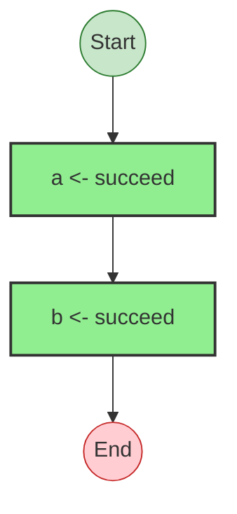


## Statistics

- **Total Effects**: 2


## Explanation

```
smallGenBlock (generator):
  1. Yields a <- succeed
  2. Yields b <- succeed

  Concurrency: sequential (no parallelism)
```


---

# Effect Analysis: provideMergeChainProgram

## Metadata

- **File**: `/Users/jreehal/dev/node-examples/effect-analyzer/packages/effect-analyzer/src/__fixtures__/lint-issues-extra.ts`
- **Analyzed**: 2026-05-22T16:10:32.802Z
- **Source Type**: generator
- **TypeScript Version**: 6.0.2


## Effect Flow

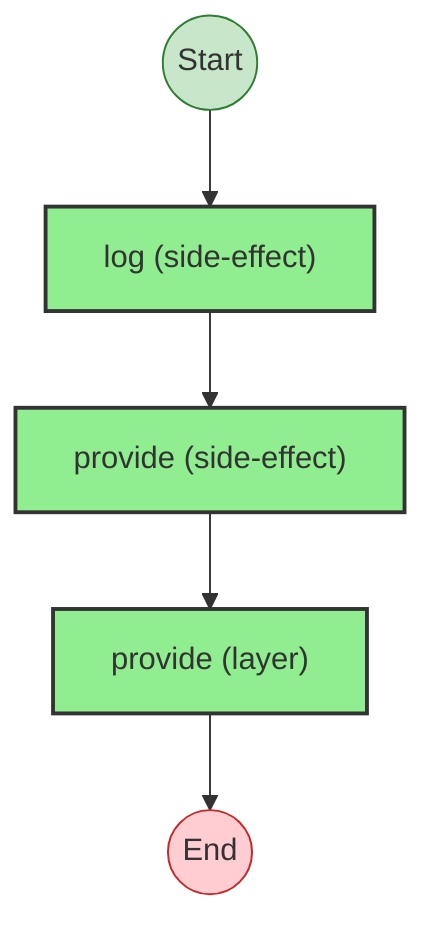


## Statistics

- **Total Effects**: 3


## Explanation

```
provideMergeChainProgram (generator):
  1. Calls log

  Error paths: E
  Concurrency: sequential (no parallelism)
```


## Error Types

- `E`


---

# Effect Analysis: sequentialFailValidation

## Metadata

- **File**: `/Users/jreehal/dev/node-examples/effect-analyzer/packages/effect-analyzer/src/__fixtures__/lint-issues-extra.ts`
- **Analyzed**: 2026-05-22T16:10:32.803Z
- **Source Type**: generator
- **TypeScript Version**: 6.0.2


## Effect Flow

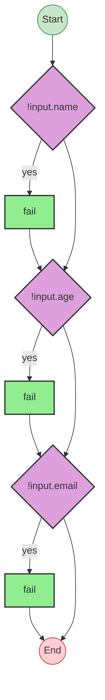


## Statistics

- **Total Effects**: 3


## Explanation

```
sequentialFailValidation (generator):
  1. If !input.name:
    Calls fail — constructor
  2. If !input.age:
    Calls fail — constructor
  3. If !input.email:
    Calls fail — constructor

  Error paths: Error
  Concurrency: sequential (no parallelism)
```


## Error Types

- `Error`


---

# Effect Analysis: deferredNoResolve

## Metadata

- **File**: `/Users/jreehal/dev/node-examples/effect-analyzer/packages/effect-analyzer/src/__fixtures__/lint-issues-extra.ts`
- **Analyzed**: 2026-05-22T16:10:32.805Z
- **Source Type**: generator
- **TypeScript Version**: 6.0.2


## Effect Flow

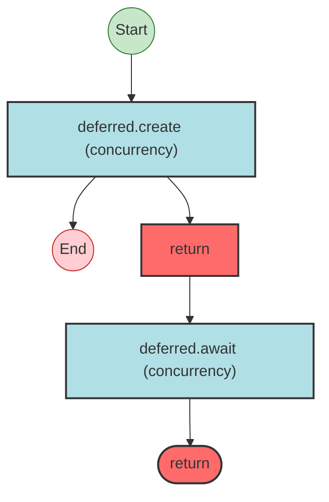


## Statistics

- No operations found


## Explanation

```
deferredNoResolve (generator):
  1. d = deferred.create
  2. Returns:
    deferred.await

  Concurrency: sequential (no parallelism)
```


---

# Effect Analysis: deferredResolved

## Metadata

- **File**: `/Users/jreehal/dev/node-examples/effect-analyzer/packages/effect-analyzer/src/__fixtures__/lint-issues-extra.ts`
- **Analyzed**: 2026-05-22T16:10:32.807Z
- **Source Type**: generator
- **TypeScript Version**: 6.0.2


## Effect Flow

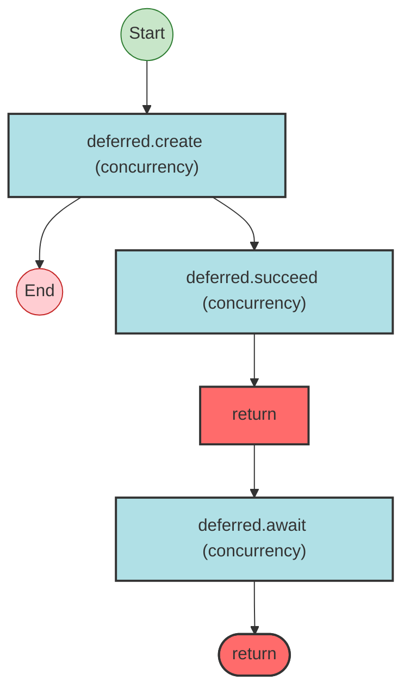


## Statistics

- No operations found


## Explanation

```
deferredResolved (generator):
  1. d = deferred.create
  2. deferred.succeed
  3. Returns:
    deferred.await

  Concurrency: sequential (no parallelism)
```


---

# Effect Analysis: run-10

## Metadata

- **File**: `/Users/jreehal/dev/node-examples/effect-analyzer/packages/effect-analyzer/src/__fixtures__/lint-issues-extra.ts`
- **Analyzed**: 2026-05-22T16:10:32.808Z
- **Source Type**: run
- **TypeScript Version**: 6.0.2


## Effect Flow

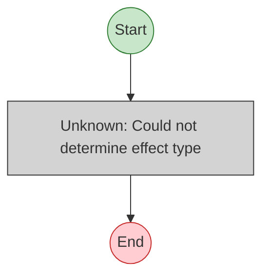


## Statistics

- **Unknown Nodes**: 1


## Explanation

```
run-10 (run):
  1. (unknown: Could not determine effect type)

  Concurrency: sequential (no parallelism)
```


---

# Effect Analysis: rawSideEffectInGen

## Metadata

- **File**: `/Users/jreehal/dev/node-examples/effect-analyzer/packages/effect-analyzer/src/__fixtures__/lint-issues-extra.ts`
- **Analyzed**: 2026-05-22T16:10:32.809Z
- **Source Type**: generator
- **TypeScript Version**: 6.0.2


## Effect Flow

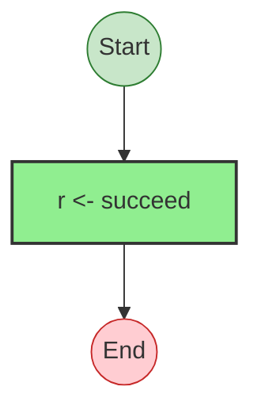


## Statistics

- **Total Effects**: 1


## Explanation

```
rawSideEffectInGen (generator):
  1. Yields r <- succeed

  Concurrency: sequential (no parallelism)
```


---

# Effect Analysis: mutableInConcurrent

## Metadata

- **File**: `/Users/jreehal/dev/node-examples/effect-analyzer/packages/effect-analyzer/src/__fixtures__/lint-issues-extra.ts`
- **Analyzed**: 2026-05-22T16:10:32.814Z
- **Source Type**: generator
- **TypeScript Version**: 6.0.2


## Effect Flow

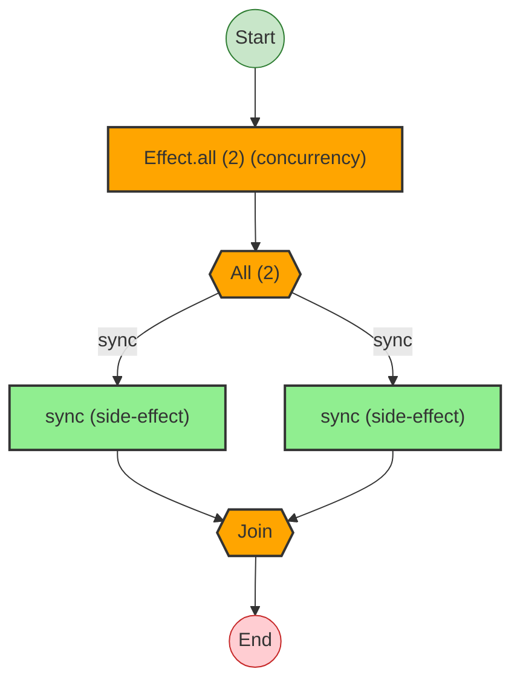


## Statistics

- **Total Effects**: 2
- **Parallel Operations**: 1


## Explanation

```
mutableInConcurrent (generator):
  1. Runs 2 effects in sequential (concurrency: unbounded):
    Calls sync — constructor
    Calls sync — constructor

  Concurrency: uses parallelism / racing
```


---

# Effect Analysis: flatMapChain

## Metadata

- **File**: `/Users/jreehal/dev/node-examples/effect-analyzer/packages/effect-analyzer/src/__fixtures__/lint-issues-extra.ts`
- **Analyzed**: 2026-05-22T16:10:32.818Z
- **Source Type**: direct
- **TypeScript Version**: 6.0.2


## Effect Flow

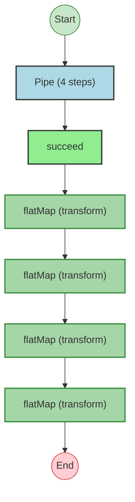


## Statistics

- **Total Effects**: 5


## Explanation

```
flatMapChain (direct):
  1. Pipes succeed through:
    Calls succeed — constructor
    Transforms via flatMap
    Transforms via flatMap
    Transforms via flatMap
    Transforms via flatMap

  Concurrency: sequential (no parallelism)
```


---

# Effect Analysis: flatMapShort

## Metadata

- **File**: `/Users/jreehal/dev/node-examples/effect-analyzer/packages/effect-analyzer/src/__fixtures__/lint-issues-extra.ts`
- **Analyzed**: 2026-05-22T16:10:32.820Z
- **Source Type**: direct
- **TypeScript Version**: 6.0.2


## Effect Flow

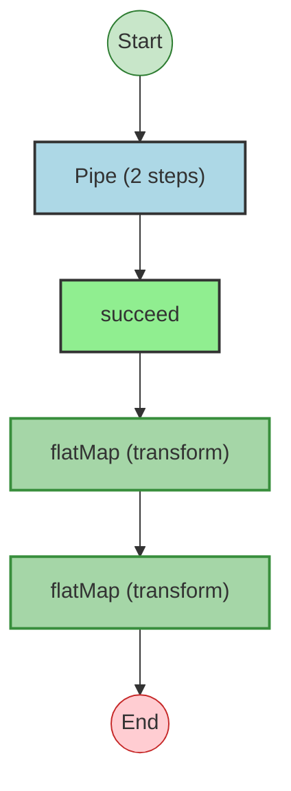


## Statistics

- **Total Effects**: 3


## Explanation

```
flatMapShort (direct):
  1. Pipes succeed through:
    Calls succeed — constructor
    Transforms via flatMap
    Transforms via flatMap

  Concurrency: sequential (no parallelism)
```


---

# Effect Analysis: runPromiseThenChain

## Metadata

- **File**: `/Users/jreehal/dev/node-examples/effect-analyzer/packages/effect-analyzer/src/__fixtures__/lint-issues-extra.ts`
- **Analyzed**: 2026-05-22T16:10:32.820Z
- **Source Type**: direct
- **TypeScript Version**: 6.0.2


## Effect Flow

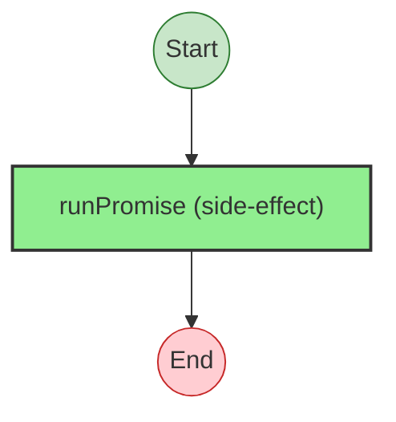


## Statistics

- **Total Effects**: 1


## Explanation

```
runPromiseThenChain (direct):
  1. Calls runPromise — constructor

  Concurrency: sequential (no parallelism)
```


---

# Effect Analysis: untaggedThrowProgram

## Metadata

- **File**: `/Users/jreehal/dev/node-examples/effect-analyzer/packages/effect-analyzer/src/__fixtures__/lint-issues-extra.ts`
- **Analyzed**: 2026-05-22T16:10:32.821Z
- **Source Type**: direct
- **TypeScript Version**: 6.0.2


## Effect Flow

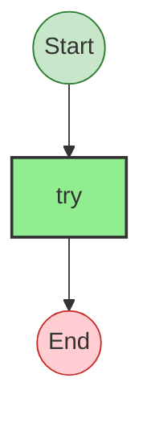


## Statistics

- **Total Effects**: 1


## Explanation

```
untaggedThrowProgram (direct):
  1. Calls try — constructor

  Error paths: unknown
  Concurrency: sequential (no parallelism)
```


## Error Types

- `unknown`

