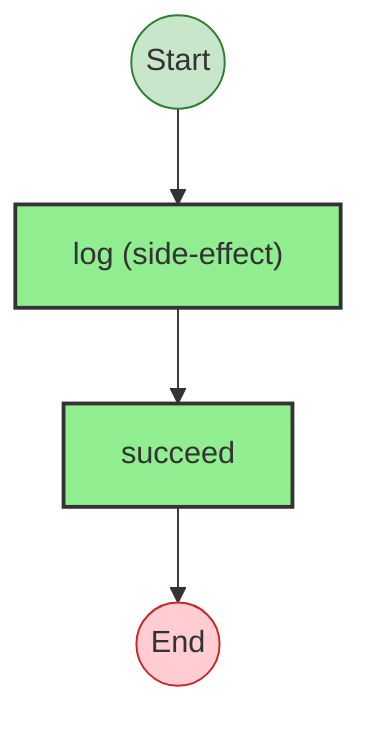
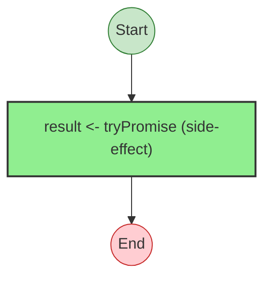
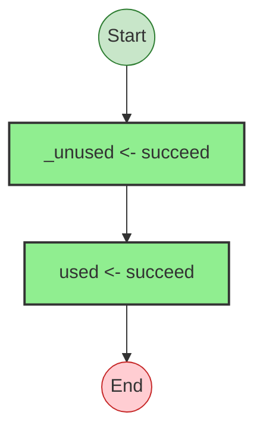
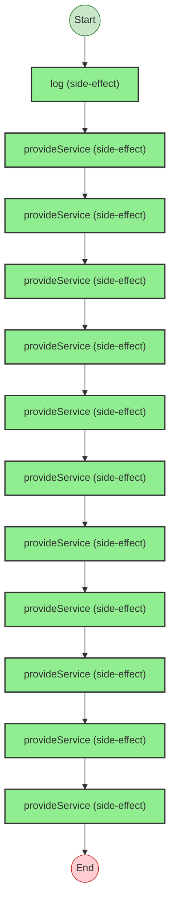
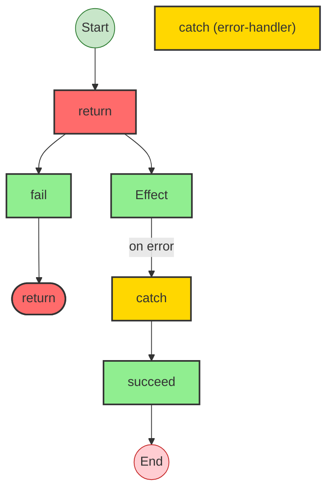
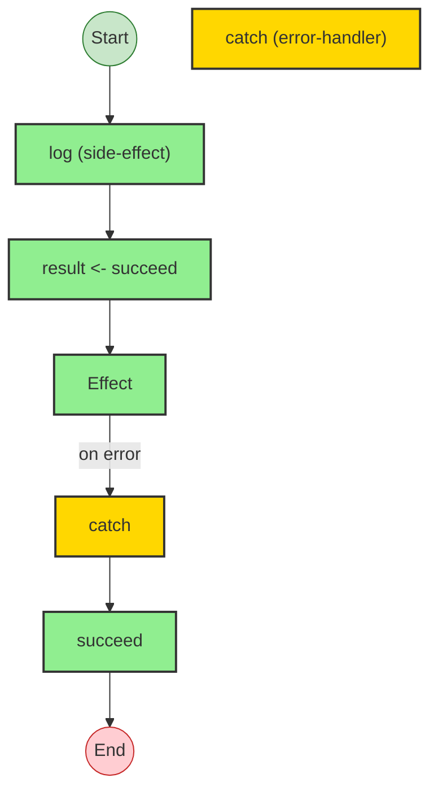

# Effect Analysis: untaggedYieldProgram

## Metadata

- **File**: `/Users/jreehal/dev/node-examples/effect-analyzer/packages/effect-analyzer/src/__fixtures__/lint-issues.ts`
- **Analyzed**: 2026-05-22T16:10:32.898Z
- **Source Type**: generator
- **TypeScript Version**: 6.0.2


## Effect Flow




## Statistics

- **Total Effects**: 2


## Explanation

```
untaggedYieldProgram (generator):
  1. Calls log
  2. Calls succeed — constructor

  Concurrency: sequential (no parallelism)
```


---

# Effect Analysis: missingHandlerProgram

## Metadata

- **File**: `/Users/jreehal/dev/node-examples/effect-analyzer/packages/effect-analyzer/src/__fixtures__/lint-issues.ts`
- **Analyzed**: 2026-05-22T16:10:32.902Z
- **Source Type**: generator
- **TypeScript Version**: 6.0.2


## Effect Flow




## Statistics

- **Total Effects**: 1


## Explanation

```
missingHandlerProgram (generator):
  1. Yields result <- tryPromise

  Error paths: Error
  Concurrency: sequential (no parallelism)
```


## Error Types

- `Error`


---

# Effect Analysis: deadCodeProgram

## Metadata

- **File**: `/Users/jreehal/dev/node-examples/effect-analyzer/packages/effect-analyzer/src/__fixtures__/lint-issues.ts`
- **Analyzed**: 2026-05-22T16:10:32.903Z
- **Source Type**: generator
- **TypeScript Version**: 6.0.2


## Effect Flow




## Statistics

- **Total Effects**: 2


## Explanation

```
deadCodeProgram (generator):
  1. Yields _unused <- succeed
  2. Yields used <- succeed

  Concurrency: sequential (no parallelism)
```


---

# Effect Analysis: complexLayerProgram

## Metadata

- **File**: `/Users/jreehal/dev/node-examples/effect-analyzer/packages/effect-analyzer/src/__fixtures__/lint-issues.ts`
- **Analyzed**: 2026-05-22T16:10:32.908Z
- **Source Type**: generator
- **TypeScript Version**: 6.0.2


## Effect Flow




## Statistics

- **Total Effects**: 12


## Explanation

```
complexLayerProgram (generator):
  1. Calls log

  Error paths: E
  Concurrency: sequential (no parallelism)
```


## Error Types

- `E`


---

# Effect Analysis: catchProgram

## Metadata

- **File**: `/Users/jreehal/dev/node-examples/effect-analyzer/packages/effect-analyzer/src/__fixtures__/lint-issues.ts`
- **Analyzed**: 2026-05-22T16:10:32.910Z
- **Source Type**: generator
- **TypeScript Version**: 6.0.2


## Effect Flow




## Statistics

- **Total Effects**: 3
- **Error Handlers**: 1


## Explanation

```
catchProgram (generator):
  1. Returns:
    Calls fail — constructor

  Error paths: { _tag: "NotFound"; message: string; }
  Concurrency: sequential (no parallelism)
```


## Error Types

- `{ _tag: "NotFound"; message: string; }`


---

# Effect Analysis: goodProgram

## Metadata

- **File**: `/Users/jreehal/dev/node-examples/effect-analyzer/packages/effect-analyzer/src/__fixtures__/lint-issues.ts`
- **Analyzed**: 2026-05-22T16:10:32.912Z
- **Source Type**: generator
- **TypeScript Version**: 6.0.2


## Effect Flow




## Statistics

- **Total Effects**: 4
- **Error Handlers**: 1


## Explanation

```
goodProgram (generator):
  1. Calls log
  2. Yields result <- succeed

  Concurrency: sequential (no parallelism)
```

