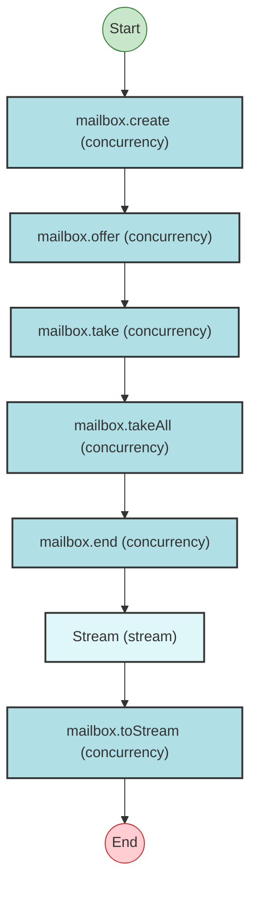

# Effect Analysis: mailboxProgram

## Metadata

- **File**: `/Users/jreehal/dev/node-examples/effect-analyzer/packages/effect-analyzer/src/__fixtures__/mailbox-stream.ts`
- **Analyzed**: 2026-05-22T16:10:32.986Z
- **Source Type**: generator
- **TypeScript Version**: 6.0.2


## Effect Flow




## Statistics

- No operations found


## Explanation

```
mailboxProgram (generator):
  1. mailbox = mailbox.create
  2. mailbox.offer
  3. msg = mailbox.take
  4. all = mailbox.takeAll
  5. mailbox.end
  6. Stream: 
    mailbox.toStream

  Concurrency: sequential (no parallelism)
```

