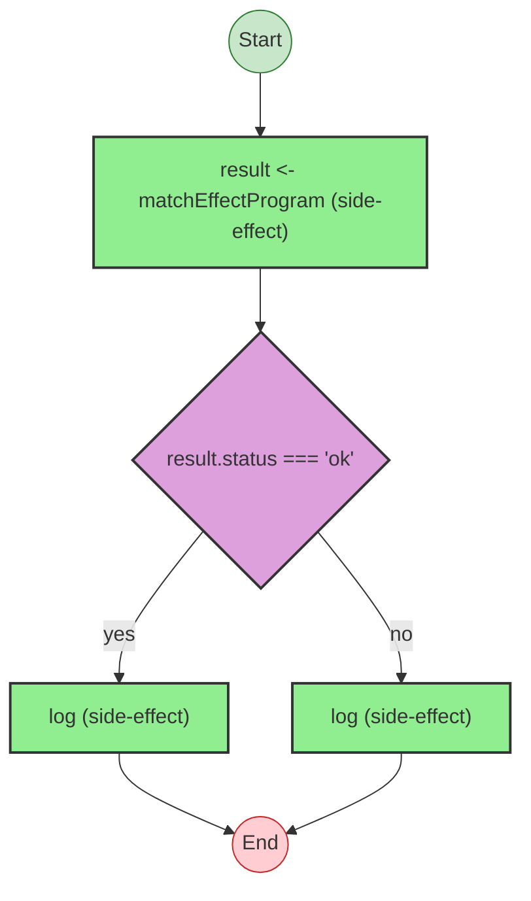
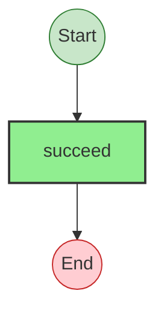
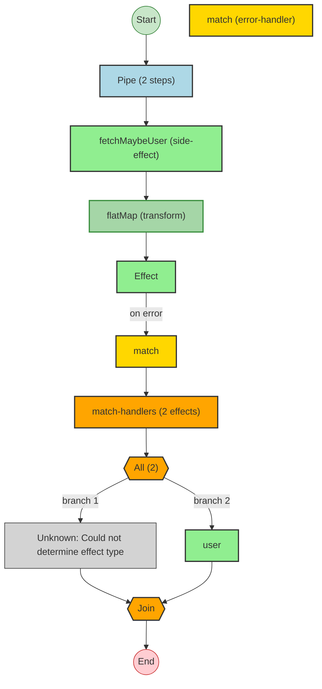
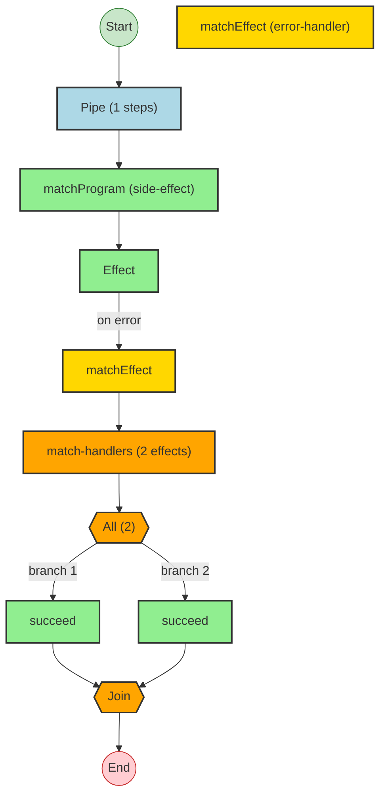

# Effect Analysis: branchingGenProgram

## Metadata

- **File**: `/Users/jreehal/dev/node-examples/effect-analyzer/packages/effect-analyzer/src/__fixtures__/match-and-branching.ts`
- **Analyzed**: 2026-05-22T16:10:33.068Z
- **Source Type**: generator
- **TypeScript Version**: 6.0.2


## Effect Flow




## Statistics

- **Total Effects**: 3


## Explanation

```
branchingGenProgram (generator):
  1. Yields result <- matchEffectProgram
  2. If result.status === 'ok':
    Calls log
  3. Else:
    Calls log

  Concurrency: sequential (no parallelism)
```


---

# Effect Analysis: fetchMaybeUser

## Metadata

- **File**: `/Users/jreehal/dev/node-examples/effect-analyzer/packages/effect-analyzer/src/__fixtures__/match-and-branching.ts`
- **Analyzed**: 2026-05-22T16:10:33.069Z
- **Source Type**: direct
- **TypeScript Version**: 6.0.2


## Effect Flow




## Statistics

- **Total Effects**: 1


## Explanation

```
fetchMaybeUser (direct):
  1. Calls succeed — constructor

  Concurrency: sequential (no parallelism)
```


---

# Effect Analysis: matchProgram

## Metadata

- **File**: `/Users/jreehal/dev/node-examples/effect-analyzer/packages/effect-analyzer/src/__fixtures__/match-and-branching.ts`
- **Analyzed**: 2026-05-22T16:10:33.070Z
- **Source Type**: direct
- **TypeScript Version**: 6.0.2


## Effect Flow




## Statistics

- **Total Effects**: 4
- **Error Handlers**: 1
- **Unknown Nodes**: 1


## Explanation

```
matchProgram (direct):
  1. Pipes fetchMaybeUser through:
    Calls fetchMaybeUser
    Transforms via flatMap
    Handles errors (match):
      Calls Effect
      Handler:
        Runs 2 effects in sequential:
          (unknown: Could not determine effect type)
          Calls user

  Concurrency: uses parallelism / racing
```


---

# Effect Analysis: matchEffectProgram

## Metadata

- **File**: `/Users/jreehal/dev/node-examples/effect-analyzer/packages/effect-analyzer/src/__fixtures__/match-and-branching.ts`
- **Analyzed**: 2026-05-22T16:10:33.071Z
- **Source Type**: direct
- **TypeScript Version**: 6.0.2


## Effect Flow




## Statistics

- **Total Effects**: 4
- **Error Handlers**: 1


## Explanation

```
matchEffectProgram (direct):
  1. Pipes matchProgram through:
    Calls matchProgram
    Handles errors (matchEffect):
      Calls Effect
      Handler:
        Runs 2 effects in sequential:
          Calls succeed — constructor
          Calls succeed — constructor

  Concurrency: uses parallelism / racing
```

