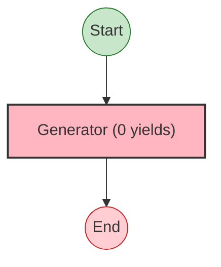
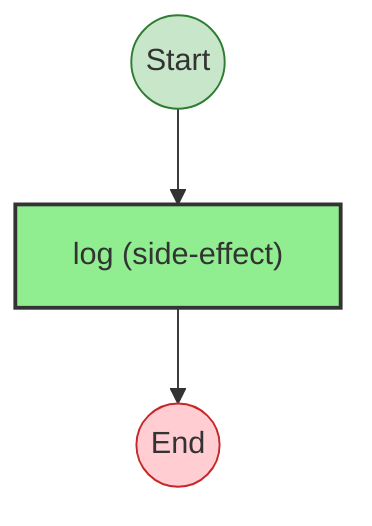
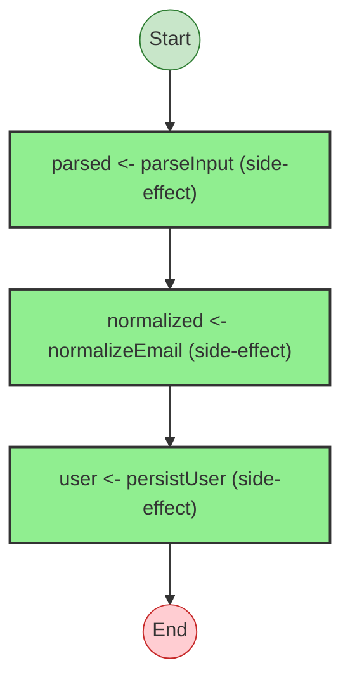
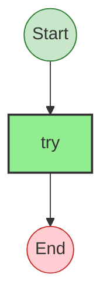

# Effect Analysis: normalizeEmail

## Metadata

- **File**: `/Users/jreehal/dev/node-examples/effect-analyzer/packages/effect-analyzer/src/__fixtures__/nested-helpers.ts`
- **Analyzed**: 2026-05-22T16:10:33.222Z
- **Source Type**: generator
- **TypeScript Version**: 6.0.2


## Effect Flow




## Statistics

- No operations found


## Explanation

```
normalizeEmail (generator):


  Concurrency: sequential (no parallelism)
```


---

# Effect Analysis: persistUser

## Metadata

- **File**: `/Users/jreehal/dev/node-examples/effect-analyzer/packages/effect-analyzer/src/__fixtures__/nested-helpers.ts`
- **Analyzed**: 2026-05-22T16:10:33.224Z
- **Source Type**: generator
- **TypeScript Version**: 6.0.2


## Effect Flow




## Statistics

- **Total Effects**: 1


## Explanation

```
persistUser (generator):
  1. Calls log

  Concurrency: sequential (no parallelism)
```


---

# Effect Analysis: nestedHelperProgram

## Metadata

- **File**: `/Users/jreehal/dev/node-examples/effect-analyzer/packages/effect-analyzer/src/__fixtures__/nested-helpers.ts`
- **Analyzed**: 2026-05-22T16:10:33.225Z
- **Source Type**: generator
- **TypeScript Version**: 6.0.2


## Effect Flow




## Statistics

- **Total Effects**: 3


## Explanation

```
nestedHelperProgram (generator):
  1. Yields parsed <- parseInput
  2. Yields normalized <- normalizeEmail
  3. Yields user <- persistUser

  Error paths: Error
  Concurrency: sequential (no parallelism)
```


## Error Types

- `Error`


---

# Effect Analysis: parseInput

## Metadata

- **File**: `/Users/jreehal/dev/node-examples/effect-analyzer/packages/effect-analyzer/src/__fixtures__/nested-helpers.ts`
- **Analyzed**: 2026-05-22T16:10:33.225Z
- **Source Type**: direct
- **TypeScript Version**: 6.0.2


## Effect Flow




## Statistics

- **Total Effects**: 1


## Explanation

```
parseInput (direct):
  1. Calls try — constructor

  Error paths: Error
  Concurrency: sequential (no parallelism)
```


## Error Types

- `Error`

