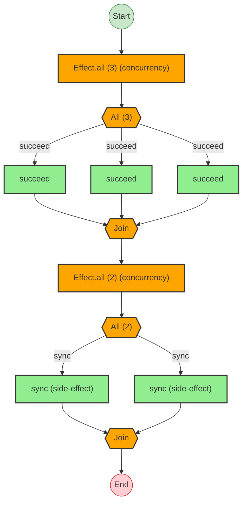
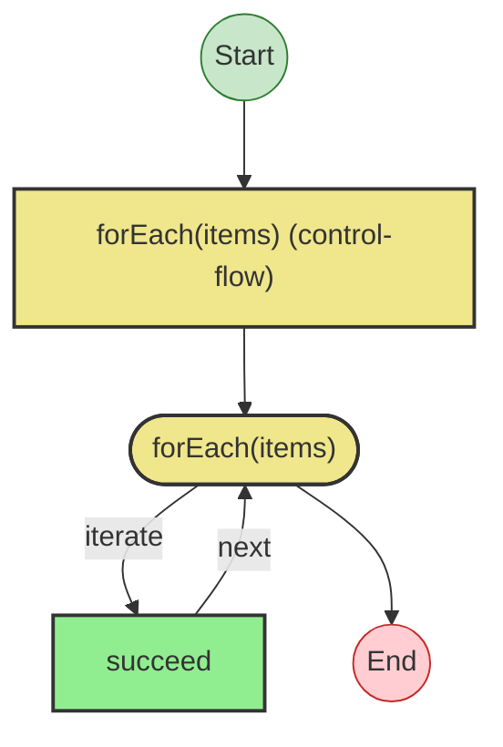

# Effect Analysis: parallelProgram

## Metadata

- **File**: `/Users/jreehal/dev/node-examples/effect-analyzer/packages/effect-analyzer/src/__fixtures__/parallel-effect.ts`
- **Analyzed**: 2026-05-22T16:10:33.310Z
- **Source Type**: generator
- **TypeScript Version**: 6.0.2


## Effect Flow




## Statistics

- **Total Effects**: 5
- **Parallel Operations**: 2


## Explanation

```
parallelProgram (generator):
  1. results = Runs 3 effects in sequential:
    Calls succeed — constructor
    Calls succeed — constructor
    Calls succeed — constructor
  2. parResults = Runs 2 effects in sequential (concurrency: unbounded):
    Calls sync — constructor
    Calls sync — constructor

  Concurrency: uses parallelism / racing
```


---

# Effect Analysis: forEachProgram

## Metadata

- **File**: `/Users/jreehal/dev/node-examples/effect-analyzer/packages/effect-analyzer/src/__fixtures__/parallel-effect.ts`
- **Analyzed**: 2026-05-22T16:10:33.312Z
- **Source Type**: generator
- **TypeScript Version**: 6.0.2


## Effect Flow




## Statistics

- **Loops**: 1


## Explanation

```
forEachProgram (generator):
  1. results = Iterates (forEach) over items:
    Calls succeed — callback-call
    Callback:
      Calls succeed — callback-call

  Concurrency: sequential (no parallelism)
```


---

# Effect Analysis: raceProgram

## Metadata

- **File**: `/Users/jreehal/dev/node-examples/effect-analyzer/packages/effect-analyzer/src/__fixtures__/parallel-effect.ts`
- **Analyzed**: 2026-05-22T16:10:33.312Z
- **Source Type**: direct
- **TypeScript Version**: 6.0.2


## Effect Flow

```mermaid
flowchart TB

  %% Program: raceProgram

  start((Start))
  end_node((End))

  n1["Effect.race (2 racing) (concurrency)"]
  race_fork_2{{{"Race (2)"}}}
  race_join_2{{{"Winner"}}}
  n3["succeed"]
  n4["succeed"]

  %% Edges
  n1 --> race_fork_2
  race_fork_2 -->|succeed| n3
  n3 --> race_join_2
  race_fork_2 -->|succeed| n4
  n4 --> race_join_2
  start --> n1
  race_join_2 --> end_node

  %% Styles
  classDef startStyle fill:#c8e6c9,stroke:#2e7d32
  classDef endStyle fill:#ffcdd2,stroke:#c62828
  classDef effectStyle fill:#90EE90,stroke:#333,stroke-width:2px
  classDef raceStyle fill:#FF6347,stroke:#333,stroke-width:2px
  class start startStyle
  class end_node endStyle
  class n1 raceStyle
  class race_fork_2 raceStyle
  class race_join_2 raceStyle
  class n3 effectStyle
  class n4 effectStyle
```


## Statistics

- **Total Effects**: 2
- **Race Operations**: 1


## Explanation

```
raceProgram (direct):
  1. Races 2 effects:
    Calls succeed — constructor
    Calls succeed — constructor

  Concurrency: uses parallelism / racing
```

