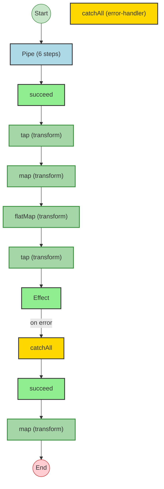
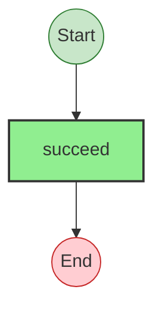

# Effect Analysis: pipeHeavyProgram

## Metadata

- **File**: `/Users/jreehal/dev/node-examples/effect-analyzer/packages/effect-analyzer/src/__fixtures__/pipe-heavy.ts`
- **Analyzed**: 2026-05-22T16:10:33.388Z
- **Source Type**: pipe
- **TypeScript Version**: 6.0.2


## Effect Flow




## Statistics

- **Total Effects**: 8
- **Error Handlers**: 1


## Explanation

```
pipeHeavyProgram (pipe):
  1. Pipes succeed through:
    Calls succeed — constructor
    Transforms via tap
    Transforms via map
    Transforms via flatMap
    Transforms via tap
    Catches all errors on:
      Calls Effect
      Handler:
        Calls succeed — constructor
    Transforms via map

  Concurrency: sequential (no parallelism)
```


---

# Effect Analysis: base

## Metadata

- **File**: `/Users/jreehal/dev/node-examples/effect-analyzer/packages/effect-analyzer/src/__fixtures__/pipe-heavy.ts`
- **Analyzed**: 2026-05-22T16:10:33.388Z
- **Source Type**: direct
- **TypeScript Version**: 6.0.2


## Effect Flow




## Statistics

- **Total Effects**: 1


## Explanation

```
base (direct):
  1. Calls succeed — constructor

  Concurrency: sequential (no parallelism)
```

