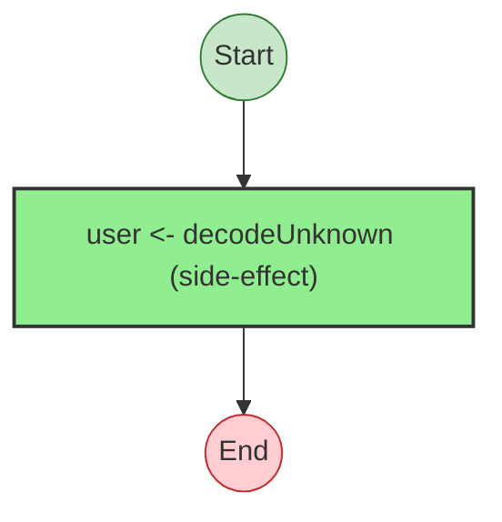
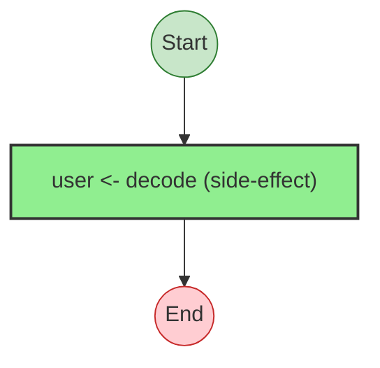
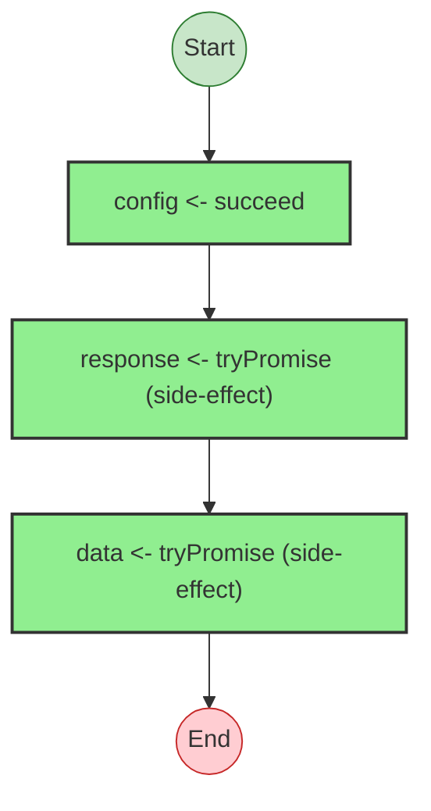
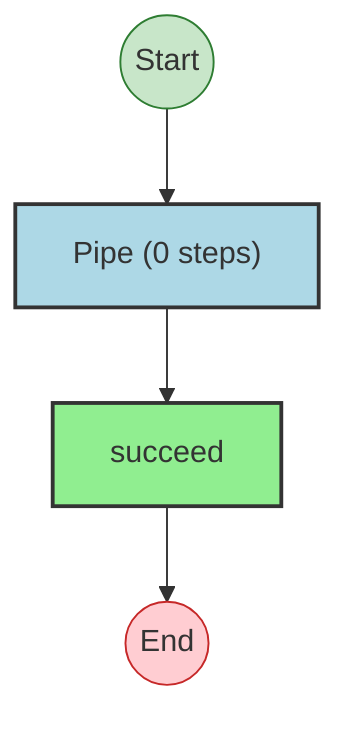
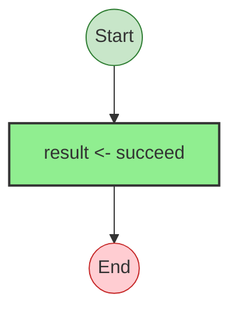
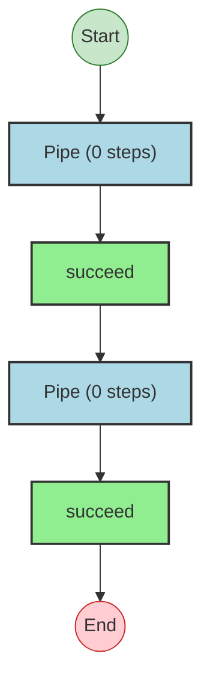
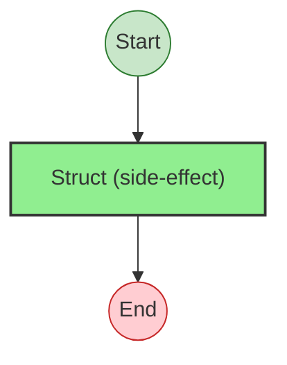

# Effect Analysis: validateUser

## Metadata

- **File**: `/Users/jreehal/dev/node-examples/effect-analyzer/packages/effect-analyzer/src/__fixtures__/quality-fixes.ts`
- **Analyzed**: 2026-05-22T16:10:33.482Z
- **Source Type**: generator
- **TypeScript Version**: 6.0.2


## Effect Flow




## Statistics

- **Total Effects**: 1


## Explanation

```
validateUser (generator):
  1. Yields user <- decodeUnknown

  Error paths: ParseError
  Concurrency: sequential (no parallelism)
```


## Error Types

- `ParseError`


---

# Effect Analysis: validateUserDecode

## Metadata

- **File**: `/Users/jreehal/dev/node-examples/effect-analyzer/packages/effect-analyzer/src/__fixtures__/quality-fixes.ts`
- **Analyzed**: 2026-05-22T16:10:33.484Z
- **Source Type**: generator
- **TypeScript Version**: 6.0.2


## Effect Flow




## Statistics

- **Total Effects**: 1


## Explanation

```
validateUserDecode (generator):
  1. Yields user <- decode

  Error paths: ParseError
  Concurrency: sequential (no parallelism)
```


## Error Types

- `ParseError`


---

# Effect Analysis: namedStepsProgram

## Metadata

- **File**: `/Users/jreehal/dev/node-examples/effect-analyzer/packages/effect-analyzer/src/__fixtures__/quality-fixes.ts`
- **Analyzed**: 2026-05-22T16:10:33.487Z
- **Source Type**: generator
- **TypeScript Version**: 6.0.2


## Effect Flow




## Statistics

- **Total Effects**: 3


## Explanation

```
namedStepsProgram (generator):
  1. Yields config <- succeed
  2. Yields response <- tryPromise
  3. Yields data <- tryPromise

  Error paths: UnknownException
  Concurrency: sequential (no parallelism)
```


## Error Types

- `UnknownException`


---

# Effect Analysis: spanAnnotatedProgram

## Metadata

- **File**: `/Users/jreehal/dev/node-examples/effect-analyzer/packages/effect-analyzer/src/__fixtures__/quality-fixes.ts`
- **Analyzed**: 2026-05-22T16:10:33.488Z
- **Source Type**: generator
- **TypeScript Version**: 6.0.2


## Effect Flow




## Statistics

- **Total Effects**: 2


## Explanation

```
spanAnnotatedProgram (generator):
  1. result = Pipes succeed through:
    Calls succeed — constructor

  Concurrency: sequential (no parallelism)
```


---

# Effect Analysis: verboseLabelsProgram

## Metadata

- **File**: `/Users/jreehal/dev/node-examples/effect-analyzer/packages/effect-analyzer/src/__fixtures__/quality-fixes.ts`
- **Analyzed**: 2026-05-22T16:10:33.489Z
- **Source Type**: generator
- **TypeScript Version**: 6.0.2


## Effect Flow




## Statistics

- **Total Effects**: 1


## Explanation

```
verboseLabelsProgram (generator):
  1. Yields result <- succeed

  Concurrency: sequential (no parallelism)
```


---

# Effect Analysis: chainedWithSpanProgram

## Metadata

- **File**: `/Users/jreehal/dev/node-examples/effect-analyzer/packages/effect-analyzer/src/__fixtures__/quality-fixes.ts`
- **Analyzed**: 2026-05-22T16:10:33.491Z
- **Source Type**: generator
- **TypeScript Version**: 6.0.2


## Effect Flow


## Statistics

- **Total Effects**: 3


## Explanation

```
chainedWithSpanProgram (generator):
  1. x = Pipes succeed through:
    Calls succeed — constructor

  Concurrency: sequential (no parallelism)
```


---

# Effect Analysis: multiSpanProgram

## Metadata

- **File**: `/Users/jreehal/dev/node-examples/effect-analyzer/packages/effect-analyzer/src/__fixtures__/quality-fixes.ts`
- **Analyzed**: 2026-05-22T16:10:33.496Z
- **Source Type**: generator
- **TypeScript Version**: 6.0.2


## Effect Flow




## Statistics

- **Total Effects**: 4


## Explanation

```
multiSpanProgram (generator):
  1. a = Pipes succeed through:
    Calls succeed — constructor
  2. b = Pipes succeed through:
    Calls succeed — constructor

  Concurrency: sequential (no parallelism)
```


---

# Effect Analysis: UserSchema

## Metadata

- **File**: `/Users/jreehal/dev/node-examples/effect-analyzer/packages/effect-analyzer/src/__fixtures__/quality-fixes.ts`
- **Analyzed**: 2026-05-22T16:10:33.497Z
- **Source Type**: direct
- **TypeScript Version**: 6.0.2


## Effect Flow




## Statistics

- **Total Effects**: 1


## Explanation

```
UserSchema (direct):
  1. Calls Struct — schema

  Concurrency: sequential (no parallelism)
```

