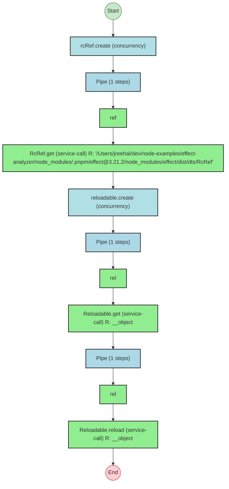

# Effect Analysis: prog

## Metadata

- **File**: `/Users/jreehal/dev/node-examples/effect-analyzer/packages/effect-analyzer/src/__fixtures__/rc-ref-reloadable.ts`
- **Analyzed**: 2026-05-22T16:10:33.579Z
- **Source Type**: generator
- **TypeScript Version**: 6.0.2


## Effect Flow




## Statistics

- **Total Effects**: 6


## Explanation

```
prog (generator):
  1. ref = rcRef.create
  2. n = Pipes ref through:
    Calls ref
    Calls "/Users/jreehal/dev/node-examples/effect-analyzer/node_modules/.pnpm/effect@3.21.2/node_modules/effect/dist/dts/RcRef".get — service-call
  3. rel = reloadable.create
  4. v = Pipes rel through:
    Calls rel
    Calls __object.get — service-call
  5. Pipes rel through:
    Calls rel
    Calls __object.reload — service-call

  Services required: "/Users/jreehal/dev/node-examples/effect-analyzer/node_modules/.pnpm/effect@3.21.2/node_modules/effect/dist/dts/RcRef", __object
  Concurrency: sequential (no parallelism)
```


## Dependencies

- `"/Users/jreehal/dev/node-examples/effect-analyzer/node_modules/.pnpm/effect@3.21.2/node_modules/effect/dist/dts/RcRef"`: "/Users/jreehal/dev/node-examples/effect-analyzer/node_modules/.pnpm/effect@3.21.2/node_modules/effect/dist/dts/RcRef"
- `__object`: __object

