# Effect Analysis: apiCallWithRetry

## Metadata

- **File**: `/Users/jreehal/dev/node-examples/effect-analyzer/packages/effect-analyzer/src/__fixtures__/real-world-patterns.ts`
- **Analyzed**: 2026-05-22T16:10:33.674Z
- **Source Type**: generator
- **TypeScript Version**: 6.0.2


## Effect Flow

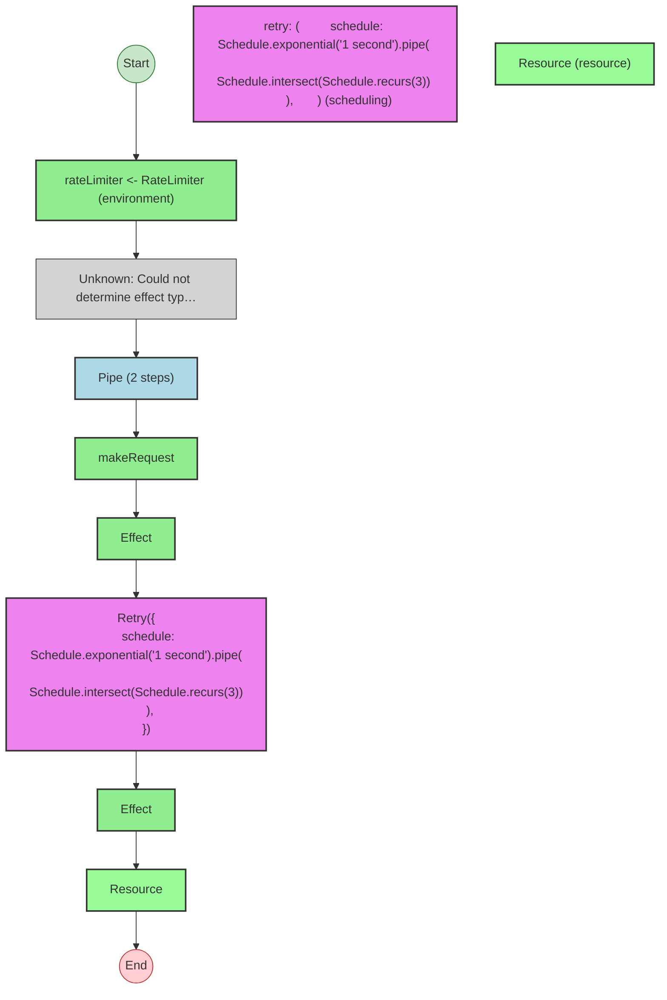


## Statistics

- **Total Effects**: 4
- **Retry Operations**: 1
- **Resources**: 1
- **Unknown Nodes**: 3


## Explanation

```
apiCallWithRetry (generator):
  1. Yields rateLimiter <- RateLimiter
  2. (unknown: Could not determine effect type)
  3. result = Pipes makeRequest through:
    Calls makeRequest
    Retries (max 3, exponential):
      Calls Effect
    Acquires resource:
      Calls Effect
      Then releases:
        (unknown: Could not determine effect type)

  Concurrency: sequential (no parallelism)
```


---

# Effect Analysis: cachedApiCall

## Metadata

- **File**: `/Users/jreehal/dev/node-examples/effect-analyzer/packages/effect-analyzer/src/__fixtures__/real-world-patterns.ts`
- **Analyzed**: 2026-05-22T16:10:33.679Z
- **Source Type**: generator
- **TypeScript Version**: 6.0.2


## Effect Flow

```mermaid
flowchart TB

  %% Program: cachedApiCall

  start((Start))
  end_node((End))

  n2["cache <- Cache (environment)"]
  n3["cached <- cache.get (side-effect)"]
  n4["result <- makeRequest"]
  n5["cache.set (side-effect)"]

  %% Edges
  n2 --> n3
  n3 --> n4
  n4 --> n5
  start --> n2
  n5 --> end_node

  %% Styles
  classDef startStyle fill:#c8e6c9,stroke:#2e7d32
  classDef endStyle fill:#ffcdd2,stroke:#c62828
  classDef effectStyle fill:#90EE90,stroke:#333,stroke-width:2px
  class start startStyle
  class end_node endStyle
  class n2 effectStyle
  class n3 effectStyle
  class n4 effectStyle
  class n5 effectStyle
```


## Statistics

- **Total Effects**: 4


## Explanation

```
cachedApiCall (generator):
  1. Yields cache <- Cache
  2. Yields cached <- cache.get
  3. Yields result <- makeRequest
  4. Calls cache.set

  Concurrency: sequential (no parallelism)
```


---

# Effect Analysis: getUserWithCache

## Metadata

- **File**: `/Users/jreehal/dev/node-examples/effect-analyzer/packages/effect-analyzer/src/__fixtures__/real-world-patterns.ts`
- **Analyzed**: 2026-05-22T16:10:33.682Z
- **Source Type**: generator
- **TypeScript Version**: 6.0.2


## Effect Flow

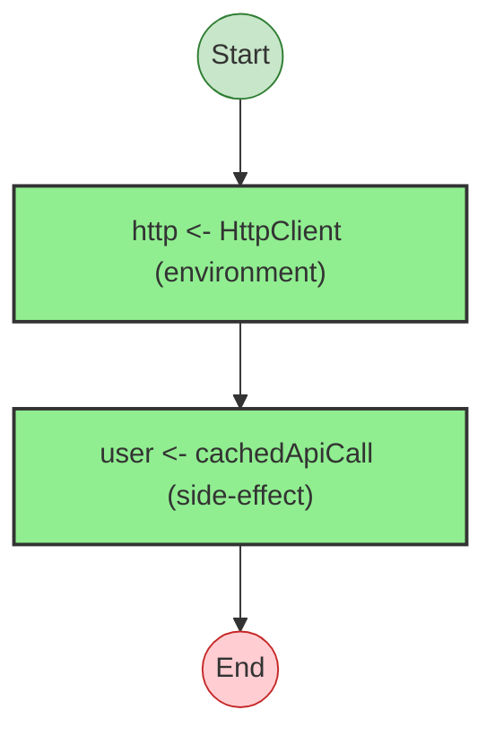


## Statistics

- **Total Effects**: 2


## Explanation

```
getUserWithCache (generator):
  1. Yields http <- HttpClient
  2. Yields user <- cachedApiCall

  Services required: HttpClient
  Error paths: HttpError
  Concurrency: sequential (no parallelism)
```


## Dependencies

- `HttpClient`


## Error Types

- `HttpError`


---

# Effect Analysis: batchFetchUsers

## Metadata

- **File**: `/Users/jreehal/dev/node-examples/effect-analyzer/packages/effect-analyzer/src/__fixtures__/real-world-patterns.ts`
- **Analyzed**: 2026-05-22T16:10:33.685Z
- **Source Type**: generator
- **TypeScript Version**: 6.0.2


## Effect Flow

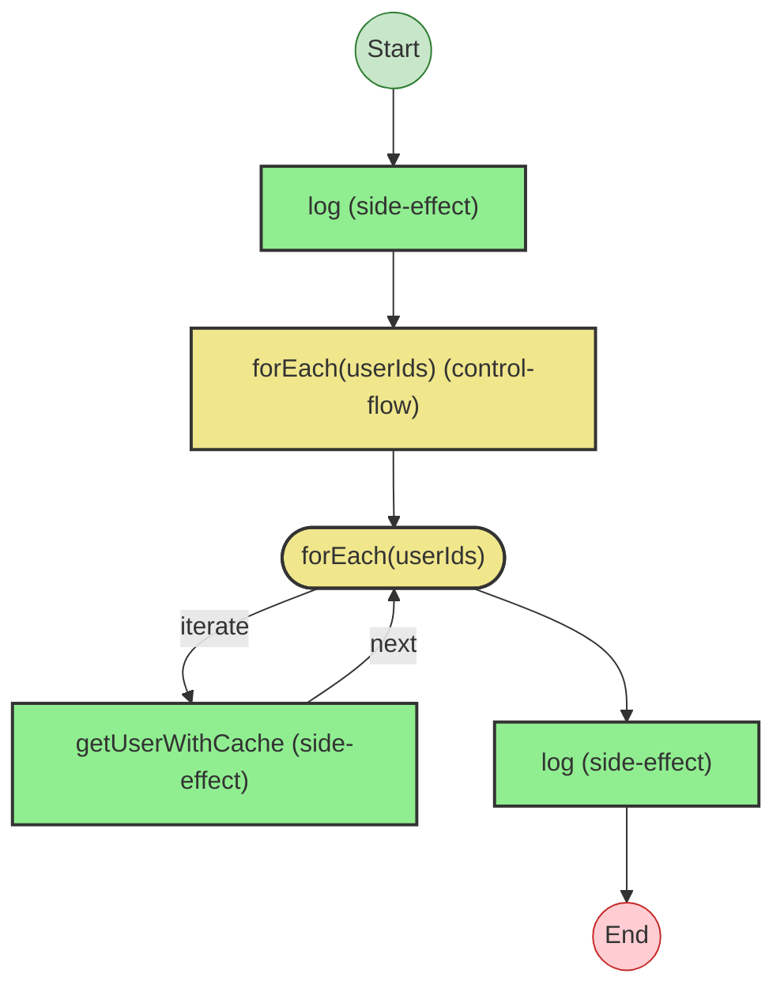


## Statistics

- **Total Effects**: 2
- **Loops**: 1


## Explanation

```
batchFetchUsers (generator):
  1. Calls log
  2. users = Iterates (forEach) over userIds:
    Calls getUserWithCache — callback-call
    Callback:
      Calls getUserWithCache — callback-call
  3. Calls log

  Concurrency: sequential (no parallelism)
```


---

# Effect Analysis: authenticatedCall

## Metadata

- **File**: `/Users/jreehal/dev/node-examples/effect-analyzer/packages/effect-analyzer/src/__fixtures__/real-world-patterns.ts`
- **Analyzed**: 2026-05-22T16:10:33.689Z
- **Source Type**: generator
- **TypeScript Version**: 6.0.2


## Effect Flow

```mermaid
flowchart TB

  %% Program: authenticatedCall

  start((Start))
  end_node((End))

  decision_3{"!token &#124;&#124; token.length === 0"}
  n4["return"]
  term_5(["return"])
  n6["fail"]
  n7["log (side-effect)"]
  n8["Pipe (1 steps)"]
  n9["makeRequest"]
  n10["catch (error-handler)"]
  n11["Effect"]
  err_handler_12["catch"]
  n13["Unknown: Could not determine effect type"]

  %% Edges
  n4 --> n6
  n6 --> term_5
  decision_3 -->|yes| n4
  decision_3 --> n7
  n11 -->|on error| err_handler_12
  err_handler_12 --> n13
  n9 --> n11
  n8 --> n9
  n7 --> n8
  start --> decision_3
  n13 --> end_node

  %% Styles
  classDef startStyle fill:#c8e6c9,stroke:#2e7d32
  classDef endStyle fill:#ffcdd2,stroke:#c62828
  classDef effectStyle fill:#90EE90,stroke:#333,stroke-width:2px
  classDef pipeStyle fill:#ADD8E6,stroke:#333,stroke-width:2px
  classDef errorHandlerStyle fill:#FFD700,stroke:#333,stroke-width:2px
  classDef decisionStyle fill:#DDA0DD,stroke:#333,stroke-width:2px
  classDef terminalStyle fill:#FF6B6B,stroke:#333,stroke-width:2px
  classDef unknownStyle fill:#D3D3D3,stroke:#333,stroke-width:1px
  class start startStyle
  class end_node endStyle
  class decision_3 decisionStyle
  class n4 terminalStyle
  class term_5 terminalStyle
  class n6 effectStyle
  class n7 effectStyle
  class n8 pipeStyle
  class n9 effectStyle
  class n10 errorHandlerStyle
  class n11 effectStyle
  class err_handler_12 errorHandlerStyle
  class n13 unknownStyle
```


## Statistics

- **Total Effects**: 4
- **Error Handlers**: 1
- **Unknown Nodes**: 1


## Explanation

```
authenticatedCall (generator):
  1. If !token || token.length === 0:
    Returns:
      Calls fail — constructor
  2. Calls log
  3. result = Pipes makeRequest through:
    Calls makeRequest
    Catches all errors on:
      Calls Effect
      Handler:
        (unknown: Could not determine effect type)

  Error paths: AuthError
  Concurrency: sequential (no parallelism)
```


## Error Types

- `AuthError`


---

# Effect Analysis: dbTransaction

## Metadata

- **File**: `/Users/jreehal/dev/node-examples/effect-analyzer/packages/effect-analyzer/src/__fixtures__/real-world-patterns.ts`
- **Analyzed**: 2026-05-22T16:10:33.693Z
- **Source Type**: generator
- **TypeScript Version**: 6.0.2


## Effect Flow

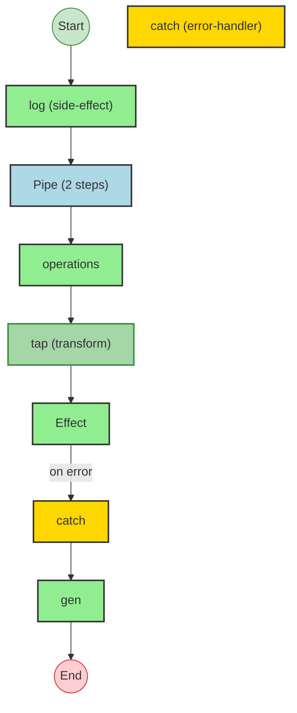


## Statistics

- **Total Effects**: 5
- **Error Handlers**: 1


## Explanation

```
dbTransaction (generator):
  1. Calls log
  2. result = Pipes operations through:
    Calls operations
    Transforms via tap
    Catches all errors on:
      Calls Effect
      Handler:
        Calls gen

  Concurrency: sequential (no parallelism)
```


---

# Effect Analysis: result

## Metadata

- **File**: `/Users/jreehal/dev/node-examples/effect-analyzer/packages/effect-analyzer/src/__fixtures__/real-world-patterns.ts`
- **Analyzed**: 2026-05-22T16:10:33.694Z
- **Source Type**: generator
- **TypeScript Version**: 6.0.2


## Effect Flow

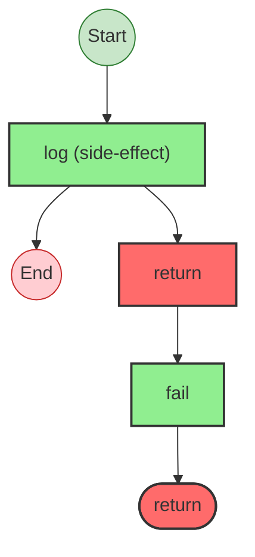


## Statistics

- **Total Effects**: 2


## Explanation

```
result (generator):
  1. Calls log
  2. Returns:
    Calls fail — constructor

  Error paths: E
  Concurrency: sequential (no parallelism)
```


## Error Types

- `E`


---

# Effect Analysis: processUserWorkflow

## Metadata

- **File**: `/Users/jreehal/dev/node-examples/effect-analyzer/packages/effect-analyzer/src/__fixtures__/real-world-patterns.ts`
- **Analyzed**: 2026-05-22T16:10:33.701Z
- **Source Type**: generator
- **TypeScript Version**: 6.0.2


## Effect Flow

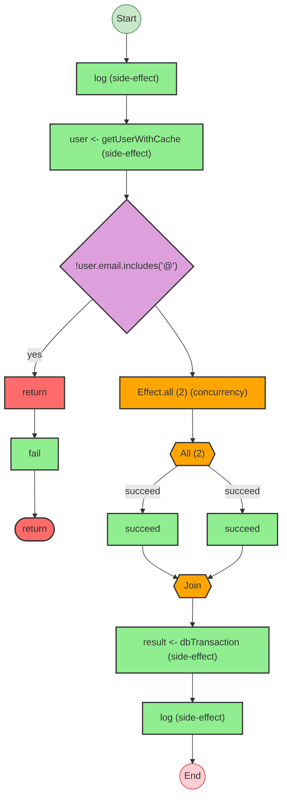


## Statistics

- **Total Effects**: 7
- **Parallel Operations**: 1


## Explanation

```
processUserWorkflow (generator):
  1. Calls log
  2. Yields user <- getUserWithCache
  3. If !user.email.includes('@'):
    Returns:
      Calls fail — constructor
  4. [processedName, enrichedData] = Runs 2 effects in sequential:
    Calls succeed — constructor
    Calls succeed — constructor
  5. Yields result <- dbTransaction
  6. Calls log

  Error paths: HttpError
  Concurrency: uses parallelism / racing
```


## Error Types

- `HttpError`


---

# Effect Analysis: result

## Metadata

- **File**: `/Users/jreehal/dev/node-examples/effect-analyzer/packages/effect-analyzer/src/__fixtures__/real-world-patterns.ts`
- **Analyzed**: 2026-05-22T16:10:33.702Z
- **Source Type**: generator
- **TypeScript Version**: 6.0.2


## Effect Flow

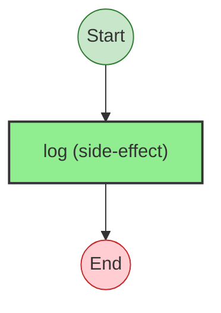


## Statistics

- **Total Effects**: 1


## Explanation

```
result (generator):
  1. Calls log

  Concurrency: sequential (no parallelism)
```


---

# Effect Analysis: withCircuitBreaker

## Metadata

- **File**: `/Users/jreehal/dev/node-examples/effect-analyzer/packages/effect-analyzer/src/__fixtures__/real-world-patterns.ts`
- **Analyzed**: 2026-05-22T16:10:33.707Z
- **Source Type**: generator
- **TypeScript Version**: 6.0.2


## Effect Flow

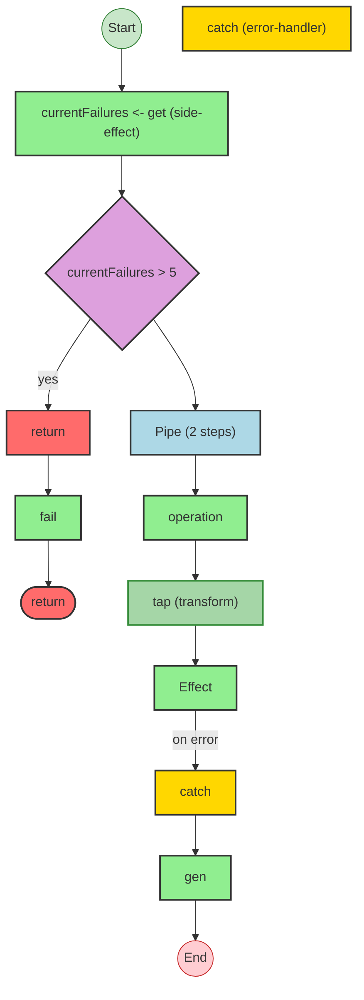


## Statistics

- **Total Effects**: 6
- **Error Handlers**: 1


## Explanation

```
withCircuitBreaker (generator):
  1. Yields currentFailures <- get
  2. If currentFailures > 5:
    Returns:
      Calls fail — constructor
  3. result = Pipes operation through:
    Calls operation
    Transforms via tap
    Catches all errors on:
      Calls Effect
      Handler:
        Calls gen

  Error paths: CircuitOpenError
  Concurrency: sequential (no parallelism)
```


## Error Types

- `CircuitOpenError`


---

# Effect Analysis: result

## Metadata

- **File**: `/Users/jreehal/dev/node-examples/effect-analyzer/packages/effect-analyzer/src/__fixtures__/real-world-patterns.ts`
- **Analyzed**: 2026-05-22T16:10:33.712Z
- **Source Type**: generator
- **TypeScript Version**: 6.0.2


## Effect Flow

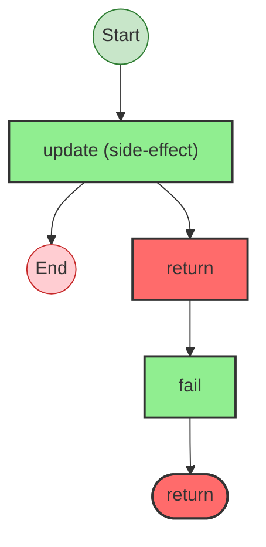


## Statistics

- **Total Effects**: 2


## Explanation

```
result (generator):
  1. Calls update
  2. Returns:
    Calls fail — constructor

  Error paths: E
  Concurrency: sequential (no parallelism)
```


## Error Types

- `E`


---

# Effect Analysis: UserId

## Metadata

- **File**: `/Users/jreehal/dev/node-examples/effect-analyzer/packages/effect-analyzer/src/__fixtures__/real-world-patterns.ts`
- **Analyzed**: 2026-05-22T16:10:33.712Z
- **Source Type**: class
- **TypeScript Version**: 6.0.2


## Effect Flow

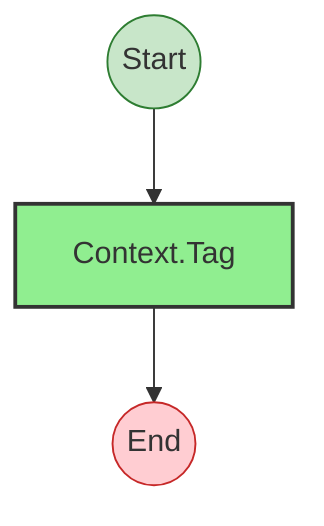


## Statistics

- **Total Effects**: 1


## Explanation

```
UserId (class):
  1. Calls Context.Tag — service-tag

  Concurrency: sequential (no parallelism)
```


---

# Effect Analysis: HttpClient

## Metadata

- **File**: `/Users/jreehal/dev/node-examples/effect-analyzer/packages/effect-analyzer/src/__fixtures__/real-world-patterns.ts`
- **Analyzed**: 2026-05-22T16:10:33.713Z
- **Source Type**: class
- **TypeScript Version**: 6.0.2


## Effect Flow


## Statistics

- **Total Effects**: 1


## Explanation

```
HttpClient (class):
  1. Calls Context.Tag — service-tag

  Concurrency: sequential (no parallelism)
```


---

# Effect Analysis: Cache

## Metadata

- **File**: `/Users/jreehal/dev/node-examples/effect-analyzer/packages/effect-analyzer/src/__fixtures__/real-world-patterns.ts`
- **Analyzed**: 2026-05-22T16:10:33.713Z
- **Source Type**: class
- **TypeScript Version**: 6.0.2


## Effect Flow


## Statistics

- **Total Effects**: 1


## Explanation

```
Cache (class):
  1. Calls Context.Tag — service-tag

  Concurrency: sequential (no parallelism)
```


---

# Effect Analysis: RateLimiter

## Metadata

- **File**: `/Users/jreehal/dev/node-examples/effect-analyzer/packages/effect-analyzer/src/__fixtures__/real-world-patterns.ts`
- **Analyzed**: 2026-05-22T16:10:33.714Z
- **Source Type**: class
- **TypeScript Version**: 6.0.2


## Effect Flow


## Statistics

- **Total Effects**: 1


## Explanation

```
RateLimiter (class):
  1. Calls Context.Tag — service-tag

  Concurrency: sequential (no parallelism)
```

