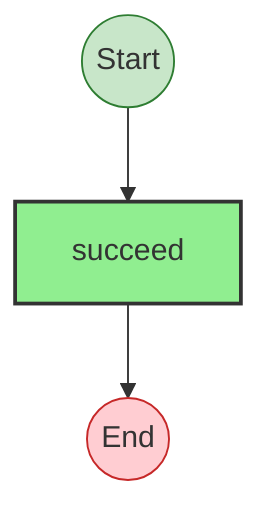
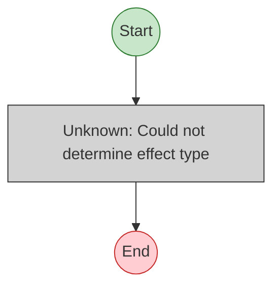

# Effect Analysis: directProgram

## Metadata

- **File**: `/Users/jreehal/dev/node-examples/effect-analyzer/packages/effect-analyzer/src/__fixtures__/regression-bare-named-imports.ts`
- **Analyzed**: 2026-05-22T16:10:33.788Z
- **Source Type**: direct
- **TypeScript Version**: 6.0.2


## Effect Flow




## Statistics

- **Total Effects**: 1


## Explanation

```
directProgram (direct):
  1. Calls succeed

  Concurrency: sequential (no parallelism)
```


---

# Effect Analysis: awaitedProgram

## Metadata

- **File**: `/Users/jreehal/dev/node-examples/effect-analyzer/packages/effect-analyzer/src/__fixtures__/regression-bare-named-imports.ts`
- **Analyzed**: 2026-05-22T16:10:33.789Z
- **Source Type**: direct
- **TypeScript Version**: 6.0.2


## Effect Flow




## Statistics

- **Unknown Nodes**: 1


## Explanation

```
awaitedProgram (direct):
  1. (unknown: Could not determine effect type)

  Concurrency: sequential (no parallelism)
```

