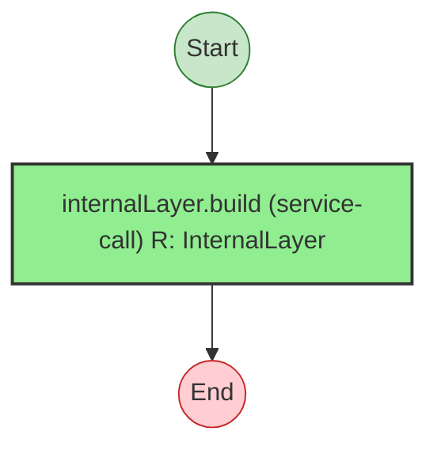
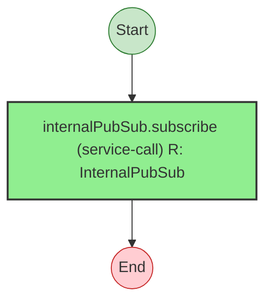

# Effect Analysis: build

## Metadata

- **File**: `/Users/jreehal/dev/node-examples/effect-analyzer/packages/effect-analyzer/src/__fixtures__/regression-internal-aliases.ts`
- **Analyzed**: 2026-05-22T16:10:33.934Z
- **Source Type**: direct
- **TypeScript Version**: 6.0.2


## Effect Flow




## Statistics

- **Total Effects**: 1


## Explanation

```
build (direct):
  1. Calls InternalLayer.build — service-call

  Services required: InternalLayer
  Concurrency: sequential (no parallelism)
```


## Dependencies

- `InternalLayer`: InternalLayer


---

# Effect Analysis: subscribe

## Metadata

- **File**: `/Users/jreehal/dev/node-examples/effect-analyzer/packages/effect-analyzer/src/__fixtures__/regression-internal-aliases.ts`
- **Analyzed**: 2026-05-22T16:10:33.934Z
- **Source Type**: direct
- **TypeScript Version**: 6.0.2


## Effect Flow




## Statistics

- **Total Effects**: 1


## Explanation

```
subscribe (direct):
  1. Calls InternalPubSub.subscribe — service-call

  Services required: InternalPubSub
  Concurrency: sequential (no parallelism)
```


## Dependencies

- `InternalPubSub`: InternalPubSub

