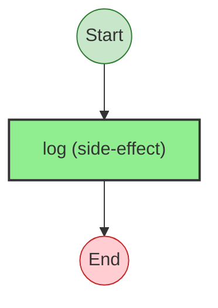
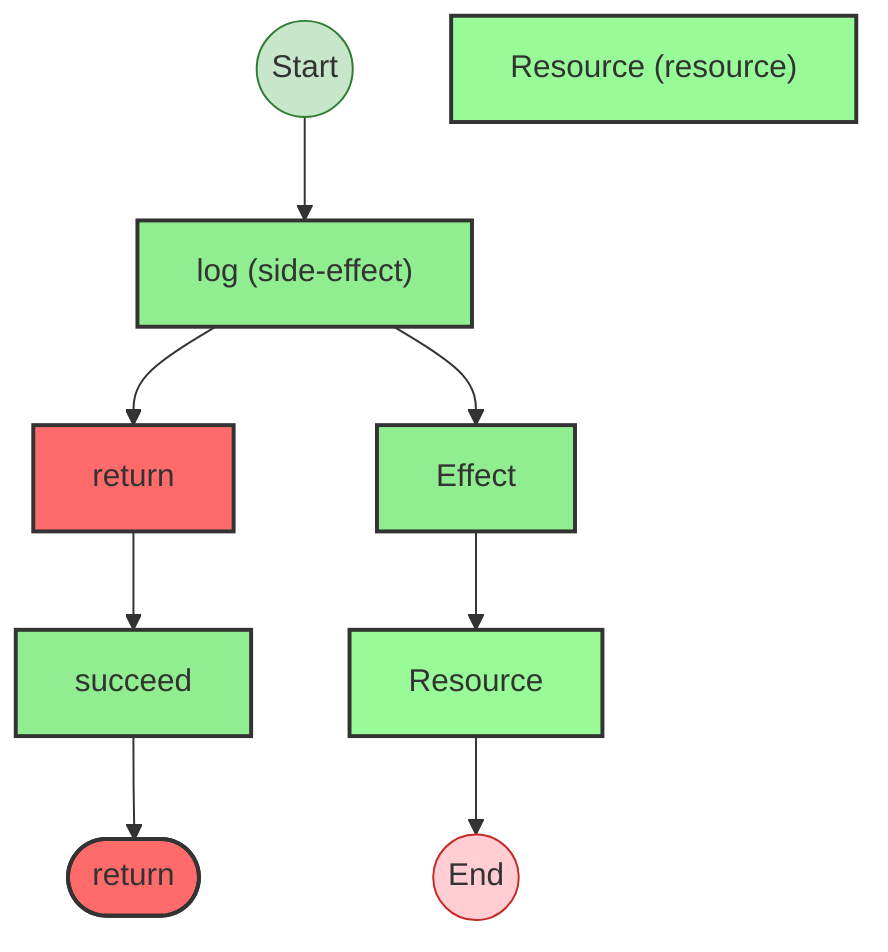
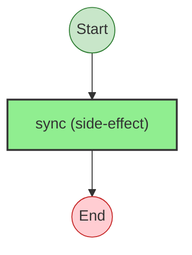

# Effect Analysis: resourceProgram

## Metadata

- **File**: `/Users/jreehal/dev/node-examples/effect-analyzer/packages/effect-analyzer/src/__fixtures__/resource-effect.ts`
- **Analyzed**: 2026-05-22T16:10:34.013Z
- **Source Type**: generator
- **TypeScript Version**: 6.0.2


## Effect Flow




## Statistics

- **Total Effects**: 1


## Explanation

```
resourceProgram (generator):
  1. Calls log

  Concurrency: sequential (no parallelism)
```


---

# Effect Analysis: ensuringProgram

## Metadata

- **File**: `/Users/jreehal/dev/node-examples/effect-analyzer/packages/effect-analyzer/src/__fixtures__/resource-effect.ts`
- **Analyzed**: 2026-05-22T16:10:34.018Z
- **Source Type**: generator
- **TypeScript Version**: 6.0.2


## Effect Flow




## Statistics

- **Total Effects**: 4
- **Resources**: 1


## Explanation

```
ensuringProgram (generator):
  1. Calls log
  2. Returns:
    Calls succeed — constructor

  Concurrency: sequential (no parallelism)
```


---

# Effect Analysis: syncWithInnerEffect

## Metadata

- **File**: `/Users/jreehal/dev/node-examples/effect-analyzer/packages/effect-analyzer/src/__fixtures__/resource-effect.ts`
- **Analyzed**: 2026-05-22T16:10:34.018Z
- **Source Type**: direct
- **TypeScript Version**: 6.0.2


## Effect Flow




## Statistics

- **Total Effects**: 2


## Explanation

```
syncWithInnerEffect (direct):
  1. Calls sync — constructor
    Callback:
      Calls succeed — constructor

  Concurrency: sequential (no parallelism)
```

