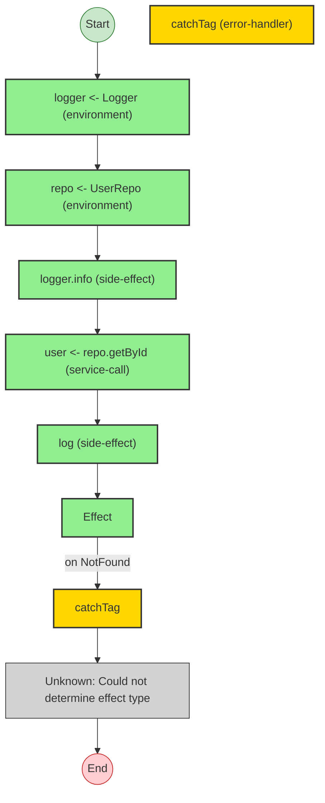
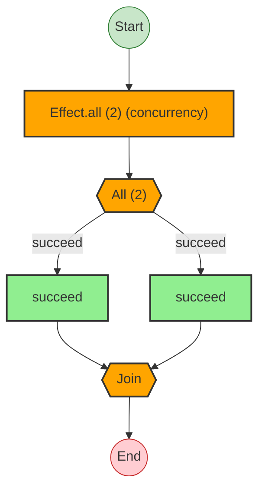
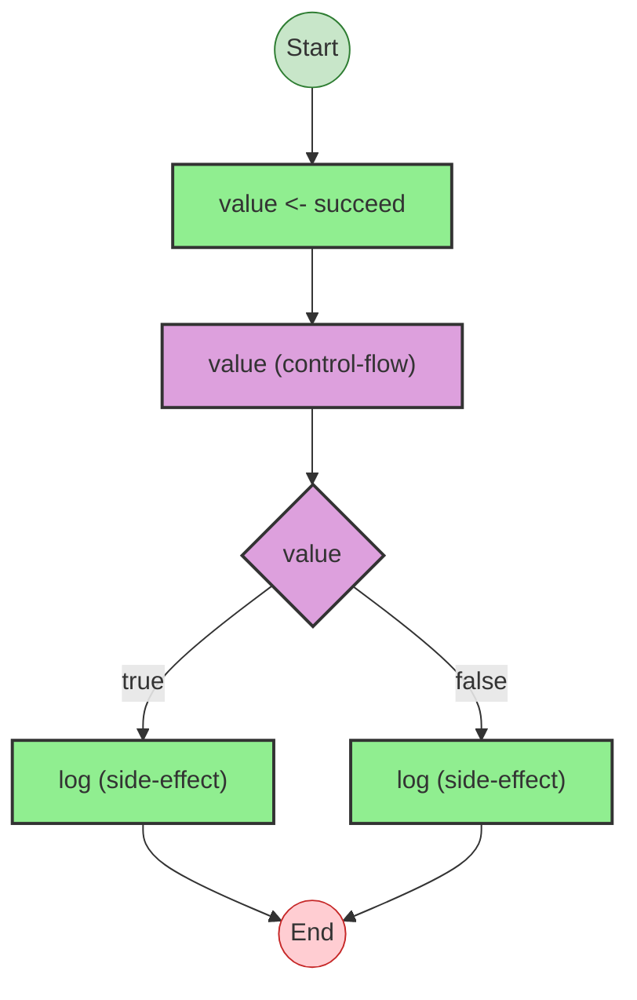
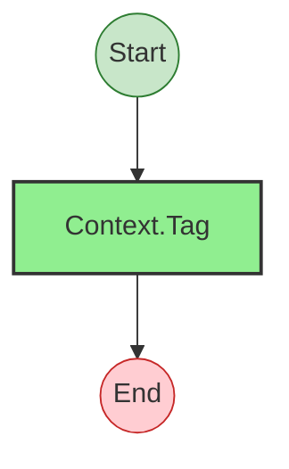

# Effect Analysis: richProgram

## Metadata

- **File**: `/Users/jreehal/dev/node-examples/effect-analyzer/packages/effect-analyzer/src/__fixtures__/rich-labels.ts`
- **Analyzed**: 2026-05-22T16:10:34.111Z
- **Source Type**: generator
- **TypeScript Version**: 6.0.2


## Effect Flow




## Statistics

- **Total Effects**: 6
- **Error Handlers**: 1
- **Unknown Nodes**: 1


## Explanation

```
richProgram (generator):
  1. Yields logger <- Logger
  2. Yields repo <- UserRepo
  3. Calls logger.info
  4. Yields user <- repo.getById
  5. Calls log

  Services required: UserRepo
  Error paths: { _tag: "NotFound"; }
  Concurrency: sequential (no parallelism)
```


## Dependencies

- `UserRepo`


## Error Types

- `{ _tag: "NotFound"; }`


---

# Effect Analysis: parallelProgram

## Metadata

- **File**: `/Users/jreehal/dev/node-examples/effect-analyzer/packages/effect-analyzer/src/__fixtures__/rich-labels.ts`
- **Analyzed**: 2026-05-22T16:10:34.116Z
- **Source Type**: generator
- **TypeScript Version**: 6.0.2


## Effect Flow




## Statistics

- **Total Effects**: 2
- **Parallel Operations**: 1


## Explanation

```
parallelProgram (generator):
  1. [a, b] = Runs 2 effects in sequential:
    Calls succeed — constructor
    Calls succeed — constructor

  Concurrency: uses parallelism / racing
```


---

# Effect Analysis: conditionalProgram

## Metadata

- **File**: `/Users/jreehal/dev/node-examples/effect-analyzer/packages/effect-analyzer/src/__fixtures__/rich-labels.ts`
- **Analyzed**: 2026-05-22T16:10:34.117Z
- **Source Type**: generator
- **TypeScript Version**: 6.0.2


## Effect Flow




## Statistics

- **Total Effects**: 3
- **Conditionals**: 1


## Explanation

```
conditionalProgram (generator):
  1. Yields value <- succeed
  2. If value:
    Calls log
  3. Else:
    Calls log

  Concurrency: sequential (no parallelism)
```


---

# Effect Analysis: UserRepo

## Metadata

- **File**: `/Users/jreehal/dev/node-examples/effect-analyzer/packages/effect-analyzer/src/__fixtures__/rich-labels.ts`
- **Analyzed**: 2026-05-22T16:10:34.118Z
- **Source Type**: class
- **TypeScript Version**: 6.0.2


## Effect Flow




## Statistics

- **Total Effects**: 1


## Explanation

```
UserRepo (class):
  1. Calls Context.Tag — service-tag

  Concurrency: sequential (no parallelism)
```


---

# Effect Analysis: Logger

## Metadata

- **File**: `/Users/jreehal/dev/node-examples/effect-analyzer/packages/effect-analyzer/src/__fixtures__/rich-labels.ts`
- **Analyzed**: 2026-05-22T16:10:34.118Z
- **Source Type**: class
- **TypeScript Version**: 6.0.2


## Effect Flow


## Statistics

- **Total Effects**: 1


## Explanation

```
Logger (class):
  1. Calls Context.Tag — service-tag

  Concurrency: sequential (no parallelism)
```

