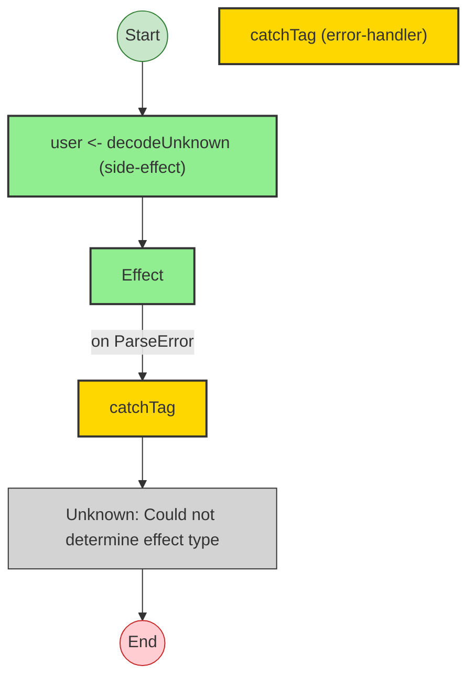
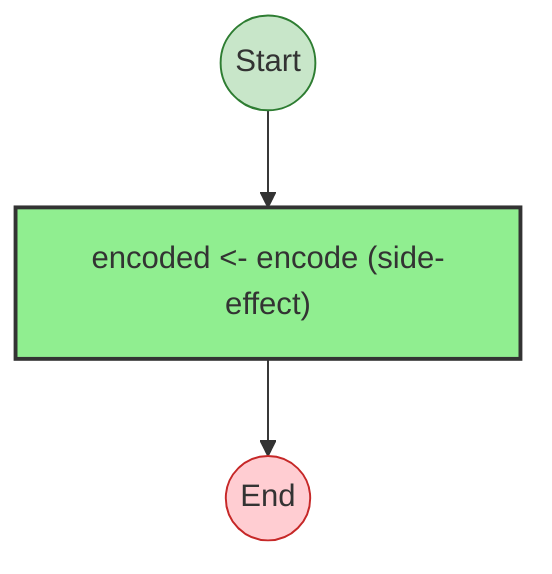
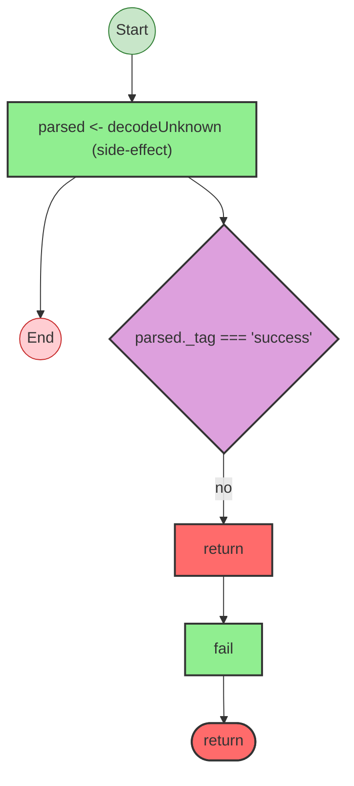
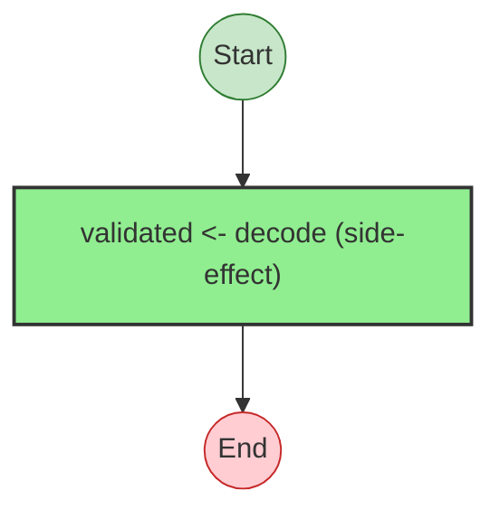
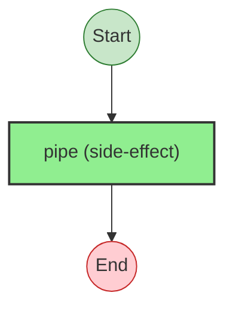
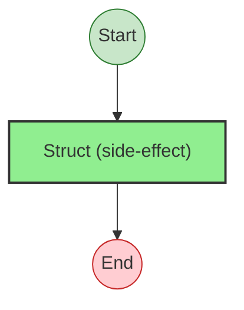
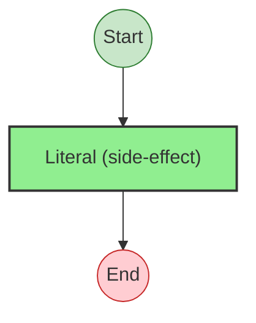
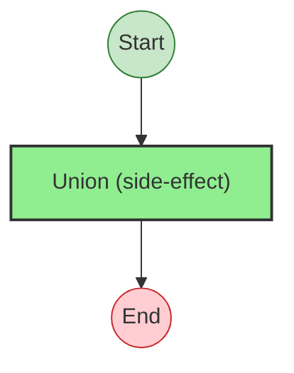
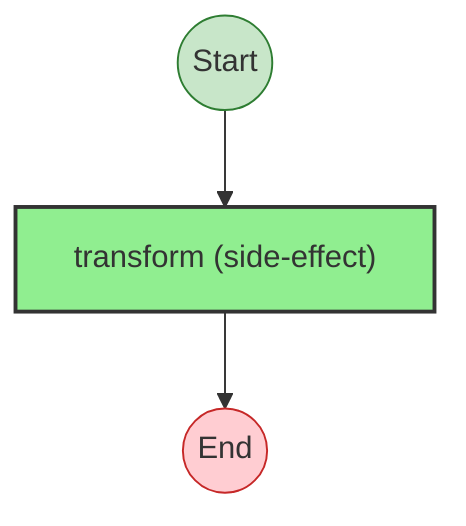

# Effect Analysis: validateUserProgram

## Metadata

- **File**: `/Users/jreehal/dev/node-examples/effect-analyzer/packages/effect-analyzer/src/__fixtures__/schema-patterns.ts`
- **Analyzed**: 2026-05-22T16:10:34.228Z
- **Source Type**: generator
- **TypeScript Version**: 6.0.2


## Effect Flow




## Statistics

- **Total Effects**: 2
- **Error Handlers**: 1
- **Unknown Nodes**: 1


## Explanation

```
validateUserProgram (generator):
  1. Yields user <- decodeUnknown

  Error paths: ParseError
  Concurrency: sequential (no parallelism)
```


## Error Types

- `ParseError`


---

# Effect Analysis: encodeUserProgram

## Metadata

- **File**: `/Users/jreehal/dev/node-examples/effect-analyzer/packages/effect-analyzer/src/__fixtures__/schema-patterns.ts`
- **Analyzed**: 2026-05-22T16:10:34.241Z
- **Source Type**: generator
- **TypeScript Version**: 6.0.2


## Effect Flow




## Statistics

- **Total Effects**: 1


## Explanation

```
encodeUserProgram (generator):
  1. Yields encoded <- encode

  Error paths: ParseError
  Concurrency: sequential (no parallelism)
```


## Error Types

- `ParseError`


---

# Effect Analysis: processApiResponseProgram

## Metadata

- **File**: `/Users/jreehal/dev/node-examples/effect-analyzer/packages/effect-analyzer/src/__fixtures__/schema-patterns.ts`
- **Analyzed**: 2026-05-22T16:10:34.253Z
- **Source Type**: generator
- **TypeScript Version**: 6.0.2


## Effect Flow




## Statistics

- **Total Effects**: 2


## Explanation

```
processApiResponseProgram (generator):
  1. Yields parsed <- decodeUnknown
  2. If parsed._tag === 'success':
  3. Else:
    Returns:
      Calls fail — constructor

  Error paths: Error, ParseError
  Concurrency: sequential (no parallelism)
```


## Error Types

- `Error`
- `ParseError`


---

# Effect Analysis: createUserIdProgram

## Metadata

- **File**: `/Users/jreehal/dev/node-examples/effect-analyzer/packages/effect-analyzer/src/__fixtures__/schema-patterns.ts`
- **Analyzed**: 2026-05-22T16:10:34.255Z
- **Source Type**: generator
- **TypeScript Version**: 6.0.2


## Effect Flow




## Statistics

- **Total Effects**: 1


## Explanation

```
createUserIdProgram (generator):
  1. Yields validated <- decode

  Error paths: ParseError
  Concurrency: sequential (no parallelism)
```


## Error Types

- `ParseError`


---

# Effect Analysis: EmailSchema

## Metadata

- **File**: `/Users/jreehal/dev/node-examples/effect-analyzer/packages/effect-analyzer/src/__fixtures__/schema-patterns.ts`
- **Analyzed**: 2026-05-22T16:10:34.256Z
- **Source Type**: direct
- **TypeScript Version**: 6.0.2


## Effect Flow




## Statistics

- **Total Effects**: 1


## Explanation

```
EmailSchema (direct):
  1. Calls pipe — schema

  Concurrency: sequential (no parallelism)
```


---

# Effect Analysis: PositiveInt

## Metadata

- **File**: `/Users/jreehal/dev/node-examples/effect-analyzer/packages/effect-analyzer/src/__fixtures__/schema-patterns.ts`
- **Analyzed**: 2026-05-22T16:10:34.256Z
- **Source Type**: direct
- **TypeScript Version**: 6.0.2


## Effect Flow


## Statistics

- **Total Effects**: 1


## Explanation

```
PositiveInt (direct):
  1. Calls pipe — schema

  Concurrency: sequential (no parallelism)
```


---

# Effect Analysis: UserId

## Metadata

- **File**: `/Users/jreehal/dev/node-examples/effect-analyzer/packages/effect-analyzer/src/__fixtures__/schema-patterns.ts`
- **Analyzed**: 2026-05-22T16:10:34.257Z
- **Source Type**: direct
- **TypeScript Version**: 6.0.2


## Effect Flow


## Statistics

- **Total Effects**: 1


## Explanation

```
UserId (direct):
  1. Calls pipe — schema

  Concurrency: sequential (no parallelism)
```


---

# Effect Analysis: AddressSchema

## Metadata

- **File**: `/Users/jreehal/dev/node-examples/effect-analyzer/packages/effect-analyzer/src/__fixtures__/schema-patterns.ts`
- **Analyzed**: 2026-05-22T16:10:34.257Z
- **Source Type**: direct
- **TypeScript Version**: 6.0.2


## Effect Flow




## Statistics

- **Total Effects**: 1


## Explanation

```
AddressSchema (direct):
  1. Calls Struct — schema

  Concurrency: sequential (no parallelism)
```


---

# Effect Analysis: UserSchema

## Metadata

- **File**: `/Users/jreehal/dev/node-examples/effect-analyzer/packages/effect-analyzer/src/__fixtures__/schema-patterns.ts`
- **Analyzed**: 2026-05-22T16:10:34.258Z
- **Source Type**: direct
- **TypeScript Version**: 6.0.2


## Effect Flow


## Statistics

- **Total Effects**: 1


## Explanation

```
UserSchema (direct):
  1. Calls Struct — schema

  Concurrency: sequential (no parallelism)
```


---

# Effect Analysis: CreateUserRequest

## Metadata

- **File**: `/Users/jreehal/dev/node-examples/effect-analyzer/packages/effect-analyzer/src/__fixtures__/schema-patterns.ts`
- **Analyzed**: 2026-05-22T16:10:34.259Z
- **Source Type**: direct
- **TypeScript Version**: 6.0.2


## Effect Flow


## Statistics

- **Total Effects**: 1


## Explanation

```
CreateUserRequest (direct):
  1. Calls Struct — schema

  Concurrency: sequential (no parallelism)
```


---

# Effect Analysis: StatusSchema

## Metadata

- **File**: `/Users/jreehal/dev/node-examples/effect-analyzer/packages/effect-analyzer/src/__fixtures__/schema-patterns.ts`
- **Analyzed**: 2026-05-22T16:10:34.260Z
- **Source Type**: direct
- **TypeScript Version**: 6.0.2


## Effect Flow




## Statistics

- **Total Effects**: 1


## Explanation

```
StatusSchema (direct):
  1. Calls Literal — schema

  Concurrency: sequential (no parallelism)
```


---

# Effect Analysis: ApiResponse

## Metadata

- **File**: `/Users/jreehal/dev/node-examples/effect-analyzer/packages/effect-analyzer/src/__fixtures__/schema-patterns.ts`
- **Analyzed**: 2026-05-22T16:10:34.260Z
- **Source Type**: direct
- **TypeScript Version**: 6.0.2


## Effect Flow




## Statistics

- **Total Effects**: 1


## Explanation

```
ApiResponse (direct):
  1. Calls Union — schema

  Concurrency: sequential (no parallelism)
```


---

# Effect Analysis: ValidationError

## Metadata

- **File**: `/Users/jreehal/dev/node-examples/effect-analyzer/packages/effect-analyzer/src/__fixtures__/schema-patterns.ts`
- **Analyzed**: 2026-05-22T16:10:34.262Z
- **Source Type**: direct
- **TypeScript Version**: 6.0.2


## Effect Flow


## Statistics

- **Total Effects**: 1


## Explanation

```
ValidationError (direct):
  1. Calls Struct — schema

  Concurrency: sequential (no parallelism)
```


---

# Effect Analysis: GetUserRequest

## Metadata

- **File**: `/Users/jreehal/dev/node-examples/effect-analyzer/packages/effect-analyzer/src/__fixtures__/schema-patterns.ts`
- **Analyzed**: 2026-05-22T16:10:34.263Z
- **Source Type**: direct
- **TypeScript Version**: 6.0.2


## Effect Flow


## Statistics

- **Total Effects**: 1


## Explanation

```
GetUserRequest (direct):
  1. Calls Struct — schema

  Concurrency: sequential (no parallelism)
```


---

# Effect Analysis: DateFromString

## Metadata

- **File**: `/Users/jreehal/dev/node-examples/effect-analyzer/packages/effect-analyzer/src/__fixtures__/schema-patterns.ts`
- **Analyzed**: 2026-05-22T16:10:34.265Z
- **Source Type**: direct
- **TypeScript Version**: 6.0.2


## Effect Flow




## Statistics

- **Total Effects**: 1


## Explanation

```
DateFromString (direct):
  1. Calls transform — schema

  Concurrency: sequential (no parallelism)
```


---

# Effect Analysis: TrimmedString

## Metadata

- **File**: `/Users/jreehal/dev/node-examples/effect-analyzer/packages/effect-analyzer/src/__fixtures__/schema-patterns.ts`
- **Analyzed**: 2026-05-22T16:10:34.266Z
- **Source Type**: direct
- **TypeScript Version**: 6.0.2


## Effect Flow


## Statistics

- **Total Effects**: 1


## Explanation

```
TrimmedString (direct):
  1. Calls pipe — schema

  Concurrency: sequential (no parallelism)
```

