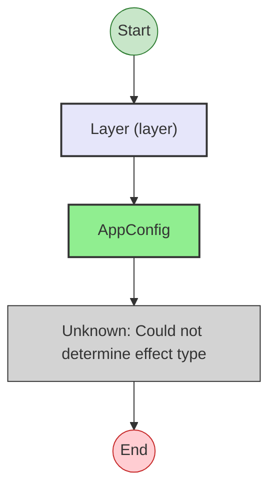
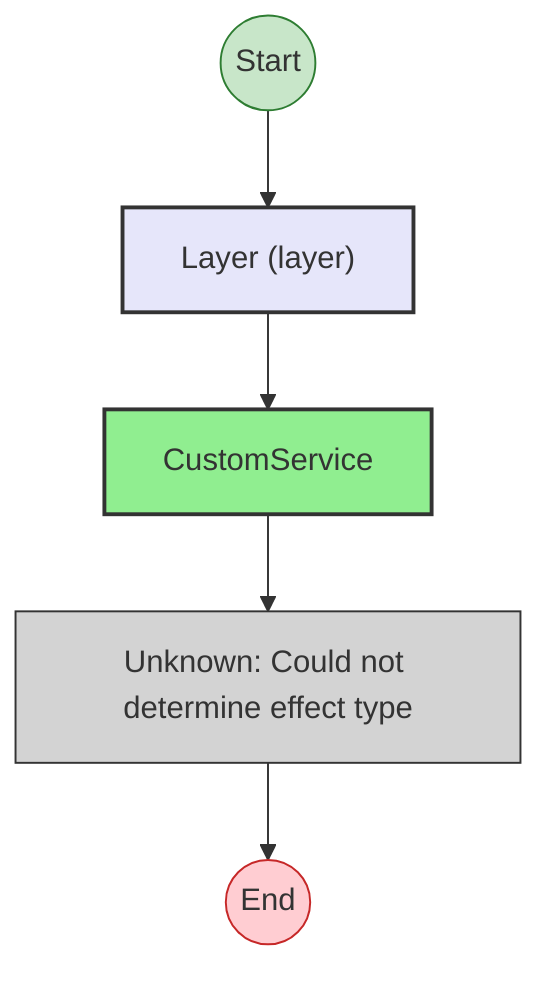
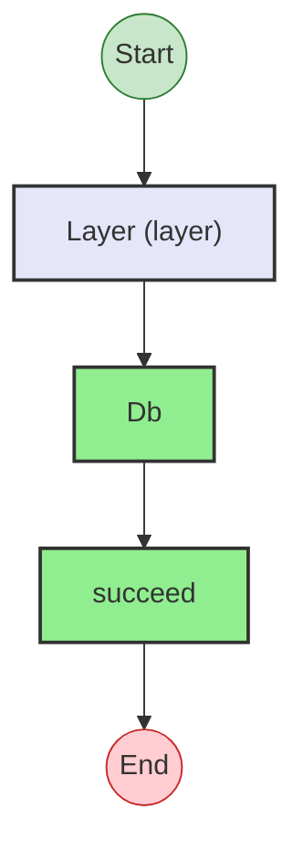
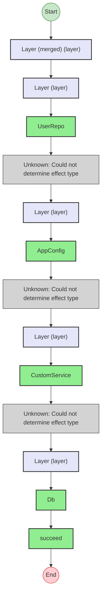
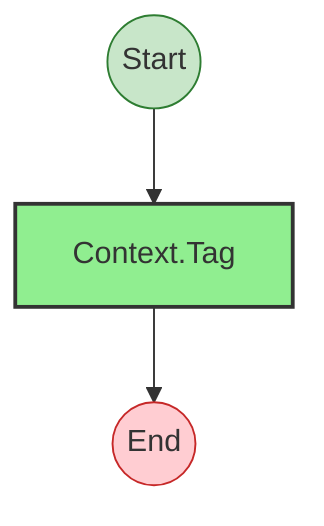

# Effect Analysis: UserRepoLive

## Metadata

- **File**: `/Users/jreehal/dev/node-examples/effect-analyzer/packages/effect-analyzer/src/__fixtures__/services.ts`
- **Analyzed**: 2026-05-22T16:10:34.350Z
- **Source Type**: direct
- **TypeScript Version**: 6.0.2


## Effect Flow


## Statistics

- **Total Effects**: 1
- **Unknown Nodes**: 1


## Explanation

```
UserRepoLive (direct):
  1. Provides layer providing UserRepo:
    Calls UserRepo
    (unknown: Could not determine effect type)

  Concurrency: sequential (no parallelism)
```


---

# Effect Analysis: AppConfigLive

## Metadata

- **File**: `/Users/jreehal/dev/node-examples/effect-analyzer/packages/effect-analyzer/src/__fixtures__/services.ts`
- **Analyzed**: 2026-05-22T16:10:34.352Z
- **Source Type**: direct
- **TypeScript Version**: 6.0.2


## Effect Flow




## Statistics

- **Total Effects**: 1
- **Unknown Nodes**: 1


## Explanation

```
AppConfigLive (direct):
  1. Provides layer providing AppConfig:
    Calls AppConfig
    (unknown: Could not determine effect type)

  Concurrency: sequential (no parallelism)
```


---

# Effect Analysis: CustomServiceLive

## Metadata

- **File**: `/Users/jreehal/dev/node-examples/effect-analyzer/packages/effect-analyzer/src/__fixtures__/services.ts`
- **Analyzed**: 2026-05-22T16:10:34.353Z
- **Source Type**: direct
- **TypeScript Version**: 6.0.2


## Effect Flow




## Statistics

- **Total Effects**: 1
- **Unknown Nodes**: 1


## Explanation

```
CustomServiceLive (direct):
  1. Provides layer providing CustomService (requires CustomService):
    Calls CustomService
    (unknown: Could not determine effect type)

  Concurrency: sequential (no parallelism)
```


---

# Effect Analysis: DbLive

## Metadata

- **File**: `/Users/jreehal/dev/node-examples/effect-analyzer/packages/effect-analyzer/src/__fixtures__/services.ts`
- **Analyzed**: 2026-05-22T16:10:34.359Z
- **Source Type**: direct
- **TypeScript Version**: 6.0.2


## Effect Flow




## Statistics

- **Total Effects**: 2


## Explanation

```
DbLive (direct):
  1. Provides layer providing Db:
    Calls Db
    Calls succeed — constructor

  Concurrency: sequential (no parallelism)
```


---

# Effect Analysis: AppLayer

## Metadata

- **File**: `/Users/jreehal/dev/node-examples/effect-analyzer/packages/effect-analyzer/src/__fixtures__/services.ts`
- **Analyzed**: 2026-05-22T16:10:34.361Z
- **Source Type**: direct
- **TypeScript Version**: 6.0.2


## Effect Flow




## Statistics

- **Total Effects**: 5
- **Unknown Nodes**: 3


## Explanation

```
AppLayer (direct):
  1. Provides layer (requires CustomService):
    Provides layer providing UserRepo:
      Calls UserRepo
      (unknown: Could not determine effect type)
    Provides layer providing AppConfig:
      Calls AppConfig
      (unknown: Could not determine effect type)
    Provides layer providing CustomService (requires CustomService):
      Calls CustomService
      (unknown: Could not determine effect type)
    Provides layer providing Db:
      Calls Db
      Calls succeed — constructor

  Concurrency: sequential (no parallelism)
```


---

# Effect Analysis: UserRepo

## Metadata

- **File**: `/Users/jreehal/dev/node-examples/effect-analyzer/packages/effect-analyzer/src/__fixtures__/services.ts`
- **Analyzed**: 2026-05-22T16:10:34.361Z
- **Source Type**: class
- **TypeScript Version**: 6.0.2


## Effect Flow




## Statistics

- **Total Effects**: 1


## Explanation

```
UserRepo (class):
  1. Calls Context.Tag — service-tag

  Concurrency: sequential (no parallelism)
```


---

# Effect Analysis: AppConfig

## Metadata

- **File**: `/Users/jreehal/dev/node-examples/effect-analyzer/packages/effect-analyzer/src/__fixtures__/services.ts`
- **Analyzed**: 2026-05-22T16:10:34.361Z
- **Source Type**: class
- **TypeScript Version**: 6.0.2


## Effect Flow


## Statistics

- **Total Effects**: 1


## Explanation

```
AppConfig (class):
  1. Calls Context.Tag — service-tag

  Concurrency: sequential (no parallelism)
```


---

# Effect Analysis: CustomService

## Metadata

- **File**: `/Users/jreehal/dev/node-examples/effect-analyzer/packages/effect-analyzer/src/__fixtures__/services.ts`
- **Analyzed**: 2026-05-22T16:10:34.361Z
- **Source Type**: class
- **TypeScript Version**: 6.0.2


## Effect Flow


## Statistics

- **Total Effects**: 1


## Explanation

```
CustomService (class):
  1. Calls Context.Tag — service-tag

  Concurrency: sequential (no parallelism)
```


---

# Effect Analysis: Db

## Metadata

- **File**: `/Users/jreehal/dev/node-examples/effect-analyzer/packages/effect-analyzer/src/__fixtures__/services.ts`
- **Analyzed**: 2026-05-22T16:10:34.362Z
- **Source Type**: class
- **TypeScript Version**: 6.0.2


## Effect Flow


## Statistics

- **Total Effects**: 1


## Explanation

```
Db (class):
  1. Calls Context.Tag — service-tag

  Concurrency: sequential (no parallelism)
```

