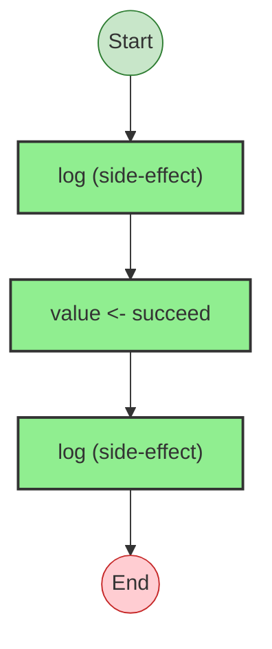
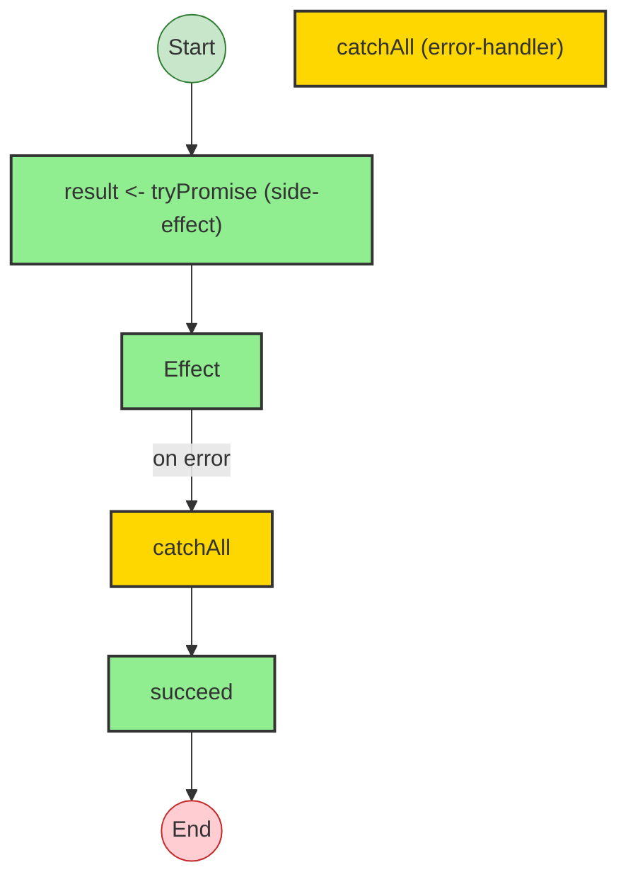

# Effect Analysis: simpleProgram

## Metadata

- **File**: `/Users/jreehal/dev/node-examples/effect-analyzer/packages/effect-analyzer/src/__fixtures__/simple-effect.ts`
- **Analyzed**: 2026-05-22T16:10:34.438Z
- **Source Type**: generator
- **TypeScript Version**: 6.0.2


## Effect Flow




## Statistics

- **Total Effects**: 3


## Explanation

```
simpleProgram (generator):
  1. Calls log
  2. Yields value <- succeed
  3. Calls log

  Concurrency: sequential (no parallelism)
```


---

# Effect Analysis: programWithErrorHandling

## Metadata

- **File**: `/Users/jreehal/dev/node-examples/effect-analyzer/packages/effect-analyzer/src/__fixtures__/simple-effect.ts`
- **Analyzed**: 2026-05-22T16:10:34.441Z
- **Source Type**: generator
- **TypeScript Version**: 6.0.2


## Effect Flow




## Statistics

- **Total Effects**: 3
- **Error Handlers**: 1


## Explanation

```
programWithErrorHandling (generator):
  1. Yields result <- tryPromise

  Error paths: Error
  Concurrency: sequential (no parallelism)
```


## Error Types

- `Error`

