# Effect Analysis: simpleStreamProgram

## Metadata

- **File**: `/Users/jreehal/dev/node-examples/effect-analyzer/packages/effect-analyzer/src/__fixtures__/stream-patterns.ts`
- **Analyzed**: 2026-05-22T16:10:34.519Z
- **Source Type**: generator
- **TypeScript Version**: 6.0.2


## Effect Flow

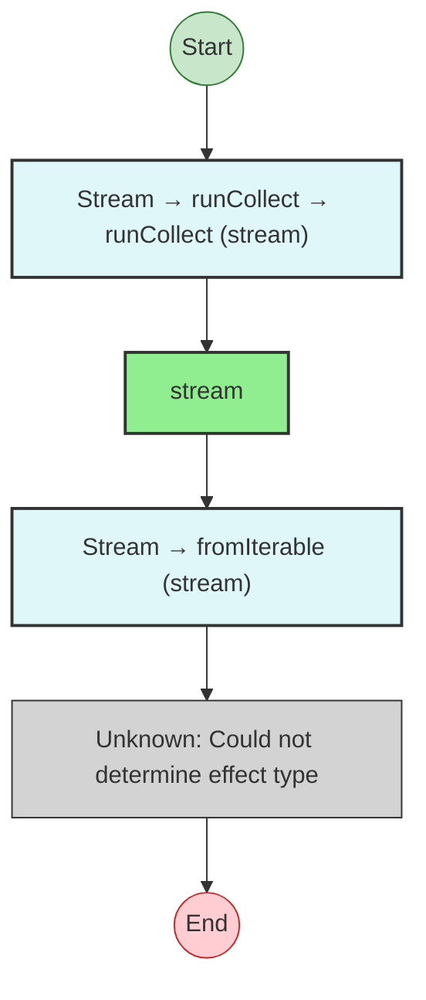


## Statistics

- **Total Effects**: 1
- **Unknown Nodes**: 1


## Explanation

```
simpleStreamProgram (generator):
  1. result = Stream: runCollect -> runCollect
    Calls stream
  2. Stream: fromIterable
    (unknown: Could not determine effect type)

  Concurrency: sequential (no parallelism)
```


---

# Effect Analysis: mappedStreamProgram

## Metadata

- **File**: `/Users/jreehal/dev/node-examples/effect-analyzer/packages/effect-analyzer/src/__fixtures__/stream-patterns.ts`
- **Analyzed**: 2026-05-22T16:10:34.521Z
- **Source Type**: generator
- **TypeScript Version**: 6.0.2


## Effect Flow


## Statistics

- **Total Effects**: 1
- **Unknown Nodes**: 4


## Explanation

```
mappedStreamProgram (generator):
  1. result = Stream: runCollect -> runCollect
    Calls stream
  2. Stream: fromIterable -> map
    (unknown: Could not determine effect type)
    map callback:
      Calls n * 2 — callback-transform
  3. Stream: fromIterable
    (unknown: Could not determine effect type)
  4. Stream: map
    (unknown: Could not determine effect type)
    map callback:
      Calls n * 2 — callback-transform

  Concurrency: sequential (no parallelism)
```


---

# Effect Analysis: filteredStreamProgram

## Metadata

- **File**: `/Users/jreehal/dev/node-examples/effect-analyzer/packages/effect-analyzer/src/__fixtures__/stream-patterns.ts`
- **Analyzed**: 2026-05-22T16:10:34.523Z
- **Source Type**: generator
- **TypeScript Version**: 6.0.2


## Effect Flow


## Statistics

- **Total Effects**: 1
- **Unknown Nodes**: 4


## Explanation

```
filteredStreamProgram (generator):
  1. result = Stream: runCollect -> runCollect
    Calls stream
  2. Stream: fromIterable -> filter
    (unknown: Could not determine effect type)
    filter callback:
      If n % 2 === 0:
        (opaque: callback-branch)
      If n % 2:
        (opaque: callback-branch)
  3. Stream: fromIterable
    (unknown: Could not determine effect type)
  4. Stream: filter
    (unknown: Could not determine effect type)
    filter callback:
      If n % 2 === 0:
        (opaque: callback-branch)
      If n % 2:
        (opaque: callback-branch)

  Concurrency: sequential (no parallelism)
```


---

# Effect Analysis: pipelineStreamProgram

## Metadata

- **File**: `/Users/jreehal/dev/node-examples/effect-analyzer/packages/effect-analyzer/src/__fixtures__/stream-patterns.ts`
- **Analyzed**: 2026-05-22T16:10:34.526Z
- **Source Type**: generator
- **TypeScript Version**: 6.0.2


## Effect Flow

```mermaid
flowchart TB

  %% Program: pipelineStreamProgram

  start((Start))
  end_node((End))

  n2["Stream → runCollect → runCollect (stream)"]
  n3["stream"]
  n4["Stream → fromIterable → map → filter → take → map (stream)"]
  n5["Unknown: Could not determine effect type"]
  n6["Stream → fromIterable (stream)"]
  n7["Unknown: Could not determine effect type"]
  n8["Stream → map (stream)"]
  n9["Unknown: Could not determine effect type"]
  n10["Stream → filter (stream)"]
  n11["Unknown: Could not determine effect type"]
  n12["Stream → take (stream)"]
  n13["Unknown: Could not determine effect type"]
  n14["Stream → map (stream)"]
  n15["Unknown: Could not determine effect type"]

  %% Edges
  n2 --> n3
  n4 --> n5
  n3 --> n4
  n6 --> n7
  n5 --> n6
  n8 --> n9
  n7 --> n8
  n10 --> n11
  n9 --> n10
  n12 --> n13
  n11 --> n12
  n14 --> n15
  n13 --> n14
  start --> n2
  n15 --> end_node

  %% Styles
  classDef startStyle fill:#c8e6c9,stroke:#2e7d32
  classDef endStyle fill:#ffcdd2,stroke:#c62828
  classDef effectStyle fill:#90EE90,stroke:#333,stroke-width:2px
  classDef streamStyle fill:#E0F7FA,stroke:#333,stroke-width:2px
  classDef unknownStyle fill:#D3D3D3,stroke:#333,stroke-width:1px
  class start startStyle
  class end_node endStyle
  class n2 streamStyle
  class n3 effectStyle
  class n4 streamStyle
  class n5 unknownStyle
  class n6 streamStyle
  class n7 unknownStyle
  class n8 streamStyle
  class n9 unknownStyle
  class n10 streamStyle
  class n11 unknownStyle
  class n12 streamStyle
  class n13 unknownStyle
  class n14 streamStyle
  class n15 unknownStyle
```


## Statistics

- **Total Effects**: 1
- **Unknown Nodes**: 10


## Explanation

```
pipelineStreamProgram (generator):
  1. result = Stream: runCollect -> runCollect
    Calls stream
  2. Stream: fromIterable -> map -> filter -> take -> map
    (unknown: Could not determine effect type)
    map callback:
      Calls n * n — callback-transform
    filter callback:
      If n > 10:
        (opaque: callback-branch)
    map callback:
      Calls `Value: ${n}` — callback-transform
  3. Stream: fromIterable
    (unknown: Could not determine effect type)
  4. Stream: map
    (unknown: Could not determine effect type)
    map callback:
      Calls n * n — callback-transform
  5. Stream: filter
    (unknown: Could not determine effect type)
    filter callback:
      If n > 10:
        (opaque: callback-branch)
  6. Stream: take
    (unknown: Could not determine effect type)
  7. Stream: map
    (unknown: Could not determine effect type)
    map callback:
      Calls `Value: ${n}` — callback-transform

  Concurrency: sequential (no parallelism)
```


---

# Effect Analysis: scannedStreamProgram

## Metadata

- **File**: `/Users/jreehal/dev/node-examples/effect-analyzer/packages/effect-analyzer/src/__fixtures__/stream-patterns.ts`
- **Analyzed**: 2026-05-22T16:10:34.528Z
- **Source Type**: generator
- **TypeScript Version**: 6.0.2


## Effect Flow

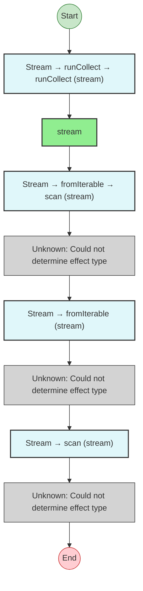


## Statistics

- **Total Effects**: 1
- **Unknown Nodes**: 4


## Explanation

```
scannedStreamProgram (generator):
  1. result = Stream: runCollect -> runCollect
    Calls stream
  2. Stream: fromIterable -> scan
    (unknown: Could not determine effect type)
    scan callback:
      Calls acc + n — callback-transform
  3. Stream: fromIterable
    (unknown: Could not determine effect type)
  4. Stream: scan
    (unknown: Could not determine effect type)
    scan callback:
      Calls acc + n — callback-transform

  Concurrency: sequential (no parallelism)
```


---

# Effect Analysis: flatMappedStreamProgram

## Metadata

- **File**: `/Users/jreehal/dev/node-examples/effect-analyzer/packages/effect-analyzer/src/__fixtures__/stream-patterns.ts`
- **Analyzed**: 2026-05-22T16:10:34.529Z
- **Source Type**: generator
- **TypeScript Version**: 6.0.2


## Effect Flow

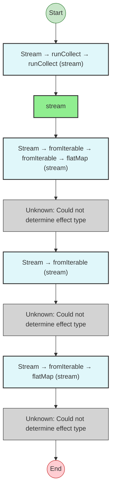


## Statistics

- **Total Effects**: 1
- **Unknown Nodes**: 4


## Explanation

```
flatMappedStreamProgram (generator):
  1. result = Stream: runCollect -> runCollect
    Calls stream
  2. Stream: fromIterable -> fromIterable -> flatMap
    (unknown: Could not determine effect type)
    flatMap callback:
      Calls fromIterable — callback-call
  3. Stream: fromIterable
    (unknown: Could not determine effect type)
  4. Stream: fromIterable -> flatMap
    (unknown: Could not determine effect type)
    flatMap callback:
      Calls fromIterable — callback-call

  Concurrency: sequential (no parallelism)
```


---

# Effect Analysis: errorHandledStreamProgram

## Metadata

- **File**: `/Users/jreehal/dev/node-examples/effect-analyzer/packages/effect-analyzer/src/__fixtures__/stream-patterns.ts`
- **Analyzed**: 2026-05-22T16:10:34.531Z
- **Source Type**: generator
- **TypeScript Version**: 6.0.2


## Effect Flow

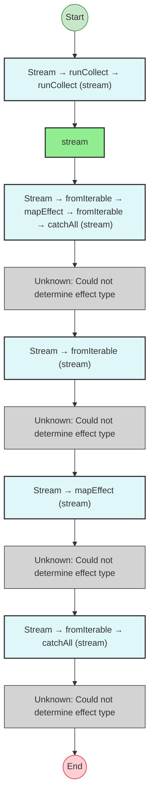


## Statistics

- **Total Effects**: 1
- **Unknown Nodes**: 6


## Explanation

```
errorHandledStreamProgram (generator):
  1. result = Stream: runCollect -> runCollect
    Calls stream
  2. Stream: fromIterable -> mapEffect -> fromIterable -> catchAll
    (unknown: Could not determine effect type)
    catchAll callback:
      Calls fromIterable — callback-call
  3. Stream: fromIterable
    (unknown: Could not determine effect type)
  4. Stream: mapEffect
    (unknown: Could not determine effect type)
  5. Stream: fromIterable -> catchAll
    (unknown: Could not determine effect type)
    catchAll callback:
      Calls fromIterable — callback-call

  Concurrency: sequential (no parallelism)
```


---

# Effect Analysis: timeoutStreamProgram

## Metadata

- **File**: `/Users/jreehal/dev/node-examples/effect-analyzer/packages/effect-analyzer/src/__fixtures__/stream-patterns.ts`
- **Analyzed**: 2026-05-22T16:10:34.535Z
- **Source Type**: generator
- **TypeScript Version**: 6.0.2


## Effect Flow

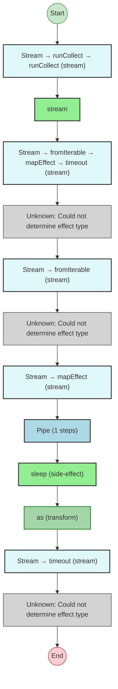


## Statistics

- **Total Effects**: 5
- **Unknown Nodes**: 4


## Explanation

```
timeoutStreamProgram (generator):
  1. result = Stream: runCollect -> runCollect
    Calls stream
  2. Stream: fromIterable -> mapEffect -> timeout
    (unknown: Could not determine effect type)
    mapEffect callback:
      Calls sleep — callback-call
      Calls as — callback-call
  3. Stream: fromIterable
    (unknown: Could not determine effect type)
  4. Stream: mapEffect
    Pipes sleep through:
      Calls sleep
      Transforms via as
    mapEffect callback:
      Calls sleep — callback-call
      Calls as — callback-call
  5. Stream: timeout
    (unknown: Could not determine effect type)

  Concurrency: sequential (no parallelism)
```


---

# Effect Analysis: sinkStreamProgram

## Metadata

- **File**: `/Users/jreehal/dev/node-examples/effect-analyzer/packages/effect-analyzer/src/__fixtures__/stream-patterns.ts`
- **Analyzed**: 2026-05-22T16:10:34.537Z
- **Source Type**: generator
- **TypeScript Version**: 6.0.2


## Effect Flow

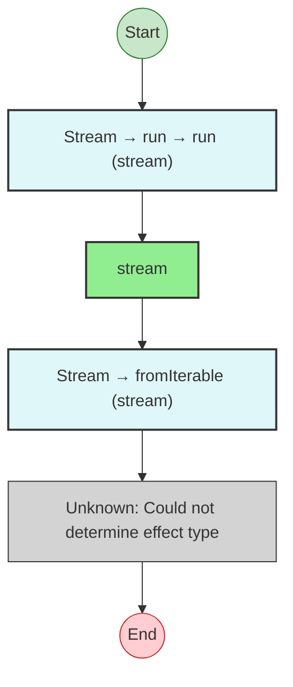


## Statistics

- **Total Effects**: 1
- **Unknown Nodes**: 1


## Explanation

```
sinkStreamProgram (generator):
  1. sum = Stream: run -> run
    Calls stream
  2. Stream: fromIterable
    (unknown: Could not determine effect type)

  Concurrency: sequential (no parallelism)
```


---

# Effect Analysis: foldSinkStreamProgram

## Metadata

- **File**: `/Users/jreehal/dev/node-examples/effect-analyzer/packages/effect-analyzer/src/__fixtures__/stream-patterns.ts`
- **Analyzed**: 2026-05-22T16:10:34.538Z
- **Source Type**: generator
- **TypeScript Version**: 6.0.2


## Effect Flow


## Statistics

- **Total Effects**: 1
- **Unknown Nodes**: 1


## Explanation

```
foldSinkStreamProgram (generator):
  1. result = Stream: run -> run
    Calls stream
  2. Stream: fromIterable
    (unknown: Could not determine effect type)

  Concurrency: sequential (no parallelism)
```


---

# Effect Analysis: mergedStreamProgram

## Metadata

- **File**: `/Users/jreehal/dev/node-examples/effect-analyzer/packages/effect-analyzer/src/__fixtures__/stream-patterns.ts`
- **Analyzed**: 2026-05-22T16:10:34.539Z
- **Source Type**: generator
- **TypeScript Version**: 6.0.2


## Effect Flow

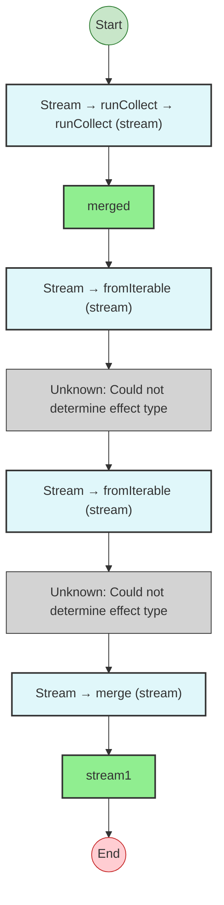


## Statistics

- **Total Effects**: 2
- **Unknown Nodes**: 2


## Explanation

```
mergedStreamProgram (generator):
  1. result = Stream: runCollect -> runCollect
    Calls merged
  2. Stream: fromIterable
    (unknown: Could not determine effect type)
  3. Stream: fromIterable
    (unknown: Could not determine effect type)
  4. Stream: merge
    Calls stream1

  Concurrency: sequential (no parallelism)
```


---

# Effect Analysis: zippedStreamProgram

## Metadata

- **File**: `/Users/jreehal/dev/node-examples/effect-analyzer/packages/effect-analyzer/src/__fixtures__/stream-patterns.ts`
- **Analyzed**: 2026-05-22T16:10:34.541Z
- **Source Type**: generator
- **TypeScript Version**: 6.0.2


## Effect Flow

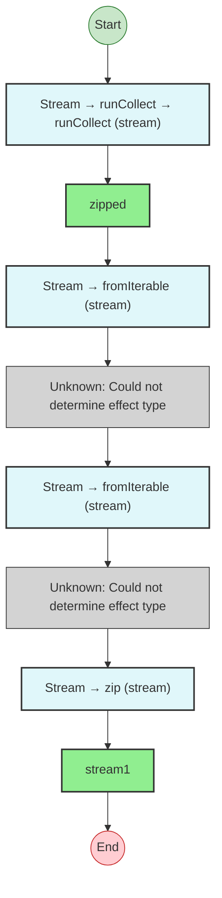


## Statistics

- **Total Effects**: 2
- **Unknown Nodes**: 2


## Explanation

```
zippedStreamProgram (generator):
  1. result = Stream: runCollect -> runCollect
    Calls zipped
  2. Stream: fromIterable
    (unknown: Could not determine effect type)
  3. Stream: fromIterable
    (unknown: Could not determine effect type)
  4. Stream: zip
    Calls stream1

  Concurrency: sequential (no parallelism)
```


---

# Effect Analysis: repeatingEffectStreamProgram

## Metadata

- **File**: `/Users/jreehal/dev/node-examples/effect-analyzer/packages/effect-analyzer/src/__fixtures__/stream-patterns.ts`
- **Analyzed**: 2026-05-22T16:10:34.543Z
- **Source Type**: generator
- **TypeScript Version**: 6.0.2


## Effect Flow

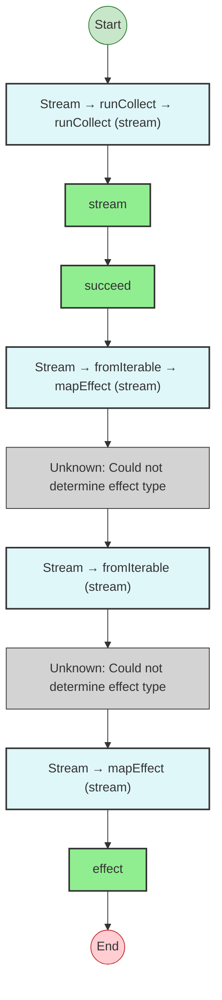


## Statistics

- **Total Effects**: 4
- **Unknown Nodes**: 2


## Explanation

```
repeatingEffectStreamProgram (generator):
  1. result = Stream: runCollect -> runCollect
    Calls stream
  2. Calls succeed — constructor
  3. Stream: fromIterable -> mapEffect
    (unknown: Could not determine effect type)
  4. Stream: fromIterable
    (unknown: Could not determine effect type)
  5. Stream: mapEffect
    Calls effect

  Concurrency: sequential (no parallelism)
```


---

# Effect Analysis: windowingStreamProgram

## Metadata

- **File**: `/Users/jreehal/dev/node-examples/effect-analyzer/packages/effect-analyzer/src/__fixtures__/stream-patterns.ts`
- **Analyzed**: 2026-05-22T16:10:34.548Z
- **Source Type**: generator
- **TypeScript Version**: 6.0.2


## Effect Flow

```mermaid
flowchart TB

  %% Program: windowingStreamProgram

  start((Start))
  end_node((End))

  n2["Stream → runCollect → runCollect (stream)"]
  n3["grouped"]
  n4["Stream → runCollect → runCollect (stream)"]
  n5["sliding"]
  n6["Stream → fromIterable → grouped (stream)"]
  n7["Unknown: Could not determine effect type"]
  n8["Stream → fromIterable (stream)"]
  n9["Unknown: Could not determine effect type"]
  n10["Stream → grouped (stream)"]
  n11["Unknown: Could not determine effect type"]
  n12["Stream → fromIterable → sliding (stream)"]
  n13["Unknown: Could not determine effect type"]
  n14["Stream → fromIterable (stream)"]
  n15["Unknown: Could not determine effect type"]
  n16["Stream → sliding (stream)"]
  n17["Unknown: Could not determine effect type"]

  %% Edges
  n2 --> n3
  n4 --> n5
  n3 --> n4
  n6 --> n7
  n5 --> n6
  n8 --> n9
  n7 --> n8
  n10 --> n11
  n9 --> n10
  n12 --> n13
  n11 --> n12
  n14 --> n15
  n13 --> n14
  n16 --> n17
  n15 --> n16
  start --> n2
  n17 --> end_node

  %% Styles
  classDef startStyle fill:#c8e6c9,stroke:#2e7d32
  classDef endStyle fill:#ffcdd2,stroke:#c62828
  classDef effectStyle fill:#90EE90,stroke:#333,stroke-width:2px
  classDef streamStyle fill:#E0F7FA,stroke:#333,stroke-width:2px
  classDef unknownStyle fill:#D3D3D3,stroke:#333,stroke-width:1px
  class start startStyle
  class end_node endStyle
  class n2 streamStyle
  class n3 effectStyle
  class n4 streamStyle
  class n5 effectStyle
  class n6 streamStyle
  class n7 unknownStyle
  class n8 streamStyle
  class n9 unknownStyle
  class n10 streamStyle
  class n11 unknownStyle
  class n12 streamStyle
  class n13 unknownStyle
  class n14 streamStyle
  class n15 unknownStyle
  class n16 streamStyle
  class n17 unknownStyle
```


## Statistics

- **Total Effects**: 2
- **Unknown Nodes**: 8


## Explanation

```
windowingStreamProgram (generator):
  1. a = Stream: runCollect -> runCollect
    Calls grouped
  2. b = Stream: runCollect -> runCollect
    Calls sliding
  3. Stream: fromIterable -> grouped
    (unknown: Could not determine effect type)
  4. Stream: fromIterable
    (unknown: Could not determine effect type)
  5. Stream: grouped
    (unknown: Could not determine effect type)
  6. Stream: fromIterable -> sliding
    (unknown: Could not determine effect type)
  7. Stream: fromIterable
    (unknown: Could not determine effect type)
  8. Stream: sliding
    (unknown: Could not determine effect type)

  Concurrency: sequential (no parallelism)
```

