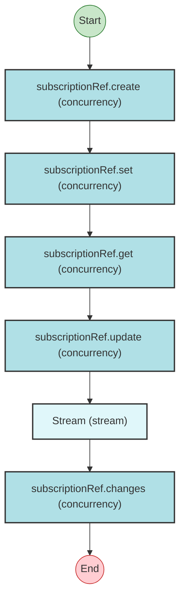

# Effect Analysis: subRefProgram

## Metadata

- **File**: `/Users/jreehal/dev/node-examples/effect-analyzer/packages/effect-analyzer/src/__fixtures__/subscription-ref.ts`
- **Analyzed**: 2026-05-22T16:10:34.626Z
- **Source Type**: generator
- **TypeScript Version**: 6.0.2


## Effect Flow




## Statistics

- No operations found


## Explanation

```
subRefProgram (generator):
  1. ref = subscriptionRef.create
  2. subscriptionRef.set
  3. value = subscriptionRef.get
  4. subscriptionRef.update
  5. Stream: 
    subscriptionRef.changes

  Concurrency: sequential (no parallelism)
```

