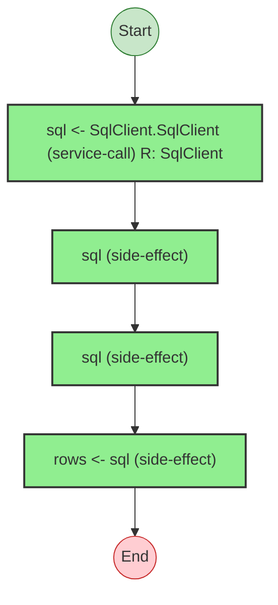

# Effect Analysis: migration

## Metadata

- **File**: `/Users/jreehal/dev/node-examples/effect-analyzer/packages/effect-analyzer/src/__fixtures__/tagged-template-sql.ts`
- **Analyzed**: 2026-05-22T16:10:34.700Z
- **Source Type**: generator
- **TypeScript Version**: 6.0.2


## Effect Flow




## Statistics

- **Total Effects**: 4


## Explanation

```
migration (generator):
  1. sql = SqlClient.SqlClient — service-call
  2. Calls sql — side-effect
  3. Calls sql — side-effect
  4. Yields rows <- sql

  Services required: SqlClient
  Concurrency: sequential (no parallelism)
```


## Dependencies

- `SqlClient`: SqlClient

