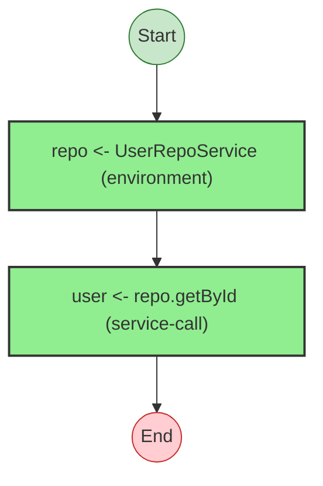
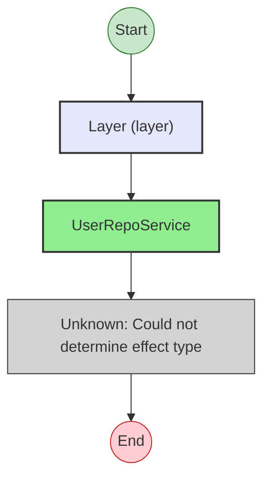
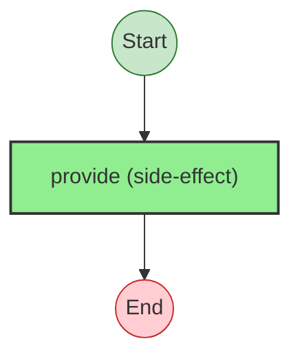
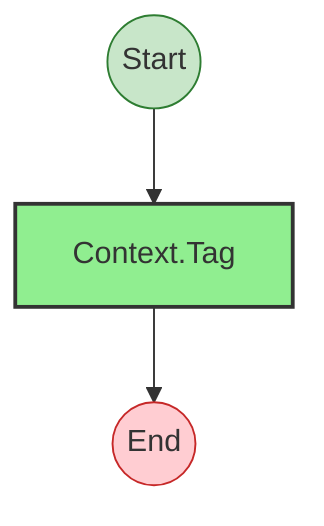

# Effect Analysis: userLookupProgram

## Metadata

- **File**: `/Users/jreehal/dev/node-examples/effect-analyzer/packages/effect-analyzer/src/__fixtures__/testing-mocks.ts`
- **Analyzed**: 2026-05-22T16:10:34.786Z
- **Source Type**: generator
- **TypeScript Version**: 6.0.2


## Effect Flow




## Statistics

- **Total Effects**: 2


## Explanation

```
userLookupProgram (generator):
  1. Yields repo <- UserRepoService
  2. user = UserRepo.getById — service-call

  Services required: UserRepoService, UserRepo
  Concurrency: sequential (no parallelism)
```


## Dependencies

- `UserRepoService`


---

# Effect Analysis: liveRepoLayer

## Metadata

- **File**: `/Users/jreehal/dev/node-examples/effect-analyzer/packages/effect-analyzer/src/__fixtures__/testing-mocks.ts`
- **Analyzed**: 2026-05-22T16:10:34.788Z
- **Source Type**: direct
- **TypeScript Version**: 6.0.2


## Effect Flow




## Statistics

- **Total Effects**: 1
- **Unknown Nodes**: 1


## Explanation

```
liveRepoLayer (direct):
  1. Provides layer providing UserRepoService (requires UserRepoService):
    Calls UserRepoService
    (unknown: Could not determine effect type)

  Concurrency: sequential (no parallelism)
```


---

# Effect Analysis: mockRepoLayer

## Metadata

- **File**: `/Users/jreehal/dev/node-examples/effect-analyzer/packages/effect-analyzer/src/__fixtures__/testing-mocks.ts`
- **Analyzed**: 2026-05-22T16:10:34.789Z
- **Source Type**: direct
- **TypeScript Version**: 6.0.2


## Effect Flow


## Statistics

- **Total Effects**: 1
- **Unknown Nodes**: 1


## Explanation

```
mockRepoLayer (direct):
  1. Provides layer providing UserRepoService (requires UserRepoService):
    Calls UserRepoService
    (unknown: Could not determine effect type)

  Concurrency: sequential (no parallelism)
```


---

# Effect Analysis: withLiveLayer

## Metadata

- **File**: `/Users/jreehal/dev/node-examples/effect-analyzer/packages/effect-analyzer/src/__fixtures__/testing-mocks.ts`
- **Analyzed**: 2026-05-22T16:10:34.790Z
- **Source Type**: direct
- **TypeScript Version**: 6.0.2


## Effect Flow




## Statistics

- **Total Effects**: 1


## Explanation

```
withLiveLayer (direct):
  1. Calls provide — context

  Concurrency: sequential (no parallelism)
```


---

# Effect Analysis: withMockLayer

## Metadata

- **File**: `/Users/jreehal/dev/node-examples/effect-analyzer/packages/effect-analyzer/src/__fixtures__/testing-mocks.ts`
- **Analyzed**: 2026-05-22T16:10:34.790Z
- **Source Type**: direct
- **TypeScript Version**: 6.0.2


## Effect Flow


## Statistics

- **Total Effects**: 1


## Explanation

```
withMockLayer (direct):
  1. Calls provide — context

  Concurrency: sequential (no parallelism)
```


---

# Effect Analysis: UserRepoService

## Metadata

- **File**: `/Users/jreehal/dev/node-examples/effect-analyzer/packages/effect-analyzer/src/__fixtures__/testing-mocks.ts`
- **Analyzed**: 2026-05-22T16:10:34.790Z
- **Source Type**: class
- **TypeScript Version**: 6.0.2


## Effect Flow




## Statistics

- **Total Effects**: 1


## Explanation

```
UserRepoService (class):
  1. Calls Context.Tag — service-tag

  Concurrency: sequential (no parallelism)
```

