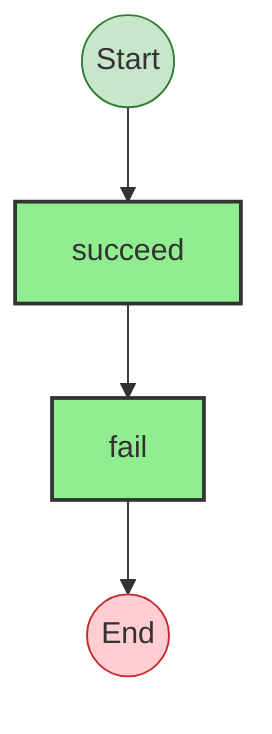
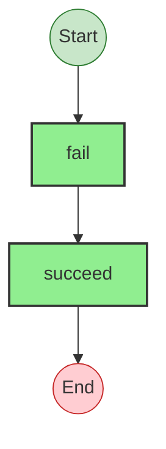

# Effect Analysis: requireItem

## Metadata

- **File**: `/Users/jreehal/dev/node-examples/effect-analyzer/packages/effect-analyzer/src/__fixtures__/utility-effect-functions.ts`
- **Analyzed**: 2026-05-22T16:10:34.861Z
- **Source Type**: functionDeclaration
- **TypeScript Version**: 6.0.2


## Effect Flow




## Statistics

- **Total Effects**: 2


## Explanation

```
requireItem (functionDeclaration):
  1. Calls succeed — constructor
  2. Calls fail — constructor

  Error paths: NotFoundError
  Concurrency: sequential (no parallelism)
```


## Error Types

- `NotFoundError`


---

# Effect Analysis: validateInput

## Metadata

- **File**: `/Users/jreehal/dev/node-examples/effect-analyzer/packages/effect-analyzer/src/__fixtures__/utility-effect-functions.ts`
- **Analyzed**: 2026-05-22T16:10:34.862Z
- **Source Type**: functionDeclaration
- **TypeScript Version**: 6.0.2


## Effect Flow




## Statistics

- **Total Effects**: 2


## Explanation

```
validateInput (functionDeclaration):
  1. Calls fail — constructor
  2. Calls succeed — constructor

  Error paths: string
  Concurrency: sequential (no parallelism)
```


## Error Types

- `string`

