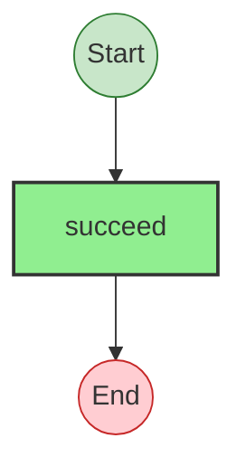
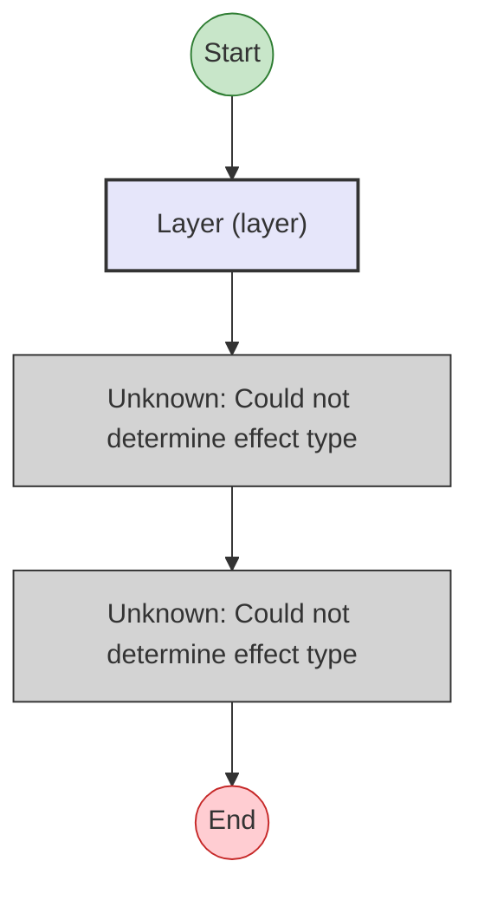
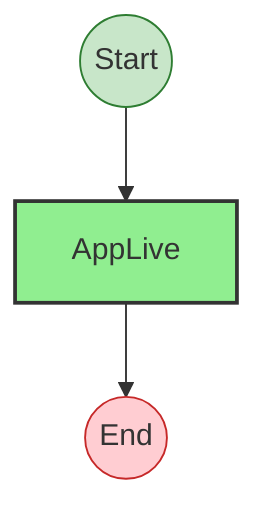

# Effect Analysis: program

## Metadata

- **File**: `/Users/jreehal/dev/node-examples/effect-analyzer/packages/effect-analyzer/src/__fixtures__/wrapper-bootstrap.ts`
- **Analyzed**: 2026-05-22T16:10:34.937Z
- **Source Type**: generator
- **TypeScript Version**: 6.0.2


## Effect Flow




## Statistics

- **Total Effects**: 1


## Explanation

```
program (generator):
  1. Calls succeed — constructor

  Concurrency: sequential (no parallelism)
```


---

# Effect Analysis: AppLive

## Metadata

- **File**: `/Users/jreehal/dev/node-examples/effect-analyzer/packages/effect-analyzer/src/__fixtures__/wrapper-bootstrap.ts`
- **Analyzed**: 2026-05-22T16:10:34.939Z
- **Source Type**: direct
- **TypeScript Version**: 6.0.2


## Effect Flow




## Statistics

- **Unknown Nodes**: 2


## Explanation

```
AppLive (direct):
  1. Provides layer:
    (unknown: Could not determine effect type)
    (unknown: Could not determine effect type)

  Concurrency: sequential (no parallelism)
```


---

# Effect Analysis: runApp

## Metadata

- **File**: `/Users/jreehal/dev/node-examples/effect-analyzer/packages/effect-analyzer/src/__fixtures__/wrapper-bootstrap.ts`
- **Analyzed**: 2026-05-22T16:10:34.939Z
- **Source Type**: run
- **TypeScript Version**: 6.0.2


## Effect Flow




## Statistics

- **Total Effects**: 1


## Explanation

```
runApp (run):
  1. Calls AppLive

  Concurrency: sequential (no parallelism)
```

